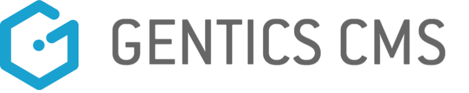

<h1 align="center">
  
</h1>

<h3 align="center">Gentics CMS is your friendly, enterprise-grade, open-source CMS</h3>

To be honest, it’s more than that: it’s your application development platform
to create your websites, your IoT applications, your mobile apps, your smart
devices and your digital signage solutions. With its complete feature list and great documentation, you’ll get your projects done
successfully in less time, no matter which technology you prefer.

 

 
 
 
</a>
 

 

# Table of Contents

<!-- re-generate with https://github.com/ekalinin/github-markdown-toc -->

   * [Table of Contents](#table-of-contents)
   * [Introduction](#introduction)
      * [Gentics CMP](#gentics-cmp)
      * [Why pick Gentics CMS?](#why-pick-gentics-cms)
   * [Status](#status)
   * [Documentation, Changelog, Download Links and System Requirements
](#documentation-changelog-download-links-and-system-requirements)
   * [Getting Help](#getting-help)
   * [Professional Services](#professional-services)
      * [Product Development](#product-development)
      * [Consulting](#consulting)
      * [Maintenance](#maintenance)
      * [Support](#support)
   * [Contributing to Gentics CMS](#contributing-to-gentics-cms)
   * [Copyright &amp; License](#copyright--license)

# Introduction

## Gentics CMP

Gentics CMP (Content Management Platform) is composed of the following components: Gentics CMS, Gentics Mesh, and Gentics Portal. Gentics CMS and Mesh are available as both open-source software (OSS) and Enterprise Edition (EE). Gentics Portal Java and PHP can only be acquired with the Enterprise Edition. You can find the EE features here: [Open-Source and Enterprise Edition](https://www.gentics.com/infoportal/cmp/ossandee/). For more information about the EE, please contact [sales@gentics.com](mailto:sales@gentics.com).

Here are the links to our open-source projects:

- Gentics CMS OSS: https://github.com/gentics/cms-oss
- Gentics CMS OSS on dockerhub: https://hub.docker.com/r/gentics/cms-oss
- Gentics Mesh OSS: https://github.com/gentics/mesh
- Gentics Mesh OSS on dockerhub: https://hub.docker.com/r/gentics/mesh

## Why pick Gentics CMS?

Gentics CMS is an integral part of the Gentics CMP and neccessary in order to create a functioning CMP. 
It is also the platform which provides a real WYSIWYG Editor, through which content can be easily edited.
You can use its modern user interface that makes content editing and administration enjoyable. You decide whether you want to
host it locally or in the cloud. We don’t care if you’re a Windows, Linux or
Mac guy or girl. Also, with its Apache 2.0 license, you are free to use it, modify
it and improve it.

What makes Gentics CMS special over other CMSes is:

* its built-in user management not only covers the admin and editor features,
  but can also be used for handling access to your application.
* it thinks in content trees (just like websites do), which brings you many
  things for free: automatic navigation menus, automatic beautiful URLs,
  built-in link resolving, …​
* it is scalable and built for clustering, so your deployment can grow with
  your project’s success.

# Status

Gentics CMS is actively developed by a dedicated team at Gentics Software GmbH in Vienna,
Austria.

    

The Gentics CMS core team consists of the following members:

 <table align="center" style="width: 100%; max-width: 600px;">
  <tr>
   <td align="center">
    <a href="https://github.com/deckdom">
     <!--   -->
     Dominik Decker <i>UI/UX developer</i>
    </a>
   </td>
  </tr>
  <tr>
   <td align="center">
    <a href="https://github.com/npomaroli">
     <!--   -->
     Norbert Pomaroli <i>Software architect</i>
    </a>
   </td>
  </tr>
    <tr>
   <td align="center">
    <a href="https://github.com/yrucrem">
     <!--   -->
     Patrick Klaffenböck <i>Backend developer</i>
    </a>
   </td>
  </tr>
    </tr>
    <tr>
   <td align="center">
    <a href="https://github.com/plyhun">
     <!--   -->
     Serhii Plyhun <i>Backend developer</i>
    </a>
   </td>
  </tr>
    </tr>
    </tr>
    <tr>
   <td align="center">
    <a href="https://github.com/guggi">
     <!--   -->
     Oliver Guggenberger <i>Backend developer</i>
    </a>
   </td>
  </tr>
    </tr>
    </tr>
    </tr>
    <tr>
   <td align="center">
    <a href="https://github.com/netwarex">
     <!--   -->
     Péter Nyári <i>Frontend developer</i>
    </a>
   </td>
  </tr>
  </tr>
    </tr>
    </tr>
    </tr>
    <tr>
   <td align="center">
    <a href="https://github.com/enizhou">
     <!--   -->
     En Qiang Zhou <i>Product Owner</i>
    </a>
   </td>
  </tr>
 </table>

<!-- XXX Roadmap XXX -->

# Documentation, Changelog, Download Links and System Requirements

For our comprehensive documentation on Gentics CMS, please visit the following link: https://www.gentics.com/Content.Node/guides/

* Changelog: https://www.gentics.com/Content.Node/changelog/
* Download Links: https://www.gentics.com/Content.Node/guides/downloads.html
* System Requirements: https://www.gentics.com/Content.Node/guides/faq_system_requirements.html

# Getting Help

Issues can be reported via [GitHub](https://github.com/gentics/mesh/issues).

# Professional Services

The company behind Gentics CMS, Gentics Software GmbH is
offering commercial services for Gentics CMS. Please contact us at
sales@gentics.com for details.

## Product Development

Gentics CMS is a robust and cutting-edge solution that has undergone continuous development for more than two decades. 
After an extension request has been received from you, it will be evaluated whether the features will be added to the standard product or
offered as an individual project.

## Consulting

We accompany you in your projects with our experienced Gentics CMS
Consultants. Here we can help you setting up the project, executing together
the conception of the structures in the CMS, taking into account your
requirements, and offer orientation to best practices.

## Maintenance

Product Maintenance includes product error removal. We offer various Product
Maintenance Packages - differing between Essential, Professional and Elite
Package - depending on the number of Gentics CMS Nodes.

## Support

To help and support you and your developers working and developing applications
and online projects using Gentics CMS we offer a dedicated Developer Support
focusing on all the typical questions and needs arising when working with
Headless CMS solutions.

# Contributing to Gentics CMS

Please sign the [CLA](https://cla-assistant.io/gentics/cms-oss) in order to contribute to Gentics CMS.

# Copyright & License

Copyright (c) 2014-2023 Gentics Software GmbH. Licensed under the
Apache License, Version 2.0.

Gentics is a registered trade mark of Gentics Software GmbH.
