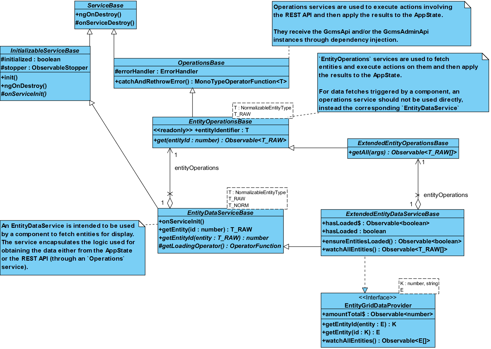

# Gentics CMS Admin UI Architecture

This document gives an overview of the architecture of the Gentics CMS Admin UI.

## Module Structure

The Gentics CMS Admin UI is made up of base modules and feature modules.
The base modules provide the application base, state management, the dashboard, and other core parts.
The feature modules implement the distinct functionalities provided by the Admin UI and are reachable from the dashboard.

### Base Modules

The following table briefly describes the base modules:

| Module             | Description                                                    |
| ------------------ | -------------------------------------------------------------- |
| `AppModule`        | The root module used to bootstrap the application.             |
| `AppRoutingModule` | Defines the main routes. Apart from the base routes, there should be one route for each feature module. |
| `CoreModule`       | Contains services and components that are required in many places of the application. This module is imported by the `AppModule` and **MUST NOT** be imported by any other module. |
| `DashboardModule`  | Contains the dashboard of the Admin UI.                        |
| `LoginModule`      | Contains the login components and the `KeycloakService`.       |
| `SharedModule`     | Contains components, directives, pipes, services, and utilities that are used by more than one feature module. |
| `StateModule`      | Defines the structure of the app state and the actions that can be executed to mutate it. |

### Feature Modules

A feature module implements a cohesive set of functionalities and is reachable by clicking on one of the items in the dashboard.
Features modules are located in the [src/app/features](../src/app/features) folder - each module has a distinct subfolder.

To register a new feature module in the Admin UI, add its root route to the [AppRoutingModule](../src/app/app-routing.module.ts) and a link to an item on the dashboard.
All routes within the feature module must be defined in the module itself.

## Routing

The [AppRoutingModule](../src/app/app-routing.module.ts), as well as the routes defined in feature modules conform to the [GcmsAdminUiRoute](../src/app/common/routing/gcms-admin-ui-route.ts).
It augments the Angular `Route` interface with a specific definition of the `data` that can be added to each route, such as the breadcrumb that should be displayed for it and the definition of the permissions the user requires to access the route.

## Services

All service classes must extend the [ServiceBase](../src/app/shared/providers/service-base/service.base.ts) class or one of its descendants ([InitializableServiceBase](../src/app/shared/providers/initializable-service-base/initializable-service.base.ts), [OperationsBase](../src/app/core/providers/operations/operations.base.ts), etc.).

## State Management

This application uses the [NGXS](https://www.ngxs.io) library to manage the application state.
NGXS allows the definition of an app state that can only be mutated through clearly defined `actions`.
Please refer to the NGXS documentation for an introduction to this library.

NGXS divides an app state into `modules`, i.e., the logical parts of the app state.
The structure of the Admin UI's app state is defined in the [AppState](../src/app/state/app-state.ts) interface and the interfaces used for its properties.
For each property in the `AppState`, there is an NGXS module, which is registered in the [StateModule](../src/app/state/state.module.ts).

The [AppStateService](../src/app/state/providers/app-state/app-state.service.ts) wraps the functionality provided by NGXS and is used in the Admin UI to read and observe the `AppState`, as well as to dispatch actions to modify it.
To observe a part of the app state, the `@SelectState` decorator may be used as well.

When creating a new app state module or action, we do not use the decorators provided by NGXS, but rely on [our own](../src/app/state/utils/state-utils/state-utils.ts) for consistency and added convenience.

## Entity Management and REST Operations

Entities (`Folder`, `Page`, `User`, `Group`, etc.) loaded from the CMS are stored in the app state in a normalized form.
For getting entities from the app state or for adding/deleting/modifying entities in the app state, the [EntityManagerService](../src/app/core/providers/entity-manager/entity-manager.service.ts) is used.

Classes that make use of the REST API through `GcmsApi` and then possibly modify the app state according to the result are called `Operations` classes and must extend [OperationsBase](../src/app/core/providers/operations/operations.base.ts) or one of its descendants.
All `Operations` classes are services, thus the suffix `Service` is omitted from the class names.

An `Operations` class that is responsible for a type of CMS entity must extend [EntityOperationsBase](../src/app/core/providers/operations/entity-operations-base/entity.operations.base.ts) or [ExtendedEntityOperationsBase](../src/app/core/providers/operations/extended-entity-operations/extended-entity.operations.base.ts).
The following UML class diagram illustrates the main classes involved in handling entities and their relationships.

  </img>

