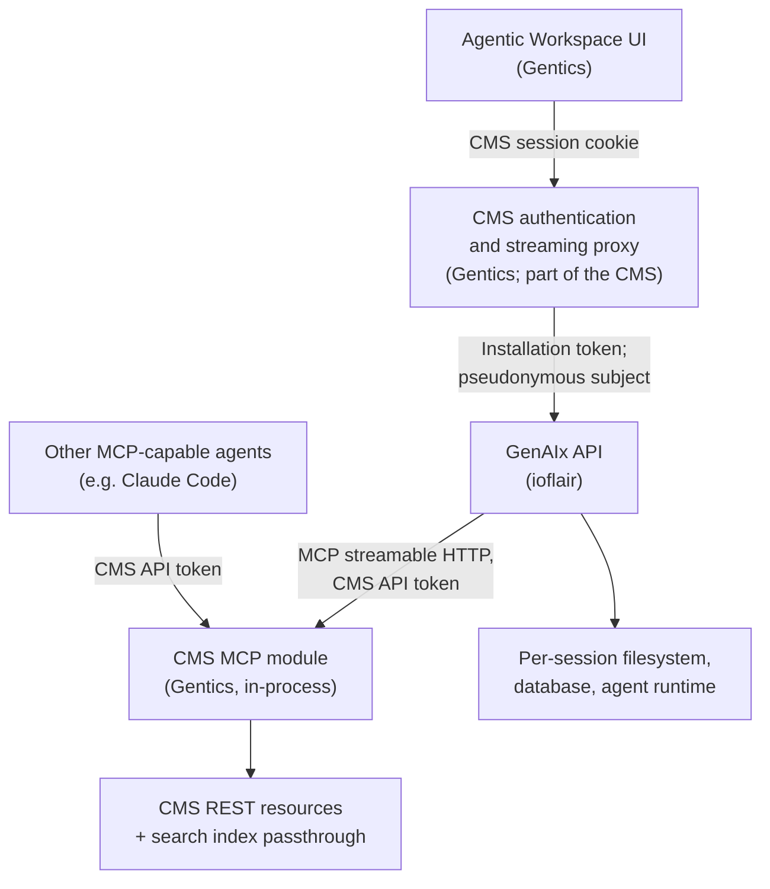

# Architecture

## Purpose

This document describes the architecture behind GenAIx's integration into CMP9's Agentic Workspace: what GenAIx does, how it connects to the CMS, and the contracts the Workspace UI and the CMS team build against. It covers the decided design, not the reasoning history behind it. Read it before the narrower sibling documents that go into exact API, tool, and schema detail: the auth and context flow document, the GenAIx API guide, the MCP scope document, the Content RAG contract, the construct and devtools requirements, the workflow modules document, and the OpenAPI specification itself.

Everything below is the agreed shape of the system, not a proposal awaiting sign-off; where a detail genuinely remains to be settled, this document says so plainly as a stated limitation rather than leaving it ambiguous.

## Scope

This phase delivers, on the GenAIx side: a standardized GenAIx API, the CMP MCP layer specification built on top of the CMS's own APIs, GenAIx's agent and tool adaptation, integration of Content RAG into GenAIx's workflows, and integration support for the Gentics-built Agentic Workspace UI. Gentics owns the Agentic Workspace UI itself, the CMS authentication and streaming proxy, the relevant CMS REST extensions, the CMS MCP module's hosting and implementation, search indexing, and permissions.

Three scenarios anchor the contract; a fourth is optional. Every element of the contracts described here traces back to at least one of these four — nothing is specified merely because it seemed generally useful.

**Content creation from source material** (Content Creator). A user uploads a source document — for example a PDF or Word file — and asks for a new page. The agent searches existing content to avoid duplicates and to link related pages, derives a folder, template, and language (each correctable by the user), and is constrained to constructs already allowed on the target template. It shows a visible plan, asks for feedback, creates an unpublished draft page, shows the CMS's own preview, iterates on request, and then the user releases the session for review — either a direct publish or a review request, depending on the user's CMS permissions. Any text the user marks verbatim must land character-identical, with proof: the finished page carries a verification record confirming the exact match, not just a claim that it was preserved.

**Content research, inventory, and reporting** (Content Creator or Chief Content Creator). Natural-language questions over the content — which pages mention a topic, when they went online, counts, outdated pages, duplicates — return a permission-filtered table or list of object references, served through the CMS's existing search index via MCP. A reviewer step re-queries a sample of what the agent reports and checks its citations before the answer is shown as finished, rather than trusting the first pass unchecked.

**Construct (tag type) creation** (Chief Content Creator). Starting from a description of a new content element, the agent drafts a template-driven construct — its keyword, translated names, editable parts, and template — validates the template, checks it for similarity against existing constructs, creates it through the CMS's REST API, assigns it to the relevant node or nodes, renders a preview, and reports back. This puts construct creation within reach of a content role, not only a developer with template-authoring access, while keeping it fully auditable and reversible through the CMS's own object model.

**Admin (optional)**. A CMP administrator creates a user and grants a role, with a permission-impact preview shown before the change is committed. This scenario depends on confirming sufficient CMS API and authorization support, and is not required for the other three; permission and role changes carry more risk than the other scenarios if a change is silently wrong, so a human confirmation step is mandatory here even more than elsewhere.

Design Studio — a second, later user interface for template and design work — is out of scope for this phase entirely. The shapes described below are deliberately designed to extend to it without a rewrite; see the extension points at the end of this document for how.

## System context

The Workspace UI never calls GenAIx directly; every call passes through the CMS's own proxy, which holds a GenAIx installation token and forwards the CMS user as an opaque, pseudonymous subject rather than their real identity. GenAIx, in turn, never writes to the CMS any way other than through the CMS MCP module, which wraps the CMS's own REST resource implementations in-process. GenAIx keeps its own session state, event log, and per-session filesystem area, so nothing about a running conversation depends on the CMS beyond the content and permission data it reads and writes there. Other MCP-capable agents may call the CMS MCP module directly, with their own CMS credential, without going through GenAIx at all — the same CMS-side module serves both paths identically.

## Components and responsibilities

| Component | Owner | Status |
|---|---|---|
| Agentic Workspace UI | Gentics | In development; consumes this contract |
| CMS authentication and streaming proxy | Gentics | Required dependency; see the requirements below |
| GenAIx API | ioflair | This deliverable; evolves GenAIx's existing implementation |
| CMS MCP module | Gentics (module package, servlet mounting, request authentication, REST and Elasticsearch extensions) and ioflair (the tools) | Specified here and in the MCP scope document. Gentics provides the module package mounted as its own servlet inside the CMS process and wires request authentication; ioflair implements the tools inside that module: the annotations on the resource methods and the composite tools |
| CMS REST resources, including extensions | Gentics | Mostly existing; extensions are listed in the construct and devtools requirements document |
| Search index passthrough | Gentics | Already exists; no CMS-side change is required for this phase's retrieval depth |
| Content RAG | ioflair, built on the CMS's existing search capability | The retrieval contract, the search tools inside the CMS MCP module and the GenAIx retrieval skill are ioflair's; the Elasticsearch indexing, the passthrough endpoint and the permission filtering stay with the CMS |
| Other MCP-capable agents (e.g. Claude Code) | Third party | Consume the CMS MCP module directly with their own CMS API token; no GenAIx dependency |

## Principles

Seven architecture principles are fixed by Gentics and not open to renegotiation. The design below honors each:

1. **One write path.** Every create or modify operation, including by AI agents, goes through the CMS REST API. The CMS MCP module wraps existing REST resource implementations rather than opening a second write path, and a draft is a real, unpublished CMS page rather than a client-composed document.
2. **Role-bound MCP, impersonation, audit.** Agents interact with the CMS exclusively through MCP; tools are scoped by the CMS permissions a caller holds through groups and roles; every call runs as the calling user, with audit. Every MCP call carries the calling user's own CMS API token, so CMS permission checks apply unmodified, plus a session and run identifier on every call for audit correlation.
3. **Content RAG on the existing search index.** Retrieval goes through the CMS's existing search index via MCP, so permission filtering, node/folder scoping, and language handling stay exactly as the CMS already implements them. This phase implements document-level retrieval — keyword search plus highlight snippets — and reserves a retrieval-mode field in the request shape so a future hybrid, passage-level mode can be added without a breaking change.
4. **Hybrid AI, model-agnostic.** GenAIx is one of several possible AI backends a customer might use against the same CMS. The CMS MCP module is a generic MCP server usable by any MCP client; nothing in its tool contracts is GenAIx-specific, so a different AI backend could integrate against the identical surface.
5. **Preview equals production.** A preview is always available through the CMS's own preview mechanism, never a client-side reconstruction. Because a draft is a real CMS page, rendering its preview uses exactly the path an editor would see.
6. **Two new user interfaces** — the Agentic Workspace now, and a later Design Studio. The session, workflow, message-part, and tool-group shapes are designed to extend to Design Studio without a rewrite.
7. **Verbatim mode and design lock.** User-marked text is adopted character-identically, with proof. Every verbatim span carries a verification record of whether it matched exactly; every uploaded file is tagged as source or verbatim content.

## The architecture

### Authentication and MCP connections

GenAIx sits behind the CMS's own authentication and streaming proxy; the Workspace UI never calls GenAIx directly. Every proxied call carries a GenAIx installation token — one per CMS installation, held server-side by the proxy — plus exactly one identity header, an opaque, installation-scoped, pseudonymous subject the proxy derives from the CMS user, so GenAIx never learns which person is behind it. GenAIx trusts this header only when the installation token itself is valid, and verifies its signature as well whenever the installation has a signing key configured for it.

GenAIx never handles a CMS session cookie or session secret, and it never creates a CMS API token on a user's behalf. Instead, GenAIx models every external tool endpoint as a **connector type** — a small, fixed catalogue it defines itself (today, one type: `cms`) — and each user holds their own **connections** of a type, each with its own URL. A connector type cannot be added, removed, or changed through the API; it is GenAIx configuration. A connection is fully client-owned: a user, through the Workspace UI, an external service, or GenAIx's own internal settings, creates it with a URL of their own choosing, can re-point or delete it later, and is capped at a configurable number of connections per type. As a convenience, GenAIx auto-creates one default `cms` connection per user, pre-filled from the installation's own configuration, the first time that user lists their connections, so the common case needs only a credential, not a manual setup step.

Authorization lives on the session, not the connection. The client creates a CMS API token scoped to one workflow session — using its own CMS login — and registers it with GenAIx, which stores it encrypted, verifies it live against the connection's endpoint, and uses it only for that session's runs. GenAIx never mints this token and never sees the credential the user used to create it. The token is deleted the moment the session no longer needs it: when the session is published, discarded or archived, when the client deletes it, or when it expires — nothing long-lived is ever stored. A standing, per-user authorization on the connection itself remains as a secondary path for GenAIx's own non-integrated interface and for tooling with no per-task token to mint; where both exist for the same connection, the session's own authorization wins. If a credential stops working mid-run, GenAIx fails that run with a specific error naming the affected connection, and the client is expected to register a working credential before the user retries.

The CMS MCP module itself is built as an in-process extension of the CMS, not a separate service: it wraps the CMS's existing REST resource implementations as MCP tools, rather than opening a second network hop or a parallel implementation of CMS business logic. This means MCP tool availability tracks the CMS's own release cadence, and every MCP tool call ultimately runs the same code path a REST call would.

The CMS MCP endpoint authenticates any bearer-token holder identically, so external LLM agents can call it directly with their own CMS API token, with nothing GenAIx-specific required. GenAIx's advantage as a client comes from the CMS-specific knowledge built into its own skills, not from privileged API access.

This phase supports only a static bearer token as the connection credential type, matching how MCP clients integrate today. A future OAuth 2.1 flow, aligned with the MCP Authorization specification's protected-resource-metadata and resource-indicator requirements (RFC 9728, RFC 8707), is a reserved extension once the CMS implements the corresponding protected-resource behavior; full detail is in the auth and context flow document.

### Sessions

Each session is owned by the pair of installation and subject; session routes enforce both, returning a not-found response for an unknown session and a forbidden response for one that exists under a different subject. Ownership keys on the stable, pseudonymous subject rather than a browser session, so a running session and its in-progress work survive a UI logout; logging in again, from any device, shows the same session list.

Within a session, a run represents one execution of the agent in response to a single message; a session accumulates many runs over its lifetime as the conversation continues. This separation is what lets the event model below replay a session's full history and then attach to whichever run, if any, is still in progress.

### Event model

Progress streams over Server-Sent Events: a single events endpoint, given the caller's last-seen sequence number, replays every persisted event after that point and then follows live, with reconnect support and a periodic heartbeat so proxies don't time out an otherwise-silent connection. This is the canonical transport; an older, client-library-specific streaming format is kept only for GenAIx's own internal maintainer interface.

### Message parts

Assistant output is built from a registry of typed message parts — plain text, a tree view, a selectable list, a properties list, an image grid, a table, and further scenario-specific types, such as a page-structure view for content creation and a construct-draft view for construct creation, plus citation and file-reference parts for grounding an answer in specific CMS objects — rather than freeform markup. Every part streams incrementally: started, then delta updates, then completed. Clients must treat an unrecognized part or event type as plain text rather than failing. New part types can be added later without breaking existing clients, provided this fallback rule is honored.

User messages are typed parts too, not just assistant output: `text`, `verbatim`, `reference`, `file_ref`, `setting`, and `filter` cover what a composer can produce — plain typed text, a span locked as character-identical, an @-mention resolving to a CMS object, a pointer to an uploaded session file, a folder or language or template chip, and a structured search selection. A plain-text rendering of the part sequence is always derived alongside it, so a client, a log, or the session history can show one readable string without needing to understand every part type.

### Workflow modules and quality gates

A session's workflow is reported as a plan, a list of steps, a list of checks, and an approval chain; the agent updates these live as it works, and the UI renders them as a visible work plan rather than only chat text.

What a workflow actually contains, and what verifies it, is a versioned module: each workflow — content creation, content research, construct creation, the optional admin scenario, and free-form chat — is its own package of instructions, skills, and quality gates, discovered by the GenAIx harness at startup. A quality gate is a mandatory check the harness runs itself, not something the model merely claims to have done: a deterministic script (for example, a template compile, a verbatim-text hash comparison, a link check, or confirming a CMS object exists and is still unpublished); a separate reviewer agent with read-only tools that returns a structured verdict; a model self-check that is advisory only and never blocking; or an explicit human approval. Gate results are reported as checks, with enough detail to show what ran and what it found. A failing blocking gate stops a release or publish action outright until it is fixed; a failing non-blocking gate must be explicitly acknowledged before the action proceeds.

The gate sets differ by workflow, matched to what each scenario needs to prove: content creation combines a verbatim-text hash check, a link check, a check that only allowed constructs were used, a check that the draft is still unpublished, and a reviewer agent's read-through; content research runs a reviewer agent that re-queries a sample of the answer's claims and checks its citations; construct creation combines a template-compile check, a similarity check against existing constructs, and a rendered-preview check, plus a reviewer agent; the admin scenario combines a permission-impact preview with an explicit human confirmation.

### Drafts, preview, and the one write path

A page the agent is drafting is created immediately as a real, unpublished CMS page; every edit during the session writes through the same REST-backed tools an editor's own save action would use, and the preview the user sees is the CMS's own preview rendering, not a client-side reconstruction. There is exactly one write path into the CMS: the CMS REST API, used in-process, always as the acting user. Abandoning a session leaves its draft page in place unless the user explicitly discards it.

### Per-session filesystem

Each session has its own filesystem area for uploaded source material, generated artifacts, and snapshots fetched from the CMS, laid out under separate uploads, artifacts, and CMS-snapshot subfolders, with file metadata — kind, whether a file is marked as a verbatim source, and a content hash — tracked alongside it. The agent reads and writes into this area through its own tools rather than touching the filesystem directly, so every file the agent produces or consumes is attributable to the session that created it.

### Content search

Content search and reporting go through the CMS's existing search index via MCP; GenAIx never queries the index directly. The CMS enforces the querying user's permissions as part of the search itself, so results are already filtered to what that user may see. This phase's retrieval is document-level: keyword search with highlighted snippets over the editor-entered text of a page (not its rendered output), covering only each page's current version, with a full-page read available when more detail is needed. The request shape reserves a retrieval-mode field so a future hybrid, passage-level mode can be added without a breaking change.

### Constructs

This phase supports creating new page-content building blocks, known as constructs, at one tier: a template with editable parts, created and updated entirely through the CMS's existing construct REST endpoint, which creates the construct, its parts, and its node assignment in a single call. No JavaScript or CSS asset files are part of this tier; a construct requiring custom script-level behavior is out of scope for this phase, and is stated to stakeholders as a known limitation rather than a gap to close before delivery. A deeper tier, mapping constructs onto further CMS data structures, is a named future capability gated on human review, not built yet.

### API versioning

The GenAIx API is versioned from the start. It may still change with approval ahead of general release; once released, changes to it are additive only, so a client built against the released contract keeps working as the API grows.

### A UI-agnostic API

The API and the CMS MCP contracts describe data, state, and events — session status, a workflow's plan, steps, and checks, message parts, stream event types, tool inputs and outputs, and CMS object references — and never prescribe a screen, a layout, or a specific widget. Any Workspace UI, or a later Design Studio, is one possible consumer of this data, not something the contract is shaped around; the unknown-part and unknown-event fallback rules exist specifically so the underlying contract can keep evolving independently of any one UI's current design. Any current mockups or prototype screens are illustrative examples of one possible realization, not a constraint the API is bound to — the Workspace UI's own team may arrive at a materially different layout without that being a breaking change to this contract.

## Known limitations

- Content search in this phase is keyword and document-level, not semantic passage retrieval; answer quality is bounded accordingly, an accepted trade-off for this phase rather than a gap to close before delivery.
- Constructs support only template-driven rendering; a construct needing custom script-level behavior is out of scope for this phase.
- The admin scenario is optional and depends on confirming sufficient CMS API and authorization support closer to delivery.
- Only a static bearer-token credential type is supported for MCP connections in this phase; an OAuth 2.1 flow is a reserved future extension, not yet implemented on either side.

## Data ownership

The table below states, for each category of data this integration touches, which system holds the copy of record and which systems merely read or cache it. As a general rule, GenAIx owns nothing that the CMS already owns a copy of, and the CMS never needs to know anything about GenAIx's own internal session state.

| Data | Lives in | Notes |
|---|---|---|
| Session, message, run, and event log | GenAIx's own database | Includes workflow, status, and context fields per session, plus the ordered event log each session's stream replays from |
| Uploaded files, generated artifacts, CMS snapshots | GenAIx's own per-session filesystem area | Laid out per session under upload, artifact, and CMS-snapshot subfolders |
| MCP authorization credentials — session-scoped (primary) | GenAIx's own database, encrypted, one row per session and connection | Registered by the client for one workflow session; deleted when the session is published, discarded or archived, when the client deletes it, or when it expires. GenAIx never creates these credentials, only stores, verifies, and uses them |
| MCP authorization credentials — standing, per subject (secondary) | GenAIx's own database, encrypted, one row per installation, subject, and connection | Registered by the client for GenAIx's non-integrated interface and for tooling; used only when a session has no authorization of its own |
| MCP connections (URL, label, default flag, status) | GenAIx's own database, per subject | Client-owned: created by the client, or auto-created as a convenience from installation configuration; re-pointing or deleting a connection is a client action |
| MCP connector-type catalogue (today: `cms`) | GenAIx configuration | Defined only by GenAIx itself; never created, changed, or removed through the API |
| Installation configuration (base CMS URL, display name) | GenAIx's own database, per installation | — |
| Everything belonging to one subject | Erased in a single call | Installation-level `DELETE /subjects/{subject}` removes every session, message, file, connection and authorization GenAIx holds for that subject; called when the CMS removes the person behind it, since GenAIx itself has no way to know |
| CMS pages, folders, templates, constructs, files, images | The CMS's own database | GenAIx never stores a copy of record; it reads through the CMS's REST API and MCP, and caches only transient snapshots |
| Search index contents | The CMS's own search cluster | GenAIx never queries it directly; always through the content-search tool |
| Permission and authorization state | The CMS's own database | GenAIx never re-implements or caches authorization decisions |
| Audit trail correlating GenAIx activity to CMS actions | Split across GenAIx's own run log, the CMS MCP module's own audit log, and the CMS's object history | Each layer carries session and run identifiers so the three can be correlated |
| Never persisted, or even received | — | CMS session secrets or cookies; raw CMS user credentials; unpromoted draft material once discarded |

## Requirements towards the CMS proxy

These are the concrete, testable requirements the CMS's authentication and streaming proxy must satisfy for the design above to work as intended.

- Forward every API request unmodified except for header injection; the proxy needs no understanding of GenAIx's own resource model.
- Inject, on every proxied call: the GenAIx installation token (one static, installation-scoped secret, held server-side); and the pseudonymous subject, derived so the same person always maps to the same opaque value. Nothing else — no user id, login, group list, session cookie or session secret is ever forwarded to GenAIx.
- Strip any client-supplied identity header before forwarding, so a browser client cannot spoof another user's identity.
- For the streaming endpoints: no response buffering, with each chunk flushed as it is produced; the periodic heartbeat passed through untouched and on schedule; request and response timeouts long enough to cover a multi-minute agent run; and no body-size limit below GenAIx's own configured upload maximum.
- Pass GenAIx's error bodies and status codes through unmodified, rather than translating them into a generic error.

## Extension points

Design Studio is out of scope for this phase, but every shape described above was chosen so it can extend to it without a rewrite:

- The workflow catalogue is additive by construction: a new workflow for Design Studio is simply a new module with its own manifest, prompts, and gates, discovered at startup, with no change to the core session, event, or check contract.
- The message-part registry already reserves a part type for API-call transparency, useful for Design Studio; the unknown-part fallback rule lets further Design-Studio-specific part types be introduced later without breaking the Workspace UI.
- CMS MCP tool groups leave room for a future group covering template decomposition and render-diff tooling, alongside this phase's groups.
- The verification shape used for verbatim-text proof generalizes to a per-template, per-breakpoint render-diff proof for Design Studio, by adding fields rather than changing the shape.
- The connector-type and connection model generalizes the same way: a future Design-Studio-specific MCP connector is a second type added to GenAIx's own configuration, and each user, or the Workspace on their behalf, creates their own connection of it, reusing the same authorization and failure model without a new code path.
