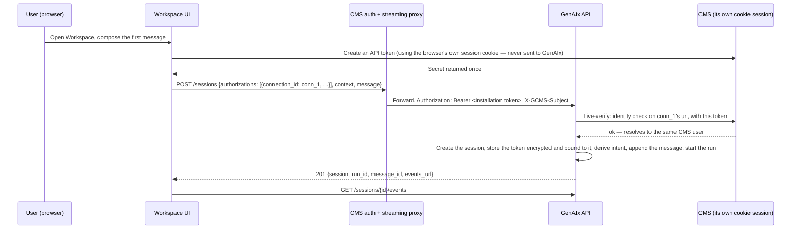
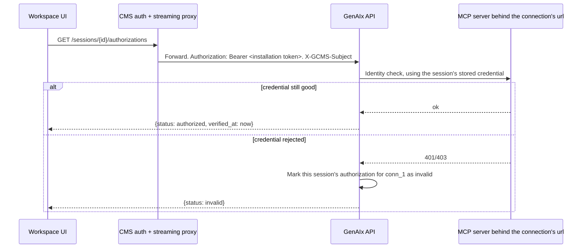
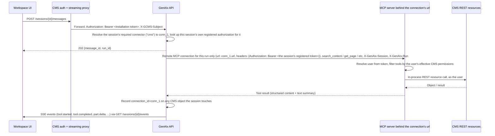
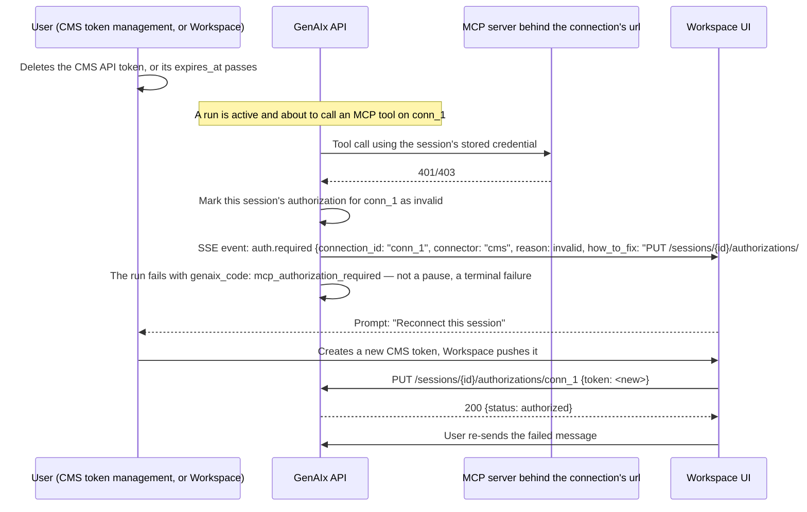
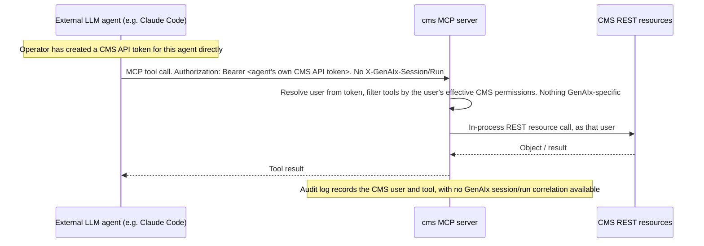

# Auth and context flow

This document is the full identity, authentication, and context-propagation contract between GenAIx, the CMS, and the Agentic Workspace UI. It is the companion to the "Authentication and MCP connections" section of the architecture document.

The guiding principle: **GenAIx never handles a CMS session secret and never creates a CMS API token.** Identity into GenAIx is an installation token plus one forwarded, pseudonymous subject header — GenAIx never learns which person is behind it. Downstream of that, GenAIx defines **connector types** (for example, `cms`) as fixed, GenAIx-configured capabilities that cannot be added through the API, while each user holds their own **connections** of a type, each carrying its own URL, created and owned by the client. The client — not GenAIx — is responsible for creating and registering the credential that lets GenAIx call that connection's endpoint on the user's behalf; in the integrated Workspace path, that credential is scoped to one workflow session rather than held standing against the connection, so nothing long-lived accumulates in GenAIx at all.

## Identity: the pseudonymous subject

GenAIx identifies the calling end user by exactly one header, `X-GCMS-Subject` — an opaque,
installation-scoped subject the proxy derives from the CMS user, for example an HMAC of the CMS user
id with a secret only the CMS holds. GenAIx uses it purely as an owner key for sessions, files,
connections and authorizations, and learns nothing else about the person behind it: no user id,
login, display name or group list is ever sent, and none is stored. The same person must always
resolve to the same subject, so their sessions survive a fresh sign-in from any device, but nothing
about how that mapping is produced is GenAIx's business.

The header's value may be a bare opaque string, or a compact JWS assertion carrying `sub` (the
subject), `iss` (the installation), `iat` and a short `exp`; the producing side may put more into
that payload, but GenAIx never decodes, uses or stores anything beyond those four claims. When the
installation is configured with the matching signing key, GenAIx verifies the signature and expiry
itself and rejects anything unsigned, malformed, mis-issued or stale with `401` `identity_invalid`;
without a configured key, the header is accepted as sent and used verbatim as the subject. A missing
or empty header on an otherwise valid installation-token request is `400` `subject_missing`.

`GET /me` reports `user: {subject}` and nothing more; there is no user id, login or group list
anywhere in the contract. `DELETE /subjects/{subject}`, authenticated by the installation token alone
with no `X-GCMS-Subject` of its own, erases every session, message, file, connection and authorization
GenAIx holds for one subject. The installation calls it when the person behind that subject is
removed — the only way this can happen at all, since a subject is opaque and GenAIx can never resolve
one back to a person on its own; audit correlation from subject to person likewise happens only on
the CMS side, never inside GenAIx.

## Actors and credentials

| Actor | Holds | Lifetime | Storage | Rotation |
|---|---|---|---|---|
| CMS installation (via the CMS authentication and streaming proxy) | GenAIx installation token | Long-lived, admin-issued, no built-in expiry | GenAIx: hash only, no plaintext after creation. CMS proxy: plaintext, server-side config only | Manual: an admin revokes and re-issues it |
| CMS end user (browser) | CMS session cookie | Browser-session-scoped | Browser cookie jar; CMS session store | Managed entirely by the CMS; GenAIx never sees this cookie or its value |
| CMS end user (session authorization — the integrated path) | A CMS API token the **client** created for one workflow session, named `genaix-<session_id>`, registered on the session | The installation's session authorization lifetime (default 24 hours), set as the CMS token's own `expires` | GenAIx: encrypted at rest, one row per session and connection; deleted when the session no longer needs it or the token expires | The client creates a fresh token and registers it again — the same name once the CMS has pruned the expired row, a new name suffix otherwise. GenAIx never recreates or rotates it itself |
| CMS end user (standing authorization on a `cms`-type connection — secondary path) | A CMS API token the **client** created, registered on the connection itself rather than on any one session | Whatever expiry the client chose when creating the token | GenAIx: encrypted at rest, one row per installation, user, and connection | The client recreates the CMS token and pushes the replacement; GenAIx never recreates or rotates it itself. Used by the non-integrated GenAIx UI and by tooling; a session's own authorization overrides it whenever both exist. Re-pointing the connection's URL drops it, since a credential for one endpoint is not assumed valid for another |
| External LLM agent | Its own CMS API token, used directly against the CMS's MCP endpoint | Whatever the operator configures | Held by the external agent's own operator, outside GenAIx entirely | Managed by the external agent's operator via the CMS's own token endpoints; unaffected by anything in this document |
| GenAIx maintainer (internal interface) | An OIDC session, plus the same per-connection authorization model on the internal path | Standard session/refresh lifetime; the registered credential follows the same rule as above | GenAIx: encrypted OIDC tokens plus the same per-connection authorization row | Session refresh is automatic; the credential is still client-registered, via the internal settings view |

## Connector types and connections

GenAIx's MCP model has two layers: **connector types**, which GenAIx defines and which are never addable through the API, and **connections**, which each user creates, owns, and points at a URL of their choosing. This supports one user eventually holding several connections of the same type — for example, several CMS instances — even though the Agentic Workspace, for now, keeps exactly one connection per connector type per user.

```
McpConnector = {
  type: "cms",                   // slug, stable, GenAIx-defined, not addable via the API
  title, description,
  transport: "streamable_http",
  auth: {
    type: "none" | "bearer" | "oauth2",
    resource?,                   // RFC 8707 canonical resource URI, once oauth2 applies
    authorization_servers?,      // RFC 9728 authorization_servers list, once oauth2 applies
    scopes_supported?,           // once oauth2 applies
    token_hint?
  },
  tool_groups: [...],
  url_template?,                 // a hint, not an enforced value
  default_url?,                  // from installation config, a Workspace convenience (see below)
  multiple: bool,                // whether a user may hold more than one connection of this type
  required_by_workflows: [...]
}

McpConnection = {
  id: uuid,
  connector: "cms",
  url,                           // user- or client-specified; never derived or assumed
  label?,
  default: bool,
  created_at,
  status: { reachable: bool, checked_at, server_info? },  // from an initialize probe; informational only;
                                                          // server_info only after a probe with a credential
                                                          // (an unauthenticated initialize sees the 401)
  authorization_status: authorized|unauthorized|pending|invalid|expired
}
```

For `cms`, `auth.type = "bearer"` today, and the `oauth2`-only fields are unset. `multiple` is `true` at the connector-type level — a user could in principle hold several CMS connections — but the Workspace UI, for now, only ever creates or shows one.

`McpConnection.authorization_status` above reflects the connection's own **standing** authorization only — the secondary path described in "Session-scoped authorization" below. It says nothing about whether any particular session can act on the connection: a session with its own registered authorization ignores this field entirely.

**What the API can and cannot do:**
- `GET /mcp/connectors` is a read-only catalogue of types; no API call can add, remove, or change one.
- `GET/POST /mcp/connections` and `GET/PATCH/DELETE /mcp/connections/{id}` are fully client-owned: a user creates a connection with their own URL, can re-point it, and can delete it.
- **URL validation:** `https` required, except `http` for `localhost`; no credentials embedded in the URL; a reachability probe runs on create/update but a failed probe does not block creation.
- **Re-pointing drops the authorization** — a credential proven against one endpoint is never assumed valid against a different one.
- **Per-user limit:** the number of connections of one type a user may hold is capped; exceeding it is a conflict response.
- **Auto-created default connection:** when an installation configures its own base CMS URL, GenAIx auto-creates one default `cms` connection per user the first time that user lists their connections, so the Workspace UI usually only has to register a credential, not create a connection.

**Where the endpoint is, and why authentication lives in the servlet.** The CMS mounts the MCP
endpoint at `/mcp` as its own servlet, not as a resource inside the `/rest/*` Jersey servlet. Because
of that, `/mcp` inherits none of the authentication filters the REST API relies on: bearer-token
authentication against CMS API tokens is wired directly in the MCP servlet itself, a consequence of
the path decision rather than a separate design choice.

**Credential type today, and the future path.** The MCP specification's normative authorization path is OAuth 2.1, with mandatory protected-resource-metadata discovery (RFC 9728) and resource indicators (RFC 8707); a pre-obtained static bearer token is nonetheless the de facto default across MCP clients and hosts in production today, and GenAIx's bearer-token-only credential type matches that norm. Moving a connection to OAuth 2.1 later requires the CMS to serve protected-resource metadata, validate token audience, and never forward a client's token unmodified downstream; registering a connection then becomes a two-step exchange, with PKCE and the token exchange handled entirely server-side, rather than a direct credential push.

## Session-scoped authorization

A credential is registered at one of two scopes, and where both exist for the same connection, **the session authorization wins**:

- **Per session**, at `/sessions/{session_id}/authorizations/{connection_id}`. This is the integrated path the Workspace UI uses: one CMS API token per workflow session, used only by that session's runs, and gone once the session no longer needs it.
- **Standing, per subject**, at `/mcp/connections/{connection_id}/authorization` (above). Optional, and the path for the non-integrated GenAIx UI and for tooling that has no per-task token to mint.

**The CMS token itself.** `POST /rest/admin/token` takes `{name, expires, pruneOnExpiry}`: `expires` is a Unix timestamp in seconds, `0` meaning never, a past value rejected outright, and the token valid only while `expires > now`. `pruneOnExpiry: true` — new on the CMS side — makes the CMS delete the token row itself once it expires, so an expired session leaves nothing to clean up there either. There is no purpose field; the name is the only marker, conventionally `genaix-<session_id>` once the session id is known.

```
SessionAuthorization = {
  connection_id: uuid,
  connector: "cms",
  session_id: uuid,
  status: authorized | invalid | expired,   // no "unauthorized": no entry simply means no credential
  auth_type: "bearer",
  token_name?,                   // the name the token carries on the CMS, for display only
                                 // (no identity member: what whoami answered is verified and
                                 // never exposed, 1.0.0-rc.2)
  expires_at,                    // ISO 8601; GenAIx stops using the credential at this instant
  registered_at,
  verified_at,
  last_error?                    // present when status is invalid
}
```

`GET /sessions/{session_id}/authorizations` lists these, verified live against each connection's own identity check (`whoami`), the same way the standing check does; an entry whose connection cannot be reached keeps its stored `status` and `verified_at`, the listing never answers `424` for one dead connection. A credential registered with an `expires_at` already in the past is stored as `expired`, not refused. `PUT /sessions/{session_id}/authorizations/{connection_id}` registers `{auth_type: "bearer", token, token_name?, expires_at?}`, verifies before storing, and is idempotent — a client renews a credential about to expire by registering again mid-session. `DELETE /sessions/{session_id}/authorizations/{connection_id}` forgets GenAIx's own copy for that session; the session then falls back to the caller's standing authorization if one exists, and otherwise cannot act on that connection until a fresh one is registered. None of this revokes anything on the CMS side.

**Lifetime.** GenAIx stops using the credential and deletes the stored token the moment any of these happens first: the session reaches `published`, `discarded` or `archived`; the client deletes it explicitly; or `expires_at` passes. It survives `released` and `review_requested`, because publishing or requesting review still calls the CMS through MCP. A run that starts without a usable credential at either scope fails with `424` `mcp_authorization_required` and first emits `auth.required {connection_id, connector, reason, how_to_fix}`; the client registers a fresh token — the same name once the CMS has pruned the expired row, a new name suffix otherwise — and re-sends the message that failed.

**One call, token included.** `POST /sessions` accepts `authorizations: [{connection_id, auth_type: bearer, token, expires_at?}]` next to `message`, so the Workspace does the whole thing in one round trip from the caller's side: create the CMS token, then this one call creates the session, registers the authorization against it, and starts the first run. Because the session id does not exist until this call returns, `token_name` in that case either follows a client-generated correlation id instead of the session id, or is left out entirely — it is optional, kept only so a human can recognize a token on the CMS side, and GenAIx never depends on it matching anything.

## Headers

| Header | Required | Set by | Validated by | Example |
|---|---|---|---|---|
| `Authorization: Bearer <installation token>` | Yes, on every API call | CMS authentication and streaming proxy | GenAIx (lookup by token hash) | `Authorization: Bearer sk_gnx_8f2c1a...` |
| `X-GCMS-Subject` | Yes, on every user route (all but `GET /ping` and `DELETE /subjects/{subject}`) | CMS authentication and streaming proxy, derived from the CMS user | GenAIx, trusted only when the bearer token above is valid; the signature and expiry too, when the installation has a signing key configured | `X-GCMS-Subject: sub_c3f1a07d9e5b4826` |
| `Authorization: Bearer <CMS API token>` (toward the target connection's URL) | Yes, on every MCP call for that session | GenAIx, forwarding the session's registered authorization — or the caller's standing one when the session has none — as the remote MCP connection's header, per run; or an external LLM agent directly, with its own token | The MCP server behind that connection's URL itself | `Authorization: Bearer gnxtok_a1b2c3...` |
| `X-GenAIx-Session` | Yes, on every MCP call GenAIx makes | GenAIx | The MCP server, for audit correlation only, not authorization | `X-GenAIx-Session: 8e0e...-uuid` |
| `X-GenAIx-Run` | Yes, on every MCP call GenAIx makes inside a run | GenAIx | The MCP server, for audit correlation only | `X-GenAIx-Run: 3fa8...-uuid` |
| `X-GenAIx-Gate` | On every MCP call a quality gate or reviewer agent makes, next to `X-GenAIx-Run` inside a run and instead of it at a transition (`1.0.0-rc.2`) | GenAIx | The MCP server, for audit correlation only | `X-GenAIx-Gate: guideline_compliance` |
| `X-GenAIx-Request-Id` | Response header, not a request header | GenAIx | Clients, for support and debugging correlation | `X-GenAIx-Request-Id: req_9c2f...` |

There is no session-id header, no per-user delegation-token header, and no login or group header on the GenAIx side — `X-GCMS-Subject` is the only identity header this contract has. GenAIx does not receive, request, or transiently hold a CMS session secret under any circumstance. The registered CMS API token is never carried as a request header from the Workspace UI to GenAIx at all; it travels only in the body of the authorization call, and from GenAIx to the MCP server as the connection's own `Authorization` header.

## Resources

- `GET /me` → `{installation, user: {subject}, mcp_connections: [{id, connector, label, url, default, authorization_status}], capabilities}` — a summary only; `user` carries the subject and nothing else, and `capabilities.workflows` narrows to what the caller's currently-authorized connections actually support.
- `GET /mcp/connectors` → the read-only connector-type catalogue above.
- `GET /mcp/connections` → the caller's own connections. Triggers the Workspace auto-create convenience (above) on first call, if none exist yet and the installation has a default CMS URL configured.
- `POST /mcp/connections {connector, url, label?, default?}` → 201, the new connection; a conflict response if the per-connector connection limit is exceeded.
- `GET /mcp/connections/{id}` → a single connection.
- `PATCH /mcp/connections/{id} {url?, label?, default?}` → 200, the updated connection. Changing the URL drops the stored authorization.
- `DELETE /mcp/connections/{id}` → 204. Removes the connection and its stored authorization from GenAIx; deleting the underlying CMS token, if any, is a separate, client-side action.
- `GET /mcp/connections/{id}/authorization` (standing, secondary path) → `{connection_id, connector, user: {subject}, status: authorized|unauthorized|pending|invalid|expired, auth_type, identity?, token_name?, registered_at?, verified_at?, expires_at?, how_to_authorize}`. This call **live-verifies**: GenAIx calls the connection's identity check with the stored credential and reports the real, current status, not a cached flag.
- `PUT /mcp/connections/{id}/authorization` (standing, secondary path) body `{auth_type: bearer, token, token_name?, expires_at?}` → 200, `status: authorized` after live verification, or a rejection response if the server refuses the token. Idempotent — replaces whatever was stored before. The token itself is never echoed back in any response.
- `DELETE /mcp/connections/{id}/authorization` (standing, secondary path) → 204. Revokes GenAIx's own copy only; the connection itself survives, only its authorization is cleared, in contrast to deleting the connection entirely.
- `GET /sessions/{session_id}/authorizations` (session-scoped, primary path) → the session's own authorizations, one `SessionAuthorization` per connection it holds a credential for, verified live the same way. An empty list means the session has none of its own and falls back to any standing authorization.
- `PUT /sessions/{session_id}/authorizations/{connection_id}` (session-scoped, primary path) body `{auth_type: bearer, token, token_name?, expires_at?}` → 200, the `SessionAuthorization`, after live verification; `409 session_released` once the session is `published`, `discarded` or `archived`. Idempotent.
- `DELETE /sessions/{session_id}/authorizations/{connection_id}` (session-scoped, primary path) → 204. Forgets GenAIx's copy for this session only; revokes nothing on the CMS.
- `DELETE /subjects/{subject}` (installation-level, not a user route) → 204. Authenticated by the installation token alone, with no `X-GCMS-Subject` of its own. Erases every session, message, file, connection and authorization GenAIx holds for that subject; idempotent, and irreversible.

## Sequence: one call — session, its own authorization, and the first message

This is the Workspace UI's primary path: the composer already has the user's first message when the
task starts, so the client provisions a session-scoped token first and lets `POST /sessions` do the
rest in one round trip.



## Sequence: check a session's authorization



This call is a live probe, not a cache read, so a client can trust it as the source of truth for whether a run will succeed. An empty list here means the session has no authorization of its own and is relying on a standing one, if any.

## Sequence: normal run using a registered authorization



The remote MCP connection is configured per run, from the session's own registered authorization — or the caller's standing one, when the session has none — never shared across sessions, and never cached beyond the run that needs it. A session works through the connections named in its context, defaulting to the user's default connection for each connector type the workflow requires; falling back to a standing authorization is the exception, since the integrated Workspace path always registers one per session.

## Sequence: session authorization expires or is revoked mid-run



Self-healing stays deliberately simple: GenAIx does not pause and silently resume. The run ends with a specific, typed error code, carrying both the connection id and the connector type so the client can identify exactly which connection to fix even if the session needs several; the client registers a fresh token for this session, and the user re-sends.

## Sequence: external LLM agent



External agents are entirely outside the connector/connection model: they never touch it, never have a GenAIx installation token, and authenticate to the CMS's MCP endpoint directly.

## The internal GenAIx interface path

GenAIx's own internal maintainer interface has a settings view that creates and authorizes connections the same way, on its own session path rather than the installation-token path. It shares storage, encryption, and live verification with the Workspace path, including the per-user connection limit — there is no separate credential model. In practice it relies on the **standing** authorization: a maintainer pastes a token created by hand in the CMS once, rather than minting a fresh one per task the way the Workspace does. Nothing prevents it from registering a session-scoped authorization instead — the routes and verification are identical — but there is no UI flow built for that yet.

## Failure modes

| Failure | HTTP status / event | Behavior |
|---|---|---|
| Missing or empty `X-GCMS-Subject` on an otherwise valid installation-token request | 400 `subject_missing` | Generic integration error; indicates a proxy misconfiguration |
| Invalid or unknown installation token | 401 | GenAIx is unreachable; a hard outage surfaced by the proxy, not by GenAIx |
| A signed subject assertion fails verification (unsigned, malformed, mis-issued, or stale) | 401 `identity_invalid` | Same as an unreachable installation: a proxy or signing-key misconfiguration, not something the end user can fix |
| No session authorization, and no standing one to fall back to, for a connection the workflow needs | `GET /sessions/{id}/authorizations` lists no entry for it; the next run fails with `424 mcp_authorization_required` before any MCP call is attempted | A "connect this session" prompt with a client-side action to create a token and register it |
| Registering a session's token and the server rejects it | 422 `mcp_authorization_rejected` | The token is reported as rejected; any previous credential is left untouched; the user is prompted to check it or create a new one |
| A session's authorization goes invalid or expires mid-run | Mid-run MCP call returns 401/403, or `expires_at` simply passes; GenAIx emits `auth.required {connection_id, connector, reason: invalid\|expired}` and the run fails | A "reconnect this session" banner whose action is to create a new CMS token and register it; the user re-sends the failed message afterward |
| Registering or deleting a session authorization once the session is `published`, `discarded` or `archived` | 409 `session_released` | Nothing to register: those sessions no longer act, which is exactly why their credentials are already gone |
| Creating a connection exceeds the per-connector limit | 409 | The limit is shown, with an offer to delete an existing connection first |
| A session, tool call, or `auth.required` event references a connection id that no longer exists | 404 | Treated as "this connection was removed"; the user is prompted to create or select another |
| Changing a connection's URL | 200, but its **standing** authorization status resets to unauthorized; any session's own authorization for it is unaffected | The client should warn before a URL change that the standing path, if relied on, will need re-authorization afterward |
| The CMS MCP endpoint accepts a connection but does not yet enforce authentication | Cannot distinguish "my token works" from "the server checks nothing yet" | GenAIx refuses to treat a bare successful connection as proof of authorization — it requires a positive identity result, and will not send real tool calls if the server cannot resolve an identity at all |
| MCP call returns 403 (the user lacks the CMS permission a tool requires) | Tool result carries `tool.failed`; not treated as an authorization event | The agent explains the limitation in-chat rather than exposing a raw 403 |
| CMS object locked by another editor | The CMS MCP module returns a locked response; GenAIx maps it to its own error with upstream detail | "This page is currently being edited by another user" |
| Session belongs to a different subject under the same installation | 403 | Treated as "not your session" |
| Session id unknown to this installation entirely | 404 | Treated as "session not found"; no distinguishing information leak |
| A blocking quality gate fails on release or publish | 409, body lists failing checks | The specific failing checks are surfaced; the user fixes and retries, or acknowledges non-blocking ones explicitly |

## Audit trail

| Layer | What is logged | Correlation key |
|---|---|---|
| GenAIx run log | Every tool call the agent makes, inputs/outputs summary, timing, session/run, plus the connection used for that call | Subject, session id, run id, connection id |
| CMS MCP module audit log | CMS user id (resolved from the registered or external-agent token), tool name, object ids touched, outcome | GenAIx session and run headers, next to the CMS user; absent for external-agent calls that don't send these headers |
| CMS object history | Standard CMS versioning and audit trail, unaffected by whether the change came from a human editor, GenAIx, or an external agent, since every write goes through the same REST resource as the impersonated user | The CMS's own object/version id |

Each CMS object a session touches additionally records which of the subject's connections it came through, relevant once a subject can hold more than one connection of the same connector type. There is nothing to log about a session secret: GenAIx never holds that data class at all, so it never appears in any audit surface. Mapping a subject back to the person behind it is entirely the CMS's own business: GenAIx's own logs never carry anything that could make that link.

## Security notes

- **MCP credentials are encrypted at rest**, either one row per session and connection (the primary path) or one row per installation, user, and connection (the standing, secondary path), mirroring the encrypted-token pattern already used for GenAIx's own internal session tokens. Never returned in any response body beyond status, token name, and expiry; never embedded in a URL; never part of any prompt, event, or message part, so the model never sees one either.
- **GenAIx never creates a CMS credential and never holds a CMS session secret**, transiently or otherwise — this removes an entire risk category rather than mitigating it.
- **Connector types are not client-writable; connections are, but scoped and validated.** No API call can add, remove, or change a connector type. Connections are client-writable by design — a user must be able to point GenAIx at their own CMS — but each is scoped to its creating user, its URL is validated, a reachability probe is informational only, and re-pointing a URL always drops its standing authorization.
- **Least privilege:** GenAIx never authenticates to an MCP server with anything but the calling session's own registered credential for that specific connection, or the caller's standing one as a fallback; there is no GenAIx service-account credential capable of acting as an arbitrary user.
- **No credential in URLs:** the installation token and every registered MCP credential are carried only in an `Authorization` header or a request body, never as a query parameter — and a connection's own URL field must itself never carry embedded credentials either.
- **The proxy must strip any client-supplied `X-GCMS-Subject`** before setting its own value, so a Workspace UI client cannot spoof another subject's identity.
- **Encryption in transit:** all hops are assumed TLS.

### Security properties of the session-scoped model

Scoping the primary credential to a session, rather than holding it standing per subject, changes what a GenAIx-side incident can expose and how fast it can be shut down. There is **no long-lived credential in GenAIx** on the integrated path: a token lives only as long as its session's authorization lifetime, bounded further by the CMS's own `pruneOnExpiry`, so nothing accumulates that a later compromise could find. The **exposure of any GenAIx incident is limited to the sessions active at the time**, not every subject that has ever connected. **Revocation from the CMS side is immediate**: deleting the token there, the same action a user already knows for any other API token, ends its usefulness to GenAIx without a second step on GenAIx's side. And credentials are **never returned by the API, never logged, and never visible to the model**: the harness attaches one to outbound MCP calls itself, outside the model's own context.

The pseudonymous, optionally signed subject above is the other half of this picture. When a signing key is configured, GenAIx verifies the proxy's claim about who is calling instead of trusting a plain forwarded identity unconditionally, and even without a key GenAIx never learns which person a subject represents.
