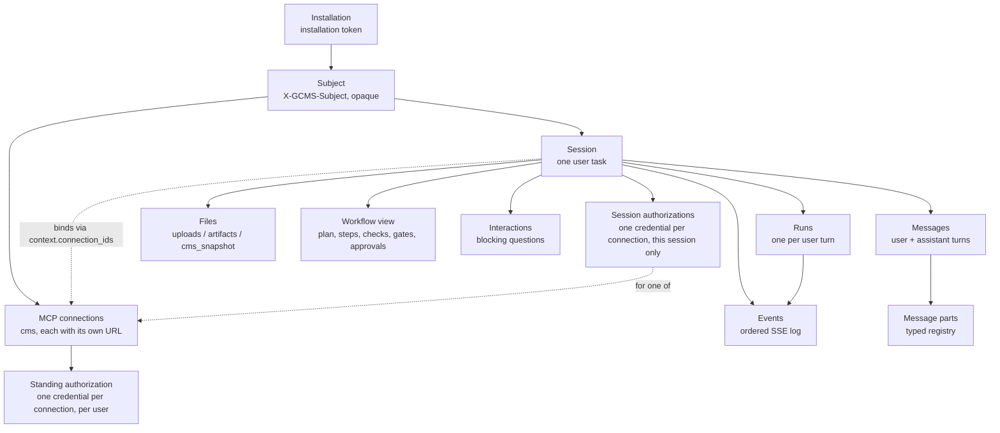
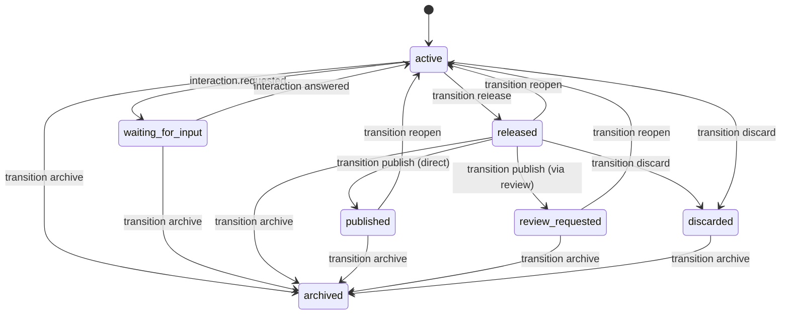

# The GenAIx API

This is the narrative guide to `openapi.yaml`, the normative contract for **GenAIx API v1**, for
the Workspace UI developer and for the team integrating the CMS authentication and streaming
proxy. Proxy implementation requirements (header forwarding, stream buffering, timeouts) are in
`09-integration-guide.md`. Every route, field, event type and part type named below exists
verbatim in `openapi.yaml`; where this document simplifies for readability, the OpenAPI file is
the tie-breaker.

Read `01-architecture.md` first for why the API is shaped this way, and
`02-auth-and-context-flow.md` for the full header and credential story. Worked examples live in
`examples/`: `session-lifecycle.md` walks the same ground with more prose, `requests.http` is the
same sequence as runnable HTTP requests, and the `.sse` transcripts are complete, schema-valid
event streams.

This API is **client-agnostic**: it describes sessions, events, parts and workflow state, never
screens or layouts. Different clients are expected to render this data differently; nothing
below constrains how a client draws anything.

## 1. Purpose and versioning policy

A GenAIx **session** is one user task: create a landing page, research the content inventory,
draft a construct, provision a user. A session accumulates **messages**; each user message
starts a **run**; a run emits an ordered **event** stream that a client renders as chat parts, a
plan, steps, checks and a CMS preview.

The contract is `v1`, served at `/api/v1`, JSON, `snake_case` field names, ISO 8601 timestamps
with an explicit offset. It is agreed by all parties and frozen for development as `1.0.0-rc.2`:
implementations build against it as it stands, and a change from here is made only by agreement,
recorded in the changelog, with a breaking change only where no additive form exists. At `1.0.0`
it is frozen and every change is **additive only**: new optional
fields, new enum members, new event types, new part types, new routes. Removing or renaming
anything requires a `v2`.

Forward compatibility is load-bearing from day one: every client **must** ignore an unknown
`event:` name (drop the frame, keep consuming, never treat it as an error) and **must** tolerate
an unknown message part type (render its `text` field if present, otherwise skip it silently,
never fail the whole message). Both rules are documented formally as `UnknownPart` and the
client-rules list on `GET /sessions/{session_id}/events` in `openapi.yaml`, and apply equally to
`schemas/events.schema.json` and `schemas/parts.schema.json`.

## 2. Base URL, headers and who calls this API

Two callers are in scope for this API, besides external LLM agents, which call `cms-mcp`
directly with their own CMS API token and never call this API at all:

1. **The CMS authentication and streaming proxy**, using server `https://{cms-host}/genaix/api/v1`.
   This is the path the Workspace UI takes. The proxy terminates the browser's CMS cookie
   session, adds the GenAIx installation bearer token, sets the identity header, and streams SSE
   through unbuffered.
2. **A local mock server** (`mocks/genaix-mock`), at `http://localhost:8080/api/v1`, for
   developing against before a production proxy is available.

| Header | Direction | Required | Meaning |
|---|---|---|---|
| `Authorization: Bearer sk_gnx_...` | request | yes, on every route including `DELETE /subjects/{subject}` | The GenAIx installation token. Identifies the CMS installation, not the user. |
| `X-GCMS-Subject` | request | yes, except on `GET /ping` and `DELETE /subjects/{subject}` | The **only** identity header: an opaque, installation-scoped, pseudonymous subject, optionally a signed assertion. Sessions are owned by `(installation token, subject)`. |
| `X-GenAIx-Request-Id` | response | always | Correlates one response with support/debugging logs. |

That is the **whole** header contract: one token, one subject, nothing else. GenAIx never holds
a CMS session cookie or secret of any kind, never learns a login name or group membership, and
never learns which person the subject stands for — it uses the value purely as the owner key of
sessions, files, connections and authorizations. Acting on the CMS as the user is a separate
concern, handled entirely by the MCP-connection model in §2.1, with its own credential
registered through its own routes, never carried as a header.

The subject may be a bare opaque string or a compact JWS assertion (`sub`, `iss`, `iat`, a short
`exp`); when the installation is configured with the signing key, GenAIx verifies the signature
and expiry and rejects anything unsigned, malformed or stale with `401 identity_invalid` — with
no key configured, the header is accepted as sent. `DELETE /subjects/{subject}` is the
installation-level counterpart: authenticated by the installation token alone, no
`X-GCMS-Subject` of its own, it erases every session, message, file, connection and
authorization of one subject, for when the CMS deletes the person behind it — the only way that
deletion can ever be triggered, since GenAIx cannot resolve a subject back to a person.

The full actor/credential table, the sequence diagrams, and the audit-header story
(`X-GenAIx-Session`, `X-GenAIx-Run`, sent from GenAIx to `cms-mcp`) are in
`02-auth-and-context-flow.md`. A request with a valid installation token but a missing or empty
`X-GCMS-Subject` is `400` with `genaix_code: subject_missing`, never treated as anonymous or as
the installation itself.

### 2.1 MCP connectors, connections and standing authorization

Acting on the CMS — or on any other system an agent needs — is not a fixed "one server per
installation" concern: GenAIx separates the **kind** of system from the **address** of a
particular instance of it.

- A **connector** is the kind: `GET /mcp/connectors` is the read-only catalogue GenAIx defines —
  `cms` is the only one in Phase One — with `type`, `transport` (`streamable_http`), `auth`
  (`type`: `none`\|`bearer`\|`oauth2`, plus a `token_hint`), `tool_groups`,
  `required_by_workflows`, `multiple` (whether a user may hold more than one connection of this
  type — `true` for `cms`), and two non-binding URL conveniences, `url_template` and
  `default_url`. **Connector types cannot be added, changed or removed through this API.**
- A **connection** is one user's address for an instance of a connector type: `GET /mcp/connections`
  lists the caller's connections; `POST /mcp/connections {connector, url, label?, default?}`
  creates one — **the client supplies the `url`**, GenAIx never derives it. URL rules: `https`
  required except for `localhost`/`127.0.0.1`; no embedded credentials, query string or fragment
  (`422 validation_failed` otherwise, and likewise for a second connection of the same type at
  the same URL). The reachability probe recorded in `status` is **informational only** — a
  connection can be registered before its server is up, and against a server that authenticates
  its transport an unauthenticated probe sees only the `401`, which counts as reachable **without
  `server_info`**; `server_info` appears once a probe ran with a credential. `label` is always
  present, the URL host by default. `PATCH`
  changes `url`, `label` or `default` (changing `url` **drops the stored credential**); `DELETE`
  removes the connection and credential, revoking nothing server-side. `409 mcp_connection_limit`
  above `max_connections_per_connector` (default 10), or when `multiple` is `false` and one
  already exists.
- **Standing authorization lives on the connection**: `GET|PUT|DELETE
  /mcp/connections/{connection_id}/authorization`. `GET` verifies **live** — it calls the
  connection's URL with the stored credential (`whoami`; `tools/list` counts as proof only for a
  connector with `auth.type: none`) and reports only whether it still works, never who it
  resolves to — and returns `status`
  (`authorized`\|`unauthorized`\|`pending`\|`invalid`\|`expired`). `PUT {auth_type: bearer,
  token, token_name?, expires_at?}` verifies before storing — `422 mcp_authorization_rejected`
  on refusal, `424` if unreachable — and stores nothing on failure; a credential whose
  `expires_at` already passed is stored as `expired`. `how_to_authorize.token_name` is
  `genaix-<installation slug>` here and `genaix-<session id>` for a session credential, so a
  client can key its token bookkeeping on it. `{auth_type: oauth2, action:
  start}` begins the MCP OAuth 2.1 flow server-side; Phase One supports `bearer` tokens only.
  This credential is
  **per user**, long-lived, and independent of any one session — the path for the
  non-integrated GenAIx UI and for tooling, where nothing mints a token per task. §2.2 covers
  the narrower, session-scoped credential the integrated path uses instead.

**The client provisions; GenAIx only verifies, stores, uses and reports.** When the installation
is configured with a CMS base URL, the first `GET /mcp/connections` a user makes auto-creates
their default `cms` connection there (`authorization_status: unauthorized`), so a client never
has to create a connection explicitly, only register a token on it — a user who wants a second
CMS calls `POST` or `PATCH` directly. GenAIx never holds a CMS session cookie and never creates a
credential on the target system itself: the client obtains the token from that system on its own
and registers it with `PUT` (the exact CMS call sequence is in `09-integration-guide.md`). GenAIx
then sends that token as the bearer credential on every call through that connection, per run,
never shared between users, so every CMS read and write runs as that user and is audited under
their name; because the token is independent of the browser session, a running agent session
survives the user logging out.

A session binds one connection per connector type its workflow requires: `SessionContext.connection_ids`
names them explicitly, or, when omitted, the user's `default` connection of each required type is
used. `CmsObjectRef.connection_id` records which connection produced each object, so an object
stays unambiguous when more than one CMS is in play. `GET /me` summarizes every connection the
user holds as `mcp_connections: [{id, connector, label, url, default, authorization_status}]`.
Anything but `authorized` removes every workflow whose non-optional `required_connectors` entry
names that type from `capabilities.workflows`. That narrowing, together with each module's own
rules and the installation configuration, is the **whole** calculation: it never involves group
membership or the manifest's `roles`, because GenAIx is never told which groups a caller belongs
to — the target system enforces permission on every tool call regardless. A client cannot
reproduce the calculation and must not try to: it offers exactly the workflow ids
`capabilities.workflows` returns, and re-reads them after registering an authorization, since a
newly authorized connection can widen the list. The list is a **hint**, not a creation rule
(`1.0.0-rc.2`): `POST /sessions` refuses only a workflow id that is not installed (`422
unknown_workflow`); a session of a workflow the caller cannot act in yet is created, and its
first run answers `auth.required`. Credentials sent in `authorizations` on the create call count
for that session at once.

**Failure is not paused, it is immediate.** When a run needs a connection with no usable
credential at either scope (§2.2), GenAIx emits `auth.required {connection_id, connector,
reason: unauthorized|invalid|expired|unreachable, how_to_fix}` and the run fails right after with
`424 mcp_authorization_required` — there is no `waiting_for_input` grace period for a connection
problem. The client registers (or re-registers) an authorization, then re-sends the message that
failed. `examples/s5-failure-and-recovery.sse` is a full transcript of exactly this. A required
connector type for which the installation offers no connection at all is not a credential problem
but a configuration error: the run fails with `503 service_unavailable` and no `auth.required`
precedes it, since there is no `connection_id` to name.

### 2.2 Session-scoped authorization

The standing authorization in §2.1 is deliberately long-lived. The **integrated path** — the
Workspace UI, and any client minting a token per task — instead scopes the credential to **one
session**, so nothing long-lived is ever stored and a GenAIx-side incident exposes only the
sessions open at the time.

- `GET /sessions/{session_id}/authorizations` lists the connections this session holds its own
  credential for, verified live — GenAIx calls the connection's URL with the stored credential
  and reports only whether it still works, never who it resolves to — as `SessionAuthorization`
  items (`connection_id`, `connector`, `status`: `authorized`\|`invalid`\|`expired`,
  `token_name?`, `expires_at?`, `registered_at`, `verified_at?`) — never the credential itself.
  A connection with no entry here simply has none at this scope.
- `PUT /sessions/{session_id}/authorizations/{connection_id} {auth_type: bearer, token,
  token_name?, expires_at?}` registers or renews it, verified live before storing — `422
  mcp_authorization_rejected` on refusal, the previous credential left untouched. `409
  session_released` once the session is `published`, `discarded` or `archived` — exactly the
  sessions whose credentials GenAIx has already deleted.
- `DELETE /sessions/{session_id}/authorizations/{connection_id}` forgets the credential in
  GenAIx — idempotent, `204` either way — without revoking it on the target system.
- `POST /sessions` accepts the same shape as `authorizations: [{connection_id, auth_type: bearer,
  token, token_name?, expires_at?}]` alongside `message` (§4), so a client creates the token on
  the target system, the session and the first turn in one round trip.

**GenAIx never creates a credential** at either scope: the client obtains the token from the
target system itself. Registering one here binds it to this session, for this session's runs
only, and it is never returned by any route, never logged, and never reaches the model — the
harness attaches it to outbound MCP calls outside the model's context.

**Lifetime.** GenAIx stops using a session credential and deletes the stored token at the first
of: the session reaching `published`, `discarded` or `archived`; the client deleting it; or
`expires_at` passing. It is **kept** through `released` and `review_requested`, since publishing
and requesting review still act on the target system.

**Precedence.** A session works through the connections named in `context.connection_ids` (§4).
For each one, GenAIx looks first for a session authorization; when none exists, or it is not
`authorized`, it falls back to the caller's standing connection authorization (§2.1). **When
both exist for the same connection, the session one wins.**

`Session.authorizations` and the workflow view's `authorizations` (§8) both carry a short
`SessionAuthorizationSummary` per credential (`connection_id`, `status`, `expires_at?`) — enough
for a reconnecting client to tell whether the session can still act before sending the next
turn, since a session credential can have expired while the client was away; `GET
/sessions/{session_id}/authorizations` has the full detail.

## 3. Resource model



A session is owned by the pair `(installation_token_id, subject)`. An unknown session id, or
one belonging to a different installation, is `404`; a session of a different subject under the
same installation is `403`. MCP connections and their standing authorizations are scoped to the
subject, not to any one session, so a connection registered once is reused by every session that
needs its connector type; a session's own authorizations (§2.2) are narrower still — bound to
that one session and gone once it is done with them. Nothing in this API is addressable outside
a session except `/me`, `/ping`, `/workflows`, `/subjects/{subject}` and the
`/mcp/connectors`/`/mcp/connections` resources.

## 4. Session lifecycle

`POST /sessions` can create a session and send its first user turn in a single call. Alongside
`workflow` (immutable afterwards, default `free_chat`), `title` and `context`, it accepts an
optional `message` — the same body as `POST /sessions/{session_id}/messages` (§5.1) — and an
optional `authorizations` array of session credentials, one per connection (§2.2). Together they
let the integrated path do everything in one round trip: create a token on the target system,
register it, create the session and send the first turn. When `message` is present, GenAIx
creates the session, derives `intent` from the message's plain rendering, appends it as the
first user turn and starts its run, all in one call: the `201` (`SessionCreated`) carries the
session plus `run_id`, `message_id` and `events_url`, so the client goes straight to the event
stream. This is the normal path for a turn the user typed, and `parts` is the shape to send — a
client with no part-aware composer sends `content` instead, the plain client variant, with the
same effect.

Leaving `message` out creates an empty session with an empty `intent`; the first turn is then
posted separately. Both flows stay valid, and the two-call flow is the one to use whenever the
turn needs an attachment: files are **per session**, so none can exist before the session id
does — a `message` sent to `POST /sessions` cannot carry `files` or a `file_ref` part (`422
validation_failed`). A turn with an attachment is therefore three calls: create the session,
upload through `POST /sessions/{session_id}/files`, then post the message with the returned
file id.

`intent` is **derived and read-only**: the plain rendering of the first user message, never a
field a client sets or patches. It stays empty until that message arrives, and it is what the
session list's `q` searches, next to `title`.

`context` is a `SessionContext`: `node_id`, `folder_id`, `language`, `template_id`, an array of
typed `ContextReference` entries, a list of `guidelines` ids, and `connection_ids` (§2.1) — the
MCP connections this session works through, defaulting to the user's `default` connection of
each required connector type when omitted. Context is **never plain text** — an at-mention, a
tree selection, a guideline or an uploaded file all arrive as a `ContextReference` (`type`, `id`,
optional `label`/`node_id`/`global_id`), so the agent resolves them through CMS tools instead of
guessing from a string.

### 4.1 Status state machine



`failed` is deliberately **not** a session status: a failure belongs to a `Run`, and the session
itself stays `active` so the user can simply retry. `archived` is a soft delete; hard deletion is
an administrative operation outside this API.

### 4.2 Transitions

`POST /sessions/{session_id}/transitions` is the single route for every status change, so a
client has one button handler and the server keeps the state machine in one place:

| `action` | from | to | starts a run |
|---|---|---|---|
| `release` | `active`, `waiting_for_input` | `released` | no (runs the gates, then cancels any active run) |
| `reopen` | `released`, `review_requested`, `published` | `active` | no |
| `publish` | `released` | `published` or `review_requested` | yes |
| `request_review` | `released` | `review_requested` | yes |
| `discard` | any except `archived` | `discarded` | no |
| `archive` | any | `archived` | no |

`release`, `reopen`, `discard` and `archive` are synchronous and return the updated `Session`
with `200`. `publish` and `request_review` are asynchronous — they go through `cms-mcp` into the
CMS — and return `202 TransitionAccepted` with a `run_id` to follow on the event stream. Whether
a `publish` results in a direct publish or a review request is decided **server-side**, from the
CMS permissions of the calling user on the target folder; the outcome is reported in the workflow
view's `approval_chain`. A `publish` the CMS converts into a review request still returns `202`,
with final status `review_requested`. `publish` accepts an optional `at` timestamp to schedule
the CMS publish.

Three details fixed in `1.0.0-rc.2`. The `202` body carries the session **as it is when the call
returns** (`released`); the outcome arrives on the stream and in the next `GET`. Repeating
`discard` on a `discarded` session or `archive` on an `archived` one is `200` with the session
and no event; only a real change appends `session.updated` with `changed: [status, updated_at]`
(`released_at` too for `release`). And `request_review` reaches the CMS only for a user who
cannot publish directly, because the CMS has no call that submits a page for review: its
`publish_page` queues the page for approval when the user lacks `publishpages`, so for such a
user `request_review` calls it and the CMS queues the page, while for a user who may publish it
is a GenAIx-side step — the session becomes `review_requested` with the approval step
`pending`, no CMS write happens, and a later `publish` performs it. `publish` maps the CMS
outcome `published` or `scheduled` to `published` and `queued_for_approval` to
`review_requested`; a CMS problem lands the run `failed` and leaves the session `released`.

**Quality gates run before `release`, `publish` and `request_review`** (§8.1), and before the
active run is cancelled on `release`, so a refusal costs the user nothing. While **any**
gate-sourced check is `warn` or `fail` and either blocking or not yet acknowledged, the
transition is refused with `409 quality_gate_failed`, carrying `failing_checks` (every such
check, blocking first), `failing_gates` (the full `GateResult` of each blocking one) and
`acknowledgeable_checks` (the non-blocking ids). A blocking failure cannot be waived: the finding has to be fixed and the gate
re-runs. A non-blocking failure must be acknowledged explicitly, by repeating the transition with
its id in `acknowledge_checks`; GenAIx then records `acknowledged_by`/`acknowledged_at` on the
`Check` and the transition proceeds.

`409 workflow_transition_invalid` when the action does not apply from the current status, `409
quality_gate_failed` when a blocking gate refuses, `423 cms_object_locked` when another CMS user
holds the object, `424` when `cms-mcp` or the CMS rejects the write.

## 5. Sending a message and consuming a run

`POST /sessions/{session_id}/messages` appends one user turn and starts exactly one run for it.
Only one run may be active per session — a second message while a run is `queued`, `running`,
`waiting_for_input` or `cancelling` is `409 run_already_active`; cancel first with
`POST /sessions/{session_id}/runs/{run_id}/cancel`, which is idempotent. The one exception is a
message whose `reply_to_interaction` names the waiting run's pending interaction: it is accepted,
the answer unblocks that run, the message joins it and no second run starts.

The request body (`MessageCreate`) carries either `parts` (the canonical, typed structure a
user composed — §5.1) or `content` (its plain-text equivalent), optional `references`
(`ContextReference[]`) and `files` (session file ids) for a client with no part-aware composer,
`reply_to_interaction` (answers a pending interaction and continues in one call), and
`options.mode`: `execute` (default) or `plan_only`, which makes the agent produce a plan and stop
without writing to the CMS.

Two response shapes, selected by `Accept`:

- `Accept: application/json` (default): `202 MessageAccepted` with `message_id`, `run_id`,
  `session_id` and `events_url`; the client follows `GET /sessions/{session_id}/events`.
  Survives a dropped connection and lets several clients share one stream.
- `Accept: text/event-stream`: the response body **is** the SSE stream of the run just started,
  beginning at `run.started`. A disconnect loses nothing, since events are persisted and
  replayable from `GET /sessions/{session_id}/events?after=<seq>`.

### 5.1 Composing a user message

`parts` is the canonical structure of a user message: an ordered list of typed elements in the
order the user composed them — text they typed, a folder or page they at-mentioned, a setting
they picked, a quote that must survive word for word, a file they attached, a filter they
selected. `content` is the **plain rendering** of those parts, so a client with no part-aware
composer can send `content` alone, and a client with one never has to build the string itself.

- `parts` present: the server derives `content` from the parts and ignores any `content` sent
  alongside it. `references` is derived from the `reference` parts, `files` from the `file_ref`
  parts.
- `parts` absent: `content` is required, and `references`/`files` carry what the user pointed at
  and attached directly.

`UserMessagePart`'s six types (`UserPartType`):

| `type` | Key fields | Renders as | What GenAIx does with it |
|---|---|---|---|
| `text` | `text` | the text itself | Glue between the other parts; carries the spacing, since parts are concatenated with nothing inserted between them |
| `verbatim` | `text`, `source` (`user` or a session file id), `label?` | the text itself | Hashed; the hash feeds the `verbatim_identical` quality gate, reported as a `Check.verification` with `unit: chars` |
| `reference` | `ref` (`ContextReference`) | `@[label]` | Resolved through the session's MCP connection; the resolved object is injected into the run's context, so the agent reads the object, not its name |
| `file_ref` | `file_id`, `mode?` (overrides the file's own) | `[[file name]]` | Attaches a session file; `mode: verbatim` puts the whole file under the same gate, hashed block by block |
| `setting` | `key`, `value`, `label?` | `#[key: value]` | Becomes a constraint for this run, reflected in `derived_settings` (and in its `corrected_by_user`), so the agent stops re-deriving what the user already decided |
| `filter` | `label`, `criteria` | `#[label]` | Passed into the search tool inputs of the run, so a research question searches what the user selected instead of what the model re-infers from prose |

The input side is **strict**, the deliberate opposite of the output registry in §7: a part whose
`type` is not one of the six above is rejected whole with `422 validation_failed`, naming the
offending part with a JSON Pointer. An unknown part on output costs a client some presentation;
an unknown part on input would silently drop something the user said, so `UserMessagePart`'s
`oneOf` is closed and `MessagePart`'s is open-ended.

**Settings typed, settings picked.** A `setting` part is the explicit path, and it remains the
shortest one: a chip says `#[language: de]` and there is nothing left to interpret. It is not the
only path. Most users state settings in the prose itself — "auf Deutsch", "unter Richtlinien", "als
Entwurf" — and GenAIx parses those out of the `text` parts rather than making the composer the only
way to be understood. The parsing happens inside GenAIx, never in the client, so a plain client
gets it too. What an inferred setting does *not* get is trust: before the first tool call that
writes to the CMS, every write-governing setting (`node`, `folder`, `template`, `language`,
`publish_at`) must have come from a `setting` part, from the session context, or from a
`settings_review` the user confirmed (§9.1). The human decides either way — by picking a chip up
front, or by accepting what was found.

**Plain-text rendering** is what `content`, the message history and the logs show, and it is the
same for every producer: `text` and `verbatim` render as themselves; `reference` as `@[label]`;
`setting` as `#[key: value]`; `file_ref` as `[[file name]]` (the name GenAIx holds for that
session file, never one the client supplies); `filter` as `#[label]`. Parts are concatenated in
order with nothing inserted between them — the spacing belongs to the `text` parts. A literal `[`
or `]` inside any label, key, value, file name or text is escaped as `\[` and `\]`, so the
rendering stays unambiguous and can be read back into parts.

**Worked example.** A client sends only `parts`, no `content`:

```json
{
  "parts": [
    {"type": "text", "text": "Create a landing page in "},
    {"type": "reference", "ref": {"type": "folder", "id": "4021", "node_id": 3, "label": "Campaigns"}},
    {"type": "text", "text": " in "},
    {"type": "setting", "key": "language", "value": "de", "label": "German"},
    {"type": "text", "text": ", based on "},
    {"type": "reference", "ref": {"type": "page", "id": "8871", "node_id": 3, "label": "Product launch 2025"}},
    {"type": "text", "text": ". The title must read exactly "},
    {"type": "verbatim", "text": "This is our Landingpage", "source": "user", "label": "Page title"},
    {"type": "text", "text": "."}
  ]
}
```

The server derives `content` = `Create a landing page in @[Campaigns] in #[language: de], based
on @[Product launch 2025]. The title must read exactly This is our Landingpage.` and `references`
from the two `reference` parts. The two `reference` parts are resolved and injected into context,
the `setting` part shows up as `derived_settings.language`, and the `verbatim` part is hashed and
handed to the `verbatim_identical` gate — the full transcript is in
`examples/s1-content-create.sse`.

**Verbatim content and uploaded files.** Locking exact wording is declared at two granularities,
both ending up as a `Check.verification`, never as a character offset into `content`:

- A `verbatim` part locks one passage, counted in characters (`unit: chars`). `source: user`
  means the user typed or pasted it; `source: <file id>` means it is a passage **quoted out of**
  that session file — GenAIx checks the quote really occurs in the file's extracted text (`422`
  if not) and hashes it the same way either way, regardless of that file's own `mode`.
- `mode: verbatim`, set at upload time or overridden per message on a `file_ref` part, locks the
  file's **wording**: GenAIx extracts its text, splits it into blocks and hashes each block, and
  the `verbatim_identical` gate verifies every block the agent **reused** appears unchanged in
  the produced CMS content (`unit: blocks`). Reused means the page carries the block, its opening
  or a stretch that resembles it — a shortened or re-worded copy is a deviation, an omitted block
  is not (the file is a source to quote from, not a document to reproduce; a module may demand
  every block through its own `verbatim_mode` input; `1.0.0-rc.2`). `mode: source` (the default)
  makes the file reference material only — the agent may read, summarise and paraphrase it, and
  nothing about it is locked, though a passage can still be locked out of it with a `verbatim`
  part.

Extraction runs **in GenAIx**, not in the model: a PDF, a Word document or an HTML upload becomes
text before the agent sees anything, so the model never receives raw binary, and the hashes on
both sides are taken from that same extracted text.

**Plain client variant.** A client with no part-aware composer sends the same turn as `content`
plus `references` and `files` instead of `parts`; the route and the run are identical, only the
composed shape on the wire differs. `examples/requests.http` shows both for the same S1 turn,
against the same session and the same uploaded PDF: request 17 sends it as `parts` (a `text`
part, a `file_ref` part locking the PDF with `mode: verbatim`, another `text` part, and a
`reference` part to the related page), with the server deriving `content` as
`...Source: [[neue-nutzungsbedingungen-ab-q3.pdf]]. Link it next to @[Garantiebedingungen].`;
request 17a is the plain client variant, typing that same instruction directly into `content`
and carrying the file id and the reference alongside it instead of inline.

### 5.2 Annotated example

A representative sample from `examples/s1-content-create.sse` (a landing page drafted from an
uploaded terms-of-service update PDF, quotes kept word for word). Comments explain what a client does with
each frame; the full transcript covers everything skipped here.

```
id: 1
event: run.started
data: {"seq":1, ..., "run":{"id":"c4e7a2b1-...", "status":"running", "trigger":"message", "message_id":"4c9a7e20-..."}}
# active_run_id on the session becomes this run's id.

id: 3
event: step.updated
data: {"seq":3, ..., "step":{"id":"st-1","label":"Read source material","status":"running", "tool_calls":0}}
# Full Step object, keyed by id - always a replacement, never a delta.

id: 5
event: tool.started
data: {"seq":5, ..., "tool_call_id":"tc-01","tool":"genaix_read_file","group":"genaix","input_summary":"Read session file neue-nutzungsbedingungen.pdf (14 pages)","step_id":"st-1"}
# input_summary is a human sentence, never raw arguments.

id: 8
event: part.delta
data: {"seq":8, ..., "message_id":"8d31b7f4-...","part_index":0,"patch_format":"append","delta":"Ich habe die neuen Nutzungsbedingungen gelesen. ..."}
# For a `text` part, delta is a plain string appended to `text`. Apply in seq order.

id: 31
event: interaction.requested
data: {"seq":31, ..., "interaction":{"id":"e3f7b1a9-...","kind":"settings_review","prompt":"Ich habe diese Einstellungen abgeleitet...","proposed":[{"key":"folder","value":"42","label":"Richtlinien","source":"context"},{"key":"language","value":"de","label":"Deutsch","source":"text","evidence":"auf Deutsch"}],"missing":[{"key":"template","options":[{"value":"17","label":"Kampagnen-Landingpage"},{"value":"21","label":"Themenseite"}]}],"step_id":"st-2"}}
# The run moves to waiting_for_input; only heartbeats flow until it resolves (seq 34,
# interaction.resolved, posted via POST /sessions/{session_id}/interactions/{interaction_id}).
# The answer is a list of setting parts; interaction.resolved carries the message_id of the
# user message those confirmed parts became, and derived_settings.updated follows at once.

id: 39
event: plan.updated
data: {"seq":39, ..., "plan":{"version":1,"summary":"New page in Policies ...","items":[{"id":"p1","kind":"create","status":"pending",...}, ...]}}
# The whole plan, every time - never a delta. version increments on every change.

id: 48
event: tool.started
data: {"seq":48, ..., "tool":"create_page","group":"content_write","input_summary":"Create page \"Neue Nutzungsbedingungen ab Q3\" in folder 42 from template 17, language de, unpublished","step_id":"st-5"}
# The one write path: every CMS mutation goes through a content_write (or constructs/admin) tool.

id: 69
event: preview.updated
data: {"seq":69, ..., "cms_ref":{"type":"page","id":9142,"node_id":3}, "preview_url":"https://cms.example.com/alohapage?realid=9142&nodeid=3&mode=view","mode":"view","changed_elements":["content_1","content_2","content_3","content_4"]}
# Fires after every CMS write affecting the preview. Reload the iframe.

id: 70
event: check.updated
data: {"seq":70, ..., "check":{"id":"chk-verbatim-identical","severity":"pass","blocking":true,"source":{"type":"gate","id":"verbatim_identical"},"gate_id":"verbatim_identical","kind":"script","evidence":{"unit":"chars","source_sha256":"...","target_sha256":"..."},"verification":{"locked":true,"matched_units":312,"total_units":312,"unit":"chars","identical":true,"source_sha256":"...","target_sha256":"..."}}}
# A quality-gate check, not an agent self-report: source.type is gate, gate_id names the
# gate, kind says it is a deterministic script. identical is what a lock badge renders.
# Every gate bound to st-5 reports here, before the step's own step.updated done.
# blocking is true only because the manifest says so AND the verdict would be fail.

id: 91
event: run.completed
data: {"seq":91, ..., "run":{"status":"completed","step_count":6,"tool_call_count":13}, "usage":{"input_tokens":18422,"output_tokens":2914,"model":"claude-sonnet-5"}}
# Terminal. active_run_id clears on the session; the session itself stays active.
```

## 6. The event model

`GET /sessions/{session_id}/events` is the **canonical** stream — everything else (the SSE
convenience on `POST .../messages`, the workflow snapshot route) is either a subset or a
point-in-time read of the same log. Events are persisted with a total, gapless, never-reused
order per session (`seq`, starting at 1), which is also the SSE `id:` field. A frame looks like:

```
id: 17
event: part.delta
data: {"seq":17,"ts":"2026-10-07T09:23:02Z","session_id":"...","run_id":"...","type":"part.delta","message_id":"...","part_index":1,"delta":"..."}
```

### 6.1 Ordering, replay, heartbeat, reconnect

- **Resume** with `?after=<seq>` or the `Last-Event-ID` header (`EventSource` sends the latter
  automatically); when both are present `Last-Event-ID` wins. The server replays every persisted
  event with `seq > N`, then follows live. `after=0` (default) replays the whole session.
- **Heartbeat** every 15 seconds of silence. Heartbeats consume a `seq` and are persisted, so
  `after` arithmetic needs no special case.
- **Pruning**: `410 events_pruned` when `after` points before the retention window. Re-hydrate
  through `GET /sessions/{session_id}/messages` and `.../workflow`, then reconnect with
  `after=0`.
- **Lifetime**: by default the stream stays open for the whole session, carrying every
  subsequent run's events too. `?follow=false` closes it right after the terminal event of the
  active run, or right after the replay if none is active.
- **Filtering**: `?types=` limits delivery to the listed event types; `heartbeat`,
  `run.completed`, `run.failed`, `run.cancelled` and `error` are always delivered regardless.
  `?run_id=` scopes to one run.
- **Server rules** (`1.0.0-rc.2`, what a client may rely on): the server subscribes live
  before it replays, so nothing in between is lost or doubled; a filtered-out event still
  advances the cursor, so the last `id` seen is always the next `after`; `follow=false` looks
  for an active run after the replay and closes on the first terminal run event; an unknown
  name in `types=` matches nothing; `run_id=` of another session's run is `404 run_not_found`;
  `410` applies exactly when `after + 1` is below the lowest retained `seq`.

Every event extends `BaseEvent` (`seq`, `ts`, `session_id`, `run_id?`, `type`). The full catalogue:

| Event | When | Payload carries | Client action |
|---|---|---|---|
| `session.updated` | Status, title, context, labels or `cms_objects` changed; not `active_run_id` alone, which the run events imply | `session`, `changed` | Replace local session state |
| `run.started` | A run began | `run` | Show the agent as working |
| `run.completed` | Run finished. Terminal | `run`, `usage` | Clear working state |
| `run.failed` | Run failed. Terminal | `run`, `error` (Problem; `model_rate_limited` when the model provider throttled the run), `usage` | Show the error; session stays `active` |
| `run.cancelled` | Run was cancelled. Terminal | `run`, `usage` | CMS writes are not rolled back |
| `message.started` | An assistant message begins | `message_id`, `role` | Create the message shell |
| `message.completed` | The message is final and persisted | `message_id`, `part_count`, `usage` | Safe to refetch from history |
| `part.started` | A part begins, with its initial shape | `message_id`, `part_index`, `part` | Render the skeleton |
| `part.delta` | Incremental update | `message_id`, `part_index`, `delta`, `patch_format` | Append string, or apply merge patch |
| `part.completed` | A part is final | `message_id`, `part_index`, `part` (authoritative) | Replace local copy |
| `status` | Short human status line | `text`, `kind`, `step_id?` | Drive the thinking indicator |
| `tool.started` | An MCP tool call began | `tool_call_id`, `tool`, `group`, `input_summary`, `cms_objects?` | Optional transparency line |
| `tool.completed` | Tool call returned | `tool_call_id`, `ok`, `output_summary`, `duration_ms`, `result_count?` | Correlate by `tool_call_id` |
| `tool.failed` | Tool call errored | `tool_call_id`, `error` | Non-fatal; agent may retry |
| `plan.updated` | The work plan changed | `plan` (whole object, versioned) | Full replace, never merge |
| `step.updated` | One step (or substep) changed | `step`, `parent_step_id?` | Full replace, keyed by id |
| `check.updated` | One check result changed; one check per gate execution, `chk-<gate id>`, re-emitted on every attempt | `check` | Full replace, keyed by id |
| `derived_settings.updated` | The correctable folder/template/language/filename card changed | `derived_settings` | Full replace |
| `approval_chain.updated` | The resolved approval chain changed | `approval_chain` (whole array) | Full replace |
| `artifact.created` | Agent wrote a new session file | `file` | Add to the file list |
| `artifact.updated` | An artifact was rewritten | `file` (new `sha256`) | Replace the file entry |
| `preview.updated` | A CMS write affecting the preview happened | `cms_ref`, `preview_url`, `mode`, `changed_elements?` | Reload the preview iframe |
| `interaction.requested` | The agent needs an answer; run blocks | `interaction` | Render the question |
| `interaction.resolved` | Interaction answered, timed out or cancelled | `interaction_id`, `answer?`, `by`, `message_id?` | Clear the blocking UI; `message_id` names the user message a confirmed `settings_review` produced |
| `auth.required` | A run needs an MCP connection it cannot use; run fails right after | `connection_id`, `connector`, `reason`, `how_to_fix` | `PUT .../authorization`, then re-send |
| `heartbeat` | Every 15 s of silence | nothing beyond `BaseEvent` | Keep the connection open |
| `error` | A non-terminal or terminal error | `error` (Problem), `recoverable` | If not recoverable, `run.failed` follows |

Four binding client rules: ignore unknown event types; ignore unknown part types, falling back
to `text`; treat `plan.updated`, `step.updated`, `check.updated`, `derived_settings.updated` and
`approval_chain.updated` as idempotent full replacements, never deltas; apply `part.delta` in
`seq` order but trust the next `part.completed` over any locally accumulated state.

## 7. The message-part registry

Both user and assistant turns are expressed as `parts`, so the same renderer handles message
history and the live stream, but the two sides use two different registries. A **user** message
carries `UserMessagePart` items — exactly the six types in §5.1, closed, rejected on input if a
`type` is unknown. A user message can additionally carry `interaction_id`: it is set on the
message GenAIx writes when a `settings_review` resolves, whose parts are exactly the `setting`
parts the user confirmed (§9.1), and it points back at that review. It is absent on the messages a
client posted itself, so history distinguishes what the user typed from what the user confirmed
without either being the agent's word for it. An **assistant** or **system** message carries `MessagePart` items, the
open-ended registry below: `PartType` is the closed list of v1.0 part types, but a part outside
it is still valid on the wire — a client renders the `UnknownPart` fallback (show `text` if
present, otherwise skip it, never fail the message). This section covers the assistant-side
registry; §5.1 covers the user-side one.

| `type` | Purpose | Key fields | Streamed incrementally as |
|---|---|---|---|
| `text` | Prose | `text`, `format` (`markdown`\|`plain`) | `part.delta` appends a string |
| `status_note` | Short persisted note, distinct from the transient `status` event | `text`, `kind` (`info`\|`warning`\|`skipped`) | string append |
| `tree_view` | Folder/structure tree, e.g. candidate folders | `nodes` (recursive `TreeNode`) | merge patch |
| `selectable_list` | In-transcript pick list; doubles as the rendering of a `choice` interaction | `items`, `multi`, `selected?`, `interaction_id?` | merge patch |
| `properties_list` | Key/value card, e.g. derived settings shown inline | `items` (`key`, `label`, `value`, `editable?`, `ref?`) | merge patch |
| `image_grid` | Image candidates, e.g. a hero image choice | `items` (`id`, `url`, `alt?`, `ref?`, `selected?`) | merge patch |
| `table` | Report rows | `columns`, `rows`, `total?`, `source?` | merge patch (whole `rows` resent on change) |
| `page_structure` | Which blocks a page will have, which construct, how far each got | `page_ref?`, `blocks` (`construct_keyword`, `status`, `verbatim?`, `tag_keyword?`) | merge patch, blocks move `planned` → `created` |
| `construct_draft` | A construct draft with template and validation | `keyword`, `name`, `parts` (the editable parts only, never the type 43 template part), `template` (Handlebars, parts addressed as `cms.tag.parts.<keyword>`), `validation`, `created_ref` | merge patch |
| `api_call_log` | Transparency list of CMS calls a step made | `calls` (`method`, `path`, `summary`, `status`, `tool?`) | merge patch |
| `citation` | Grounding for an answer | `refs` (`ref`, `snippet?`, `score?`, `marker?`); a `ref` of type `document` points at a non-CMS source such as a knowledge-corpus page | merge patch |
| `file_ref` | Download chip for a session file | `file_id`, `name?`, `media_type?`, `kind?` | sent complete, not streamed |

`part.delta`'s `patch_format` says which payload shape it carries: `append` (a string, for `text`
and `status_note`) or `merge_patch` (a JSON merge patch per RFC 7386, for every structured part).
Merge patch replaces arrays wholesale, which is why `page_structure.blocks`, `table.rows` and
similar arrays are resent in full whenever one entry changes.

## 8. The workflow view

`GET /sessions/{session_id}/workflow` returns one `WorkflowState` snapshot — the reconnect
counterpart of `plan.updated`, `step.updated`, `check.updated`, `approval_chain.updated` and
`derived_settings.updated`. A client hydrates once from this route and then keeps the same state
current purely from the event stream.

- **`state`**: the coarse phase, derived and never stored (`1.0.0-rc.2` publishes the rule, in
  order of precedence): session `discarded`/`archived` → `discarded`; `published` → `done`;
  `released`/`review_requested` → `awaiting_approval`; `waiting_for_input` → `awaiting_feedback`;
  an active run without a plan → `planning`, with a plan → `executing`; no run yet →
  `not_started`; last run `failed` → `failed`; otherwise, the agent finished its turn and waits for
  the user → `awaiting_feedback`.

- **`plan`**: `{version, summary, items}`. `items` are `PlanItem`s (`id`, `label`, `kind`:
  `create`\|`update`\|`link`\|`translate`\|`publish`\|`construct`\|`report`\|`other`, `target?`,
  `status`). Versioned and replaced wholesale on every change.
- **`steps`**: `Step` objects (`id`, `label`, `status`: `pending`\|`running`\|`done`\|`skipped`\|
  `failed`\|`waiting`, `detail?`, `substeps?`, `tool_calls?`). `waiting` means blocked on a user
  interaction, not on the model. Always sent whole, so `step.updated` is idempotent. The catalogue's
  `steps_template` carries the same `substeps`, so the rail with its substeps can be rendered
  before the first `step.updated`.
- **`checks`**: `Check` objects (`id`, `label`, `severity`: `pass`\|`info`\|`warn`\|`fail`,
  `blocking`, `message`, `source`, `suggested_actions?`). `blocking` is a property of the check,
  not of severity. A verbatim-reuse check carries a `verification` object: `locked`,
  `matched_units`, `total_units`, `unit` (`chars`\|`blocks`\|`files`), `identical` (the lock
  badge boolean), plus up to 20 `deviations` when it failed. When `source.type` is `gate` the
  check came from a quality gate, not the agent (§8.1): `gate_id`, `kind`
  (`script`\|`subagent`\|`prompt`\|`human`) and `evidence` carry what the gate observed; an
  agent self-report through `report_check` has a non-`gate` source, `kind: prompt` and
  `blocking: false`. On a gate check `blocking` is the manifest's flag **and** a `fail` verdict,
  so a blocking gate's `warn` is an acknowledgeable non-blocking check; there is exactly one
  check per gate execution, `chk-<gate id>`. `acknowledged_by`/`acknowledged_at` are set once a
  non-blocking finding is accepted through `acknowledge_checks` (§4.2).
- **`gates`**: one `GateResult` per declared quality gate, in manifest order, so the full gate
  list renders before anything has run; `attempt` counts every execution and the record is the
  latest one. Covered in §8.1.
- **`approval_chain`**: ordered `ApprovalStep`s (`actor`, `status`: `pending`\|`done`\|
  `not_required`\|`rejected`, `reason?`), resolved **server-side** from the CMS permissions on
  the target folder — how a client explains "direct publish" versus "goes to review". The `user`
  actor carries no id or label (GenAIx never exposes who a subject is); a `group` actor carries
  the approving group's id and name once the CMS answered. The chain is resolved during the run
  right after the page is created and again at the transition.
- **`derived_settings`**: the correctable card — `node`, `folder`, `template`, `language`,
  `publish_at`, `filename`, `url`, `permission_used` and `corrected_by_user`. `null` for
  workflows that write nothing (a module whose `produces` is empty or only `report`, such as
  `content_research`). `corrected_by_user` lists the keys the user decided rather than the agent:
  those sent as `setting` parts, and those confirmed through a `settings_review` (§9.1), which
  emits a `derived_settings.updated` naming every confirmed key the moment it resolves. A key
  listed there is not re-derived again in this session. The write-governing settings — `node`,
  `folder`, `template`, `language`, `publish_at` — must be a `setting` part, session context or
  a confirmed review before the first CMS write; a review is raised at most once per run, batched,
  and only when one of them was inferred from the user's text or is missing altogether. A user
  correction outside a run is sent through `PATCH /sessions/{session_id}` with a complete,
  replaced `context` object.
- **`preview`**: the CMS preview of the object the session produced — pages only in Phase One.
- **`cms_objects`**: every `CmsObjectRef` created or touched, each with an `operation`
  (`created`\|`updated`\|`linked`\|`published`\|`taken_offline`\|`deleted`\|`read`) and,
  when session-recorded, a `connection_id`. `read` is recorded for single-object reads
  (`get_page`, `get_template`, `get_file`, `get_image`, `get_page_tags`, `get_page_versions`,
  `render_preview`, `get_construct`, `get_datasource`); a search, list, count or permission call
  touches nothing and reports a `result_count` on its `tool.completed` instead, and a later read
  never demotes a write. `url` is the CMS tool's `url`, else `niceUrl`, else `path`.
- **`pending_interaction`**: the interaction the run is blocked on, if any, so a reconnecting
  client can re-render the question without replaying the stream.

`GET /workflows` is the catalogue a client reads once (cacheable): Phase One ids are
`content_create`, `content_research`, `construct_create`, `admin_user` (optional) and
`free_chat` (no workflow rail). Each entry carries a `steps_template` the client draws before the
agent has reported anything; the reported `Step.id` values match the template's `id`s. Beyond
that each `Workflow` carries `version` (echoed on the session as `Session.workflow_version`),
`inputs_schema` (workflow-specific settings beyond `context`), `required_connectors` (a list of
`{type, optional?}` objects), `tool_groups` (the allowlist the module is confined to, **keyed by
connector type**, e.g. `{cms: [identity, search, content_read, content_write], genaix:
[harness]}`), `quality_gates` (§8.1), and `available`/`reason`: whether *this* user may start the
module right now. A session's `WorkflowState` also reports `workflow_version_drift: true` when
the installation has since loaded a newer module revision.

### 8.1 Workflow modules and quality gates

A workflow is not a state machine the model interprets — it is a **module** the GenAIx harness
loads and executes, and the checks it enforces are not the model's self-report. A `QualityGate`
(`id`, `label`, `kind`: `script`\|`subagent`\|`prompt`\|`human`, `blocking`, `when`:
`step_end`\|`before_release`\|`before_publish`) is declared on the module: `script` is
deterministic code (a Handlebars compile, a verbatim hash comparison, a link check); `subagent`
is a reviewer agent with read-only tools and a structured verdict; `prompt` is an
advisory model self-check that can never be `blocking`; `human` is an explicit
`interaction.requested {kind: confirm}`. Only `script` or `subagent` can set a blocking `Check`.

Execution is tracked as a `GateResult` (`gate_id`, `label`, `kind`, `blocking`, `when`, `status`:
`pending`\|`running`\|`passed`\|`failed`\|`skipped`\|`error`, `verdict?`:
`pass`\|`warn`\|`fail`\|`error`, `attempt`, `check_ids`, `evidence_file_id?`), one per declared
gate, surfaced in `WorkflowState.gates`. `status` and `verdict` deliberately differ: a gate
configured to treat its own errors as non-blocking ends `status: error` with a `warn` check,
rather than pretending to have passed. A blocking gate re-runs with `attempt` incremented each
time the agent fixes what it reported.

Module layout, the manifest and verdict JSON Schemas, the four gate kinds in detail, the full
gate catalogue per scenario, timeouts, retries and the security boundary around gate execution
are in `08-workflow-modules.md`.

## 9. Interactions

An `Interaction` is a blocking question: `kind` is `ask_user`, `choice`, `confirm`, `form` or
`settings_review`. The run and the session both move to `waiting_for_input`; the event stream
stays open, carrying only heartbeats until the question resolves.

| `kind` | `answer` shape | Used for |
|---|---|---|
| `ask_user` | `{"text": "..."}`, ≤4000 chars | Free-text clarification |
| `choice` | `{"selected": ["option-id", ...]}`, one id unless `multi: true` | Picking among `options` (e.g. which template) |
| `confirm` | `{"approved": bool, "comment"?: "..."}` | Yes/no gates (e.g. "create it as a draft?") |
| `form` | `{"values": {...}}`, validated against `interaction.schema` | Structured input (e.g. construct metadata) |
| `settings_review` | `{"settings": [UserSettingPart, ...], "comment"?: "..."}` | Confirming the settings GenAIx inferred from the user's text, and supplying the ones it could not derive (§9.1) |

Resolve with `POST /sessions/{session_id}/interactions/{interaction_id}` (the blocked run
continues on the same stream), or with `reply_to_interaction` on the next `POST .../messages`
call when the user types into the composer instead of clicking a dedicated control.

Every interaction has a default **10-minute** expiry (`expires_at`, configurable per
interaction); the client then sees `410 interaction_expired` and should send a new message
rather than retry the answer. A second answer to an already-resolved interaction (a double submit
from two tabs) is `409 interaction_already_answered`. `blocking` is always `true` in v1.0.
Cancelling the run (`POST .../runs/{run_id}/cancel`) while an interaction is pending resolves it
with `by: cancel` and ends the run in the usual cancellation path (§12).

### 9.1 The settings review

A user states settings in plain text far more often than through a chip — "auf Deutsch", "unter
Richtlinien", "als Entwurf". GenAIx parses that text itself, but a setting it inferred is never
used for a CMS write until the user has confirmed it. `settings_review` is that confirmation: one
blocking question carrying everything the run believes about the settings, answered with real
`setting` parts.

The interaction carries two arrays instead of `options`:

- **`proposed`**: `{key, value, label, source, evidence?, options?}` — the settings the run
  already has. `key`, `value` and `label` are exactly the fields of a `setting` part.
  `source` says where the value came from: `text` (inferred from the user's own words),
  `context` (taken from the session context) or `default` (an installation default; none exists
  in Phase One, so the value is reserved and never produced).
  `evidence` is the quoted fragment of the user's text an inference rests on, present only for
  `source: text`, so the review can show *why* a value was picked. `options` lists
  `{value, label, ref?}` alternatives when a real choice exists, for instance two qualifying
  templates.
- **`missing`**: `{key, label, options?}` — settings the run needs, could not derive, and asks
  the user to supply.

`prompt` stays the human sentence introducing the card ("Ich habe diese Einstellungen aus deinem
Text abgeleitet. Passt das so, bevor ich die Seite anlege?"). A part-aware client renders `proposed` and `missing` as
prefilled, editable chips; a plain client sees an ordinary interaction and answers it like any
other. Either side may raise the review (`1.0.0-rc.2`): the agent, through its
`request_interaction` tool, with its own wording in the user's language and the template options
it found — the S1 transcript shows this — or the harness itself, before the first CMS write,
when the agent reached a write without asking, with a neutral English `prompt`. One review per
run either way; a client renders the two arrays and treats `prompt` as the sentence above them
whoever wrote it. Template `options` come from the templates the target folder allows
(`list_templates` scoped to the folder), so they are absent while no folder is known.

The answer is `{"settings": [...], "comment"?: "..."}`. `settings` is a list of `setting` parts
and must contain every `proposed` and every `missing` key, carrying the value the user accepted
or corrected; additional keys the user chose to add are allowed and become constraints for the
run like any other `setting` part. A missing key is `422` with `errors[].pointer`
`/answer/settings` and the detail `No setting part for '<key>'.`; a value that is not one of a
`missing` key's `options` is `422` with a pointer ending in `/value` and `code: not_an_option`.
As with every interaction, the answer goes either to
`POST /sessions/{session_id}/interactions/{interaction_id}` or to `reply_to_interaction` on the
next `POST .../messages`; answered the second way, the review yields **two** stored user
messages, the confirmation and the reply itself.

On resolution GenAIx stores a **user-role message whose `parts` are exactly the confirmed
`setting` parts**, with `Message.interaction_id` pointing back at the review, and
`interaction.resolved` carries that new `message_id` (§6). The history therefore reads
`#[folder: Richtlinien] #[language: de]` as the user's own decision, not as something the agent
assumed. Immediately afterwards `derived_settings.updated` lists every
confirmed key in `corrected_by_user`, and the agent stops re-deriving those keys for the rest of
the session. The confirmed `folder_id`, `template_id`, `language` and `publish_at` also become the
`Session.context` (`session.updated` with `context` in `changed`), so the next run starts from the
decision; the other way round, a `PATCH` of `context` lists its changed keys in
`corrected_by_user`.

**The write rule.** The write-governing settings — `node`, `folder`, `template`, `language` and
`publish_at` — must have come from a `setting` part, from the session context, or from a
confirmed `settings_review` before the first tool call that writes to the CMS. Read and search
tools may run before the review, so the agent can look around before it asks. Every other key is
advisory and never blocks a run. Which keys a run *needs*: for a module that produces a page,
`folder`, `template` and `language` are required before the first write and appear in `missing`
when they cannot be derived; `node` follows from the folder and `publish_at` matters only for
`publish`, so both are reviewed only when they were read out of the text. A module that produces
no page needs none of them. GenAIx holds the write-tool call itself until the review is answered,
so no write `tool.started` ever precedes the review's `interaction.resolved` on the stream.

**When a review is raised.** At most one per run, batched into a single question, and only when
at least one write-governing setting was inferred from text (`source: text`) or is missing.
Settings that came from a chip, from the session context, or that are already in
`corrected_by_user` are not asked again — they may still appear in `proposed` with
`source: context` so the card is complete, but they do not by themselves cause a review. If
everything the run needs is already covered, no review is raised at all.

Expiry, double answers and cancellation follow §9 unchanged: a review that times out or is
cancelled ends the run without a CMS write, exactly as an unanswered `choice` would.

## 10. Files and the per-session filesystem

Every session has its own filesystem, laid out on GenAIx's disk as
`<base>/sessions/<session_id>/{uploads,artifacts,cms}/`. `FileKind` names the subdirectory a
`File` lives in: `upload`, `artifact` (written by the agent's `write_artifact` tool — drafts,
reports, plans), or `cms_snapshot` (a CMS object's state saved before a change, for comparison
and audit).

`POST /sessions/{session_id}/files` is a multipart upload (`file`, `mode`, optional `purpose`).
`mode: verbatim` declares the file's wording locked: GenAIx extracts its text, splits it into blocks
and hashes each one, and the `verbatim_identical` gate verifies every block the agent reused
appears unchanged in the produced CMS content, proven later by a `Check.verification` with `unit:
blocks` (§5.1; what "reused" means is in §5.1 too). `mode: source` (default) means the agent may
paraphrase; a passage can still be locked out of a `source` file with a `verbatim` part. Limits:
25 MB per file by default (`capabilities.upload_max_bytes` from `GET /me`), `413 file_too_large`
above it, `422 unsupported_media_type` for a type outside `capabilities.upload_media_types`. ZIP
is accepted but not unpacked in Phase One. The stored `name` is the uploaded filename kept
verbatim (path separators, control characters and leading dots removed; a repeated name in one
session becomes `<name>-1`, `<name>-2`), which is what a `file_ref` renders as `[[name]]`. The
declared `Content-Type` is authoritative for text types; a declared binary type (PDF, PNG, JPEG,
WEBP, ZIP, DOCX) is checked against its magic number and answers `422` when the bytes disagree
(`1.0.0-rc.2`).

`GET /sessions/{session_id}/files` lists uploads, artifacts and CMS snapshots together, newest
first, filterable by `kind`; `GET .../files/{file_id}` returns metadata; `GET
.../files/{file_id}/content` streams the bytes with `Content-Disposition: attachment` and an
`ETag` equal to the stored `sha256`; `DELETE .../files/{file_id}` removes the entry (`409` while a
run is active, because the agent may be reading it — the id stays referenced by past messages,
which render a missing-file chip).

## 11. Errors

Every error is RFC 9457 `application/problem+json`: `type` a stable URI under
`https://genaix.gentics.com/problems/`, `status` the repeated HTTP code, `detail` a safe-to-show
explanation, `instance` the request path, and `genaix_code` — the field clients should branch on,
since it keeps its exact string across contract versions. Every response also carries
`X-GenAIx-Request-Id`, repeated in the body as `request_id`.

| HTTP status | Meaning | Representative `genaix_code` values |
|---|---|---|
| 400 | Malformed request; credentials were fine | `subject_missing`, `malformed_request`, `invalid_cursor` |
| 401 | Installation token missing, unknown or revoked, or a signed `X-GCMS-Subject` failed verification | `invalid_installation_token`, `identity_invalid` |
| 403 | Exists, but owned by a different subject under this installation | `session_forbidden` |
| 404 | Unknown id, or an id belonging to another installation | `session_not_found`, `run_not_found`, `file_not_found`, `interaction_not_found`, `mcp_connection_not_found` |
| 409 | State conflict | `run_already_active`, `session_released`, `workflow_transition_invalid`, `interaction_already_answered`, `quality_gate_failed`, `mcp_connection_limit` |
| 410 | Resource existed, no longer available | `interaction_expired`, `events_pruned` |
| 413 | Upload over the configured limit | `file_too_large` |
| 422 | Body parsed but failed validation, or a connection's credential was refused | `validation_failed`, `unsupported_media_type`, `unknown_workflow`, `mcp_authorization_rejected` |
| 423 | CMS object locked by another user | `cms_object_locked` (carries `locked_by`, `locked_since`, `cms_object`) |
| 424 | A dependency failed (an MCP connection, CMS REST, the model provider) | `mcp_authorization_required`, `mcp_unreachable`, `cms_request_failed`, `model_error`, `model_rate_limited` (the provider throttled the run; retry later) |
| 429 | Rate limited | `rate_limited` (with `Retry-After` and `retry_after_seconds`) |
| 503 | GenAIx cannot serve; safe to retry | `service_unavailable` |

`mcp_connection_limit` (409, on `POST /mcp/connections`) means the user already holds
`max_connections_per_connector` connections of that type, or the type's `multiple` is `false`
and one already exists. `mcp_authorization_rejected` (422) means the target system refused a
credential just registered — at either scope, session (`PUT
/sessions/{session_id}/authorizations/{connection_id}`, or `authorizations` on `POST /sessions`)
or standing (`PUT /mcp/connections/{connection_id}/authorization`); nothing is stored either
way. `mcp_authorization_required` (424) is the mid-run
version: a connection the run needed has no usable credential at either scope; both carry
`connection_id` and `connector`. `424` carries an `upstream` object (`service`, `url?`, `tool?`,
`status?`, `message?`, `cms_response_code?`) so a client can show something actionable without
leaking credentials. Registering or renewing a session credential on a session that is
`published`, `discarded` or `archived` is `409 session_released` — exactly the sessions whose
credentials GenAIx has already deleted (§2.2). `PATCH /sessions/{session_id}` is `409
workflow_transition_invalid` on an `archived` **or `discarded`** session; every other status is
editable.

A `422 validation_failed` carries `errors[]` with a JSON Pointer into the body **as sent**,
never into a discriminator branch: a bad member of a `text` part is `/parts/0/format`, an
unknown part type points at the item (`/parts/1`), a bad bearer `token` is `/token`. The
`errors[].code` values a client may branch on (`1.0.0-rc.2`, growing additively): `missing`,
`file_not_found`, `passage_not_found` (a `verbatim` quote not in its file, pointer
`/parts/N/text`), `not_an_option` (a `settings_review` value off the key's `options`),
`invalid_url`, `duplicate` (a second connection at the same URL).

Mid-run failures mostly arrive as **events**, not status codes: `tool.failed` is usually
recoverable, while an `error` event with `recoverable: false` is immediately followed by a
terminal `run.failed` carrying the same `Problem` an equivalent REST call would return.
`auth.required` does **not** pause the run in `waiting_for_input` — it fails immediately with a
matching `424 genaix_code`, and the client registers (or re-registers) an authorization (§2.1)
before re-sending. `examples/s5-failure-and-recovery.sse` walks through this end to end. See the
full sequence diagrams in `02-auth-and-context-flow.md`.

## 12. Cancellation and timeouts

`POST /sessions/{session_id}/runs/{run_id}/cancel` asks a run to stop: it moves to `cancelling`,
the agent is interrupted at the next safe point, and the stream ends with `run.cancelled`. CMS
writes already made are **not** rolled back — they are listed in the session's `cms_objects` and
in the workflow view. Cancelling a run that is already `cancelling`, `completed`, `failed` or
`cancelled` is `202` with no effect — idempotent, so a client never needs to check status first.

Interaction timeouts are covered in §9 (default 10 minutes). There is no separate run-level
timeout; a run ends only on `run.completed`, `run.failed`, `run.cancelled`, or a cancel.

## 13. Pagination

`GET /sessions`, `GET /sessions/{session_id}/messages` and `GET /sessions/{session_id}/files` all
page the same way: a `limit` parameter and an opaque `cursor`, returning `{items, next_cursor}`
with `next_cursor: null` on the last page. Sessions list newest-`last_activity_at`-first; messages
list oldest-first (so a client appends as it paginates forward); files list newest-first. A stale
or malformed cursor is `400 invalid_cursor` — restart from the first page rather than retry the
same cursor.

## 14. Scenario walkthroughs

Each mandatory scenario maps to one `workflow` id and one example transcript. `requests.http`
contains every operation used below as a runnable request; the `.sse` files are the complete
event transcripts.

- **Content creation** (`workflow: content_create`, `examples/s1-content-create.sse`): confirm
  the `cms` connection is authorized — the standing per-user authorization (registering a token
  once, requests 9-10) or a session credential registered once the session exists (`PUT
  /sessions/{session_id}/authorizations/{connection_id}`, requests 12b-12d; §2.2) — →
  `POST /sessions` with `context.node_id` and a `page` reference, no `message` yet because the
  turn needs an upload (the two-call flow; request 12) → upload the source PDF (`mode:
  verbatim`, request 13) → `POST .../messages` as typed parts, locking the PDF with a `file_ref`
  part (request 17; request 17a is the plain client variant) → follow `GET .../events`,
  answering the `settings_review` interaction that confirms folder and language and picks the
  template (§9.1) → watch `plan.updated`, `step.updated`,
  `preview.updated` and the gate-produced `check.updated {gate_id: verbatim_identical}` arrive →
  `GET .../workflow` for the full panel snapshot, including `gates` and `authorizations` →
  release, then publish.
- **Content research** (`workflow: content_research`, `examples/s2-content-research.sse`):
  `POST /sessions` with just `context.node_id` (no `message`, no files) → `POST .../messages`
  with the research question, which derives the session's `intent` → the run calls
  `search_content` one or more times, with no CMS writes → the answer streams as a `table` part
  plus a `citation` part → `derived_settings: null` and an empty `cms_objects` reflect the
  read-only nature of this workflow.
- **Construct creation** (`workflow: construct_create`, `examples/s3-construct-create.sse`):
  the run checks `list_constructs` for a keyword collision and a similarity shortlist, drafts a
  `construct_draft` part with the Handlebars template, validates it, and raises a `confirm`
  interaction before calling the CMS → `create_construct` and `assign_construct_to_nodes` appear
  as tool events and as an `api_call_log` part → a preview renders the new construct.
- **Admin user provisioning** (`workflow: admin_user`, optional, `examples/s4-admin-user.sse`):
  same shape, with a `form` interaction collecting the new user's data, a
  `preview_permission_impact` tool call reported before any write, then `create_user` and
  `assign_user_to_group`.

Not one of the four core scenarios, but worth exercising: `examples/s5-failure-and-recovery.sse` walks a
recoverable `tool.failed` (a locked CMS page, the run continues) next to an unrecoverable one
(the session's credential for the `cms` connection is refused, `auth.required` fires, the run
ends `424 mcp_authorization_required`), then the client registering a fresh session credential
(`PUT /sessions/{session_id}/authorizations/{connection_id}`) and
re-sending the same message.

## 15. Compatibility and known limitations

- `X-GCMS-SID`, `X-GCMS-User-Token`, `X-GCMS-User-Id`, `X-GCMS-User-Login` and
  `X-GCMS-User-Groups` do not exist in this API. `X-GCMS-Subject` is the only identity header:
  an opaque, pseudonymous, installation-scoped value, trusted only with a valid installation
  token, and never resolved by GenAIx to a person, a login or a group membership.
- The internal GenAIx maintenance UI uses a separate authentication path (Keycloak OIDC),
  unrelated to the Workspace-facing contract described here.
- The earlier single-turn ask-and-answer mechanism is generalised into the `Interaction` shape
  covering `ask_user`, `choice`, `confirm`, `form` and `settings_review`. An older endpoint for
  answering such questions remains available for backward compatibility.
- Previous integrations assumed one implicit CMS connection. This API models MCP connections
  explicitly, so a workflow can require one or more connector types and a user can hold more
  than one connection of a type; the Workspace path still ends up with exactly one `cms`
  connection, auto-created when first needed.
- `oauth2` as an `McpConnectorAuthType` is reserved for a future extension; no connector in
  Phase One implements it.
