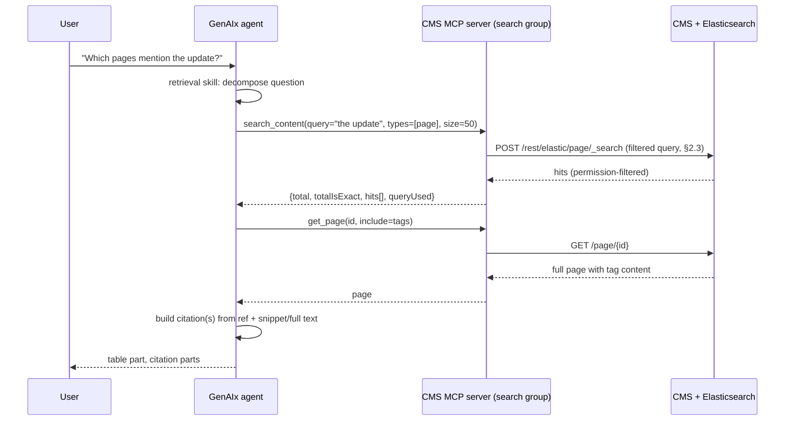

# Content RAG contract

This document defines the `search_content` tool and its three supporting tools — `find_similar`,
`get_related`, `count_content` — that make up the search tool group exposed by the CMS MCP server,
the ground truth of the CMS search endpoint they wrap, and the retrieval skill that turns a user
question into one or more tool calls.

## 1. Goal and responsibility split

Two recurring needs drive this contract: before creating new content, an agent must check whether
related content already exists, so it can reuse or link it instead of duplicating it; and a user
may ask natural-language questions over the whole content set — which pages mention a topic, when
they went online, how many exist, which are outdated or duplicated.

Both are read operations. Every CMS read that is a search, as opposed to "fetch this one object by
id," goes through Content RAG, which is the Elasticsearch passthrough already built into the CMS.
GenAIx never indexes content itself and never maintains a second index or vector store.

| Concern | Owner | Notes |
|---|---|---|
| Indexing pages, folders, files, images, and forms into Elasticsearch | CMS | Existing mechanism. |
| Permission enforcement on search results | CMS | Both a query-time filter and a result-time re-check (§2.3). The MCP server must never attempt to replicate or bypass this. |
| The `/rest/elastic/{type}/_search` passthrough endpoint | CMS | Ground truth in §2; already exists. |
| `search_content` (and siblings) tool contract, query construction, result shaping | ioflair | Specified here and implemented by ioflair as composite tools inside the CMS MCP module, on top of the existing passthrough endpoint. |
| Deciding when to search, decomposing a question into calls, verifying and citing hits | GenAIx (agent skill, §5) | Runs in the agent session, not in the MCP server. |
| New index mapping attributes, if any | CMS | Additive; no reindex pipeline change. |

GenAIx never calls Elasticsearch directly and never receives Elasticsearch credentials;
`search_content` and its siblings are the only path from an agent to indexed content.

Field names in the tool inputs and outputs below are `camelCase`, identical to the CMS REST model
names, as `mcp/tools.json` declares them (`1.0.0-rc.2` regenerated this document from it; the
earlier `snake_case` spelling was a documentation error). Elasticsearch's own fields (`_id`,
`multi_match`, `query_string`) keep their native spelling.

## 2. Ground truth of the CMS search endpoint

### 2.1 Path, types, and activation

- `POST /rest/elastic/{type}/_search`, with `{type}` one of `page`, `folder`, `file`, `image`,
  `form` — a fixed, five-member index-type enumeration (`IndexType.java`). An unrecognized type is
  rejected with a validation error (`SearchResourceImpl.searchType`).
- A second, generic route, `POST /rest/elastic/{path}`, covers a bare search across all index
  types at once and shares the same filter and permission logic; `search_content` only targets
  the typed route.
- The endpoint requires the CMS `elasticsearch` feature to be active; if not, it answers with a
  non-200 status before any query logic runs. Content RAG depends entirely on this feature.
- The request body is a raw Elasticsearch query DSL document, forwarded essentially unmodified
  except for the filters injected in §2.3 (`SearchResourceImpl.doSearch`).

### 2.2 Query parameters

These are HTTP query parameters, not body fields. One naming detail worth noting: the wire
parameter is `language` (singular); the underlying field is the plural `languages`. Callers use
`?language=` on the wire regardless.

| Param | Type | Default | Effect |
|---|---|---|---|
| `nodeId` | int | `0` | Restrict to one node; `0` means no node filter. |
| `folderId` | list of int | — | Restrict to given folder(s); combines with `recursive`. |
| `recursive` | bool | `false` | When `folderId` is given, also include visible subfolders. |
| `language` | list of string | — | Narrows which per-language indices are queried (only `page`/`form` are per-language, §2.4). |
| `wastebin` | enum `exclude`\|`include`\|`only` | `exclude` | Controls the injected `deleted` filter. |
| `package` | string | — | Name of a content staging package; adds a `hits.staging` block reporting each hit's staging status. |
| `template`, `folder`, `langvars`, `translationstatus`, `contenttags`, `objecttags`, `privileges`, `privilegeMap` | bool | `false` | Embed additional REST sub-objects into hits (template, folder, language variants, translation status, tags, privileges). |

`search_content`'s `nodeId`, `folderId`, `recursive`, and `languages` inputs map directly onto
`nodeId`, `folderId`, `recursive`, `language`. The embedding flags are intentionally not exposed as
separate `search_content` inputs — the tool always requests the plain object, keeping payloads
small; an agent that needs the template or tags for a hit calls `get_page`/`get_template`
afterward.

### 2.3 Injected filters (permission enforcement)

This is the single most important mechanic in this contract, because it is where CMS permissions
are enforced, and it has a precise, non-obvious shape:

1. The endpoint parses the body's `query` node. If there is no `query`, or no `bool` child under
   it, the body is returned completely unmodified — no filters are injected at all, so a bare
   `match_all` query would skip permission filtering entirely. `search_content` always builds a
   `bool` query (§3), so ordinary calls are always filtered; this is a sharp edge only for the
   `rawQuery` escape hatch (§3.4).
2. With a `bool` object present, the CMS appends to `bool.filter`: always a `terms` filter on
   `groupId` (the caller's permitted group IDs for the given node, applied regardless of whether
   `nodeId` was supplied); if `nodeId > 0`, a `term` filter on `nodeId`; if `folderId` is
   non-empty, a `terms` filter expanded to visible subfolders when `recursive=true` (folders the
   user cannot see are silently excluded, not surfaced as an error); and, by `wastebin`, `exclude`
   (default) adds `deleted:false`, `only` adds `deleted:true`, `include` adds no wastebin filter.
3. A second, independent layer runs after the response returns: for every hit, the CMS re-checks
   view permission and drops failing hits from the list without flagging them. The reported total
   is not reduced by this post-filter, so a counting call with `size: 0` is exact, but a
   `search_content` call can show a total slightly higher than the number of hits returned — a
   known limit (§7), not a defect to route around.
4. Each surviving hit carries the full REST-model object — the source of `search_content`'s
   `hits[].object` (§3.2).

### 2.4 Index shape

- One Elasticsearch index per object type, and — only for pages and forms, the two multi-language
  types — one index per language in addition. Folders, files, and images use a single,
  non-language index.
- Indexed page properties include id, node, folder, name, filename, description, content,
  creation/edit/publish metadata, template id, language, online state, nice URL, and path.
  Folders, files, images, and forms have their own, narrower property lists; files and images add
  mime type, and files additionally index binary content (images do not).
- The indexed `content` is an array of the raw, editor-entered values of every content-tag part
  whose part type is a text part type — not a single string, and not the page's rendered output.
  A non-text part (select, boolean, overview, …) contributes nothing, and, critically, a phrase
  that exists only in a construct's rendered template output — including static or generated text
  the template itself produces around a part's value — is not indexed and not findable via
  `search_content`. Wording that lives in template text rather than an editable part will never
  surface in a content search (see the construct and devtools requirements document).
- Only the current version is indexed, not history — `search_content` cannot answer "what did
  this page look like earlier"; that is version-history territory, not Content RAG.
- Language-specific analyzers (stemming, stopwords) already apply per index, so `search_content`'s
  query needs no application-side stemming.
- The existing CMS search-UI convention — `multi_match` over name, path, description, and content
  inside a `bool` query, paged with `from`/`size` — confirms that this contract's query
  construction (§3.3) matches an already-proven shape. One difference: the existing UI never
  requests highlighting; `search_content` adds that, safely, since Elasticsearch supports
  highlighting natively and the passthrough forwards the body largely as-is.

### 2.5 Response shape

Essentially the raw Elasticsearch response with one addition: each hit carries the full REST
object under an `_object` key, and, when a staging package is named, the response carries an extra
`staging` block.

```
{
  "took": 12, "timed_out": false, "_shards": {...},
  "hits": {
    "total": { "value": 8, "relation": "eq" },
    "max_score": 3.2,
    "hits": [
      { "_id": "123", "_index": "...", "_type": "page", "_score": 3.2,
        "_source": {...}, "_object": { "...full REST object..." } }
    ]
  },
  "staging": { "<packageName>": { "123": "INCLUDED", ... } }
}
```

## 3. The `search_content` tool contract

`search_content` is the primary tool in the search tool group, deliberately trimmed to the inputs
the mandatory scenarios actually use. The MCP server constructs the Elasticsearch query from
structured input so that an agent never has to write raw query DSL for the common case, the CMS's
permission-filter mechanics (§2.3) are always exercised, and the shape stays stable even if the
passthrough's own wiring changes.

**Normative rule**: `search_content` must always emit a request body whose `query` is a `bool`
query — never a bare `match_all`, `multi_match`, or other non-`bool` top-level shape, even for the
simplest call. This is not a style preference: the CMS only injects the permission, node, folder,
and wastebin filters into `bool.filter`, and only when a `bool` node is present; any other query
shape receives no permission filtering at all. Verified directly: an otherwise identical counting
query run with and without the `bool` wrapper produces a visibly larger result count without it,
confirming the filter applies only when the wrapper is present. Every structured-input path below
already produces a `bool` query by construction; `rawQuery` (§3.4) is the one input path that can
violate this on its own, which is why the MCP server always wraps it when necessary.

### 3.1 Input

```
search_content(
  query: string,                       // required; natural language or Lucene query_string syntax
  types: [page|folder|file|image|form] = [page],
  nodeId?: int,
  folderId?: int[],
  recursive?: bool = true,
  languages?: string[],                // ISO codes, e.g. ["de","en"]
  filters?: {
    online?: bool,
    templateIds?: int[],
    editedAfter?: integer (Unix seconds)
  },
  size?: int = 10,                     // max 50
  from?: int = 0,
  rawQuery?: object                    // escape hatch, see §3.4
)
```

Highlighted snippets are always returned; there is no separate toggle. There is no `fields`,
`sort`, or `aggregations` input — reporting rollups live in `count_content` (§4) instead, and
result ordering is always relevance order.

| Field | Semantics | Maps to the query as |
|---|---|---|
| `query` | Free text or `query_string` syntax (`AND`/`OR`/`"phrase"`/`field:value`). Matches only raw, editor-entered text-part values (§2.4) — a phrase existing only in a construct's rendered output is never matched. | `multi_match`/`query_string` over `name`, `description`, `content`, `path`, boosting `name`. |
| `types` | Which index/indices to search. | Chooses the `{type}` path segment; multiple types means one call per type, merged by the tool. |
| `nodeId` | Restrict to a node. | `?nodeId=`, triggering the node-id filter (§2.3). |
| `folderId`, `recursive` | Restrict to folder(s), optionally with subfolders. Defaults to `true`, broader than the CMS's own default of `false` (§2.2), because most questions mean "in this folder and everything under it" unless narrowed. | `?folderId=&recursive=`, triggering the folder-id filter. |
| `languages` | Which language index/indices (page/form only). | `?language=`, selecting per-language indices (§2.4). |
| `filters.online` | Published state. | `term { online }` in `bool.filter`. |
| `filters.templateIds` | Restrict to pages using given templates. | `terms { templateId }`. |
| `filters.editedAfter` | Only content edited on or after a date. | `range { edited: { gte } }`. |
| `size`, `from` | Paging. `size` is capped at 50. | Passed through as `size`/`from`. |
| `rawQuery` | Escape hatch, full query DSL, single type only. | See §3.4. |

### 3.2 Output

```
{
  total: int,
  totalIsExact: bool,
  hits: [
    {
      ref: { type, id, nodeId, name, path?, niceUrl?, language? },
      score: float,
      snippets: [string],           // highlight fragments; always populated when there is a match
      language?: string,
      online: bool,
      edited: string (ISO),
      templateId?: int,
      folderId: int
    }
  ],
  queryUsed: { ...the query actually sent... }
}
```

Hits no longer carry the full or trimmed REST object — an agent that needs anything beyond `ref`
and the listed fields calls `get_page` (§5); this keeps `search_content` a pure lookup step and
`get_page` the single place that returns full content, rather than two tools returning
overlapping shapes.

`totalIsExact` replaces a previous ambiguity directly: the per-hit permission re-check (§2.3
point 3) can drop hits after Elasticsearch has already computed `total`, so whenever `size > 0`
hits were returned, `total` is the raw, pre-drop count and `totalIsExact` is `false` — read it
as "at most this many, usually exactly this many." For a `size: 0` counting call there is no hit
list to post-filter, so `totalIsExact` is `true` relative to the coarser, group-based permission
filter (§2.3 point 2); this is the case `count_content` (§4) relies on. `queryUsed` is returned so
the agent can show it for transparency in reporting answers, and so a reviewer can see exactly
what was sent to Elasticsearch.

### 3.3 How `search_content` builds the query

```json
{
  "query": {
    "bool": {
      "must": [
        { "multi_match": { "fields": ["name^2", "description", "content", "path"], "query": "<query>" } }
      ],
      "filter": [
        { "term": { "online": true } },
        { "range": { "edited": { "gte": "<iso-date>" } } }
      ]
    }
  },
  "from": 0,
  "size": 10,
  "highlight": {
    "fields": { "content": { "fragment_size": 200, "number_of_fragments": 3 }, "description": { "fragment_size": 200, "number_of_fragments": 3 } }
  }
}
```

The MCP server appends nothing to `bool.filter` beyond what `filters.*` produced — the
permission, node, folder, and wastebin filters (§2.3) are added by the CMS itself from the query
parameters, never constructed client-side. The MCP server must never build its own permission
filter (for example, by computing group IDs itself); duplicating that logic would create a
second, driftable copy of the permission model. The `highlight` block is always present, since
highlighting is no longer a caller-controlled input.

### 3.4 `rawQuery`: the escape hatch, and why permission filtering still holds

`rawQuery` lets an agent, or a developer debugging a report, supply a complete query DSL object
for cases the structured input cannot express (nested aggregations, script fields, geo queries).
Because filters are only injected when the body's `query` has a `bool` node (§2.3 point 1), the
MCP server validates and, if necessary, rewrites `rawQuery` before sending it, rather than
forwarding it unchanged:

1. If `rawQuery.query` is missing or not a `bool` query, the MCP server wraps it:
   `{"query": {"bool": {"must": [<original query>], "filter": []}}}`, so the CMS's filter
   injection always has a `bool.filter` array to append to. This is a safety requirement on the
   MCP server, not a CMS behavior — the CMS has no obligation to wrap the query, and forwarding an
   unwrapped query would mean no permission filtering at all. This is the single most important
   security-relevant implementation requirement in this document.
2. `nodeId`, `folderId`, and `languages` are still taken from the structured tool input even
   when `rawQuery` is supplied, and passed as query parameters, always applied by the CMS
   regardless of body shape; the permission filter itself depends on the wrapping in step 1.
3. `rawQuery` is intended for a single type per call; the MCP server rejects it combined with
   more than one requested type, since merging heterogeneous raw queries across indices is out of
   scope.

This makes the escape hatch safe by construction: the MCP server, not the calling agent, decides
whether the wrapping in step 1 happens, based purely on the shape of the JSON it receives.

## 4. `find_similar`, `get_related`, `count_content`

These three tools share `search_content`'s permission and index model.

- **`find_similar { ref: {type, id}, size?: int = 10 }`** — wraps the same passthrough with a
  "more like this" query seeded from the referenced object's name and content fields, restricted
  to the same type. Used for construct-similarity checks and for avoiding content duplication.
  Output matches `search_content.hits[]` minus `snippets`, plus a `similarity_score`.
- **`get_related { ref: {type, id} }`** — not an Elasticsearch query: wraps the CMS's object-usage
  endpoints (what links to or uses a page, template, or construct), complementing full-text search
  with structural relationships Elasticsearch does not model. Output:
  `{ used_by: [ref...], uses: [ref...] }`. Requires the CMS to expose a usage/reference endpoint
  per object type (§8).
- **`count_content`** — a thin convenience over `search_content` with `size: 0` and no hit list,
  for counting questions:
  ```
  count_content(
    query: string,
    types: [page|folder|file|image|form] = [page],
    nodeId?: int, folderId?: int[], recursive?: bool = true, languages?: string[],
    filters?: { online?: bool, templateIds?: int[], editedAfter?: integer (Unix seconds) },
    groupBy?: language | template | online,   // single value, optional
    groupLimit?: int
  ) -> { total: int, totalIsExact: bool, groups?: [{ key: string, count: int }] }
  ```
  Without `groupBy`, this is exactly `search_content`'s `total`/`totalIsExact` with no hit
  list fetched: the count runs over the same indexed fields and the same object types the search
  matches, so a `count_content` call with a search's own inputs reproduces that search's `total`
  (`1.0.0-rc.2`). `queryUsed` is returned for display only and is not an input either tool takes
  back; a gate that replays a search replays its tool inputs. With `groupBy`, it adds one `terms` aggregation — on `languageCode`, `templateId`,
  or `online` respectively — capped at `groupLimit` buckets, still evaluated inside the same
  permission-filtered `bool` query (§2.3). Since aggregations run in the same query context as the
  `bool.filter` clauses, they are permission-filtered by construction, but — like the plain count
  — only to the coarser, group-based model (§2.3 point 2), not the precise per-object check applied
  to individual hits; there is no hit list here for that check to apply to.

## 5. The retrieval skill

Lookup depth in this phase is document-level retrieval plus highlight snippets — not passage-level
chunking (§7.2) — and the normal flow is always two steps: search, then verify with `get_page`,
never search alone. This matters because of the corpus limit (§2.4, repeated here since it is easy
to miss): indexed `content` is raw, editor-entered text-part values only, never a construct's
rendered template output, so a negative search result does not always mean "this wording is not on
the site" — it can mean "this wording lives only in a template," and only a full-page fetch via
`get_page` resolves the ambiguity for anything the agent is about to state as fact.



1. **Question to one or more `search_content` calls.** A broad question is usually one call with
   a generous `size`; a compound question may need two calls, or one call combining `query` with
   `filters.editedAfter`. A counting question goes straight to `count_content`.
2. **Verify with `get_page` — the normal next step, not a fallback.** `search_content` returns
   only `ref`, score, snippets, and a few scalar fields (§3.2); it never returns enough to quote,
   edit, or state something as settled fact. The skill fetches the full, current object via
   `get_page` before answering or citing, every time, not only when a snippet looks ambiguous.
3. **Cite.** Every claim carries a citation pointing at the concrete page or folder it came from —
   this is what makes reporting answers auditable rather than free-text summaries.
4. **Reporting shape.** For table or list answers, the skill emits a table part whose source field
   carries the query actually used, so the interface can show how the answer was computed.

## 6. Worked examples

A representative set of natural-language questions, each mapped to a concrete tool call using the
trimmed input shape, and what the agent does with the result.

1. **"Which pages mention this topic? We need to review all of them."**
   `search_content({query: "<topic>", types: ["page"], size: 50})` builds a `multi_match` query
   inside a `bool` query, before the CMS injects its permission and wastebin filters (§2.3). Agent
   action: `get_page` each hit, then render a table (name, path, edited, snippet) covering all of
   them.
2. **"Do we already have content on this topic anywhere? I don't want to create duplicates."**
   `search_content({query: "<topic>", types: ["page"], filters: {online: true}, size: 20})`. Agent
   action: if hits exist, surface them with a "link instead of creating new" suggestion; if empty,
   proceed to draft creation and note that in the plan.
3. **"What changed on this page yesterday?"** Not answerable by `search_content` alone: the agent
   resolves the page with a content search, then calls `get_page_versions` for the change —
   `search_content` only indexes the current version (§2.4), so history questions fall through to
   version history.
4. **"Our page on this topic is several years old. Check which statements are outdated and
   suggest changes."** `search_content({query: "<topic>", types: ["page"], size: 10})` — no date
   filter narrows this one, since only `editedAfter` exists (§3.1), not a "before" bound; the
   agent reads each hit's `edited` field to judge age, then always calls `get_page` on the match
   (the normal two-step pattern, §5) before proposing a diff.
5. **"How many pages mention this topic, broken down by template?"**
   `count_content({query: "<topic>", types: ["page"], groupBy: "template"})`, internally
   `search_content` with `size: 0` and a single `terms` aggregation on template id (§4). Agent
   action: render a table (template name, count) from the returned `groups`.

## 7. Phase limits and caveats

### 7.1 Current depth

Document-level keyword retrieval: `multi_match`/`query_string` over indexed fields, structured
filters, always-on highlight snippets, and a `get_page` fetch for verification — now the normal
flow, not an optional step (§5). This matches what the CMS index already supports, with no new
indexing infrastructure.

### 7.2 Future extension

Passage chunking and a dense-vector/nearest-neighbor hybrid retrieval mode are not part of this
contract and have no reserved field in it. If built later, hybrid retrieval would be an additive
extension: a new query clause alongside the existing `bool` query, with every permission filter in
§2.3 unchanged, since chunking and embeddings are index changes, not a different filtering model.

### 7.3 Known limitations

- **Rendered-output text is not searchable.** This is the most consequential limitation in this
  contract: `content` holds only the raw values of text-typed parts (§2.4), so a search that
  "should" match a visible phrase on the rendered page can legitimately return nothing if that
  phrase never passed through an editable text part. It is why `get_page` verification is the
  normal second step (§5), not an optional one — a miss here must never be read as "this content
  does not exist."
- **Size cap**: `size` is capped at 50 per call; larger result sets should use `count_content`
  (§4) instead of paging through hundreds of hits via `from`.
- **Feature and index scope**: the endpoint is unavailable if the CMS `elasticsearch` feature is
  not active. Only pages and forms are split by language (§2.4); folder, file, and image search
  ignores the language filter. Deleted objects and staging-package status are excluded/omitted by
  default and are not surfaced through `search_content`'s trimmed input at all.
- **Aggregation permission granularity**: `count_content`'s `groupBy` aggregations (§4) are
  permission-filtered only through the injected `bool.filter` clause, never through the per-hit
  post-filter that ordinary `search_content` hits go through — a narrow discrepancy between
  coarser, group-based filtering for aggregate counts and precise per-object filtering for hits.
- **Content freshness**: indexing is not synchronous with a CMS write, as with any
  Elasticsearch-backed search; a page cannot be assumed searchable the instant it is created or
  updated. The typical indexing delay for a given deployment should be documented (§8).

## 8. Requirements towards the CMS

1. The `elasticsearch` feature must be active on any CMS instance where Content RAG is used;
   without it, no content-search or reporting capability works at all.
2. The typical index-to-search delay after a CMS write should be documented, so agent behavior
   depending on "just created, immediately searchable" content is calibrated correctly.
3. An optional new index mapping attribute — a list of the construct keywords used on a page —
   would support construct-similarity and reuse checks; this is an additive, configuration-only
   change consistent with how other custom attributes are added.
4. Single-field `terms` aggregation passthrough (used by `count_content`'s `groupBy`) must be
   confirmed on the exact Elasticsearch/CMS version in use: the passthrough forwards the body
   unmodified, so this should already work, but should be exercised against a running instance
   before being relied on.
5. Representative content and permission fixtures should be available for validation: pages on a
   shared topic, spread across at least two permission groups, so permission-filtered search
   behavior can be tested end to end.
6. The CMS must expose a usage/reference endpoint per object type (what links to or uses a given
   page, template, or construct) so `get_related` (§4) can be implemented against a defined
   contract rather than an assumed one.
