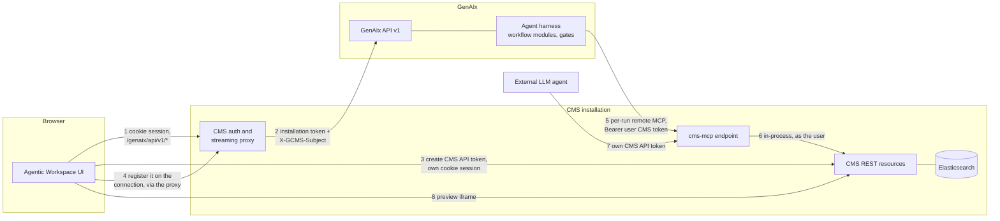

# Integration guide

This is the single place for everything about integrating GenAIx with the Gentics CMS and the
Agentic Workspace UI. The API contract (`openapi.yaml`, `03-genaix-api.md`) describes what GenAIx
does; the CMS MCP specification (`mcp/tools.json`, `04-mcp-scope.md`) describes what the CMS exposes.
Neither says how the two are wired together, who creates which credential, what the proxy in between
must do, or what to do when a step fails. That is this document.

Every route and field name used below exists in `openapi.yaml`, contract version `1.0.0-rc.2`, the agreed release candidate.

## 1. Purpose and audience

- **The Workspace UI developer.** Sections 3 to 6: the headers requests arrive with, how to register
  the user's CMS credential, how a session runs, what to render when it fails.
- **The CMS team.** Section 3 is the proxy specification, section 4 states what the CMS MCP endpoint
  must accept, section 9 collects every requirement.
- **Any other external service** driving GenAIx, which takes the same path as the Workspace UI.
- **Operators of external LLM agents** wanting CMS tools without GenAIx: section 7.2, short because
  that path touches none of the GenAIx API.

### What GenAIx is responsible for, and what the integrator is

| GenAIx | The integrator |
|---|---|
| Authenticates an installation by its token, and trusts the identity header accompanying it | Authenticates the end user and sets that header |
| Defines the connector types it can talk to, and their tool groups | Decides which instance a user connects to, by supplying a URL |
| Verifies a credential live, stores it encrypted, uses it per run, reports its status | Obtains the credential from the target system and registers it |
| Runs the agent, emits the event stream, runs the quality gates, writes to the CMS through MCP | Renders the stream, answers interactions, drives the transitions |
| Keeps session history, files and the event log replayable | Reconnects and re-hydrates after a dropped connection |
| Fails a run with a typed code when a credential is unusable | Fixes the credential and re-sends the message |

### The one rule that shapes all of this

**The client provisions credentials. GenAIx never creates them.** GenAIx holds no CMS session cookie,
has no CMS service account, and cannot mint a CMS API token. A client that wants GenAIx to act on a
CMS obtains a token from that CMS itself, with the user's own session, and registers it on a GenAIx
MCP connection. GenAIx verifies it, stores it encrypted, sends it as the bearer credential for that
user's runs on that connection, and reports whether it still works.

Two consequences follow. Recovery from a dead credential is always an action by the client or the
user, never something that happens silently inside GenAIx. And the blast radius of a GenAIx
compromise is the set of tokens it was given, not the ability to mint new ones.

The normative identity contract is `02-auth-and-context-flow.md`, the API in prose is
`03-genaix-api.md`, the CMS tool surface is `04-mcp-scope.md`, the gate catalogue is
`08-workflow-modules.md`, and `examples/requests.http` has every operation as a runnable request.

## 2. Topology



The browser only ever talks to its own CMS host (1): the Workspace UI holds no GenAIx credential and
never addresses GenAIx directly in production. The proxy adds the installation token and the identity
headers and streams the response back unbuffered (2), which is section 3. The UI creates the CMS API
token with the browser's own session cookie, which never leaves the CMS host (3), and registers it on
the user's `cms` connection through the proxy like any other call (4). That is section 4.

At run time the harness configures each connection as a remote MCP server for that run only, with the
user's registered token as its `Authorization` header (5); the endpoint resolves the token to a CMS
user and calls the REST resource implementations in-process as that user (6), so permissions, locking
and the audit trail apply unchanged. An external agent skips all of it and presents its own token to
the same endpoint (7), and preview URLs point at the CMS, which the browser loads with its own
session (8).

Edge 5 is the only outbound hop from GenAIx into the CMS, and it carries one user's token at a time.
There is no shared service credential here.

## 3. Calling GenAIx through the CMS proxy

The proxy's job is small and entirely mechanical: authenticate the browser's CMS session, state who
the user is in headers, add the installation credential, and stay out of the way of a long-lived
event stream.

### The installation token

One long-lived token per CMS installation, sent as `Authorization: Bearer sk_gnx_...` on every
`/api/v1` call. It identifies the installation, not the user. GenAIx stores only its hash; the proxy
holds the plaintext in server-side configuration. It must never reach the browser, never appear in a
query string and never be logged, and rotation is manual. `GET /ping` is the one route needing the
token alone; every other route needs token plus identity.

### The identity header

| Header | Required | Meaning |
|---|---|---|
| `X-GCMS-Subject` | Yes | The **only** identity header. An opaque, installation-scoped, pseudonymous subject: GenAIx's owner key for sessions, files, connections and authorizations, and nothing more |

That is the whole contract. There is no `X-GCMS-User-Id`, no `X-GCMS-User-Login`, no
`X-GCMS-User-Groups`, no `X-GCMS-SID`, no `X-GCMS-User-Token` and no `X-GCMS-Session-Secret`. GenAIx
never learns which person is behind a subject: no user id, login, display name or group list is ever
sent, and none is stored. The CMS API token a user registers for MCP is never a request header at
all: it travels once, in the body of `PUT /sessions/{session_id}/authorizations/{connection_id}` (or,
for the standing path, `PUT /mcp/connections/{connection_id}/authorization`).

**Generating the subject.** The proxy derives it from the CMS user however the installation chooses —
an HMAC of the CMS user id with a secret only the CMS holds is enough, as long as the same person
always maps to the same subject and no outside party can invert it back to that person. The value can
be a bare opaque string, or a compact JWS assertion carrying `sub` (the subject), `iss` (the
installation), `iat` and a short `exp`; the producing side may put more into that payload, but GenAIx
never decodes, uses or stores anything beyond those four claims. When the installation is configured
with the corresponding signing key, GenAIx verifies the signature and expiry itself and rejects
anything unsigned, malformed, mis-issued or stale with `401` `genaix_code: identity_invalid`. Without
a configured key, GenAIx accepts the header as sent and uses it verbatim as the subject — the
installation is trusted for that choice the same way it is trusted for everything else the proxy
asserts.

A valid installation token with an empty or missing `X-GCMS-Subject` is `400` with
`genaix_code: subject_missing`, never treated as anonymous and never as the installation acting on
its own behalf.

**Header stripping is mandatory.** The proxy must overwrite or strip any `X-GCMS-Subject` the client
sent before setting its own. GenAIx trusts this header precisely because the installation token
authenticated the proxy, so passing an unverified client header through would let any compromised
browser page claim an arbitrary subject and read that subject's sessions. Strip the browser's
`Authorization` header too, and do not forward the CMS session cookie.

**Removing a subject.** `DELETE /subjects/{subject}`, authenticated by the installation token alone
with no `X-GCMS-Subject` of its own, erases every session, message, file, connection and authorization
GenAIx holds for one subject. The installation calls it when the person behind that subject is
removed — the only way this can happen at all, since a subject is opaque and GenAIx can never resolve
one back to a person on its own.

### What must be forwarded

All of `/api/v1`, with no route allowlist: the contract's forward-compatibility rules allow new
routes in any minor version, so a proxy enumerating paths breaks on the first addition. Forward the
method, the path below `/api/v1`, the query string, the body and the `Content-Type` and `Accept`
headers unchanged.

Two headers need care. **`Last-Event-ID`** on a request must pass through untouched: it is how a
reconnecting stream says where it left off, and rewriting it turns a resume into a full replay at
best and a gap at worst. **`X-GenAIx-Request-Id`** on a response must reach the client, being the
support correlation key. The streaming variant of `POST /sessions/{session_id}/messages` also answers
with `X-GenAIx-Run-Id` and `X-GenAIx-Message-Id`, so pass those through too.

### Streaming requirements

Two routes stream Server-Sent Events: `GET /sessions/{session_id}/events`, and
`POST /sessions/{session_id}/messages` with `Accept: text/event-stream`.

| Requirement | Value |
|---|---|
| No response buffering | Buffering off, and honour GenAIx's `X-Accel-Buffering: no`. A buffered stream does not arrive late, it arrives all at once at the end |
| Flush per event | Every `data:` frame reaches the client as produced. A frame is a unit of UI state, so a coalesced batch defeats the point |
| Heartbeats | GenAIx sends `heartbeat` after 15 s of silence. Heartbeats consume a `seq` and are persisted, so resume arithmetic needs no special case |
| Idle timeout | At least 15 minutes, 30 is safer. A blocking interaction carries nothing but heartbeats until its `expires_at`, ten minutes by default |
| Keep-alive | Pass `Connection: keep-alive` and `Cache-Control: no-store` through; the stream must not be cached at any layer |
| HTTP/1.1 upstream | Chunked transfer encoding is what makes incremental delivery possible |
| Request body size | At or above `capabilities.upload_max_bytes`, 26 214 400 bytes by default, so an oversized upload is `413 file_too_large` rather than an opaque proxy error |

### A sample nginx configuration

Illustrative: the session-resolution subrequest depends on how the CMS exposes it.

```nginx
# The installation token lives here, in server-side configuration only.
map $host $genaix_token { default "sk_gnx_8f2c1a..."; }

location /genaix/api/v1/ {
    # Resolve the browser's CMS session and derive its subject; the subrequest answers 401
    # when there is none. Deriving the subject itself — an HMAC of the CMS user id, or a
    # signed assertion — is the CMS's own business; this proxy only forwards what it returns.
    auth_request      /internal/cms-subject;
    auth_request_set  $gcms_subject     $upstream_http_x_gcms_subject;

    proxy_pass         https://genaix.internal/api/v1/;
    proxy_http_version 1.1;

    # Invent nothing; overwrite everything the client may have tried to set.
    proxy_set_header   Authorization    "Bearer $genaix_token";
    proxy_set_header   Cookie           "";
    proxy_set_header   X-GCMS-Subject   $gcms_subject;

    # The reconnect header passes through unchanged.
    proxy_set_header   Last-Event-ID    $http_last_event_id;
    proxy_set_header   Connection       "";

    # Streaming: no buffering, timeouts beyond the longest legal silence.
    proxy_buffering         off;
    proxy_request_buffering off;
    proxy_cache             off;
    proxy_read_timeout      1800s;
    proxy_send_timeout      1800s;

    # Uploads: above the GenAIx per-file limit, not below it.
    client_max_body_size    32m;
}
```

A servlet filter has the same shape, in this order: resolve the CMS session and answer 401 without
calling GenAIx when there is none; copy the request headers except `x-gcms-subject`, `authorization`,
`cookie` and `host`; set the installation token and the identity header server-side; copy the response
status, headers and body straight through, flushing after every chunk. Three things most often go
wrong there: a servlet that is not `asyncSupported`, a response copied through a buffering wrapper,
and a default HTTP client read timeout in the tens of seconds.

## 4. Connecting GenAIx to the CMS MCP

A run can only touch the CMS through an MCP connection carrying a working credential for that
session. Setting that up is the one piece of integration work no other component can do for the
client.

### Connector types versus connections

GenAIx separates the *kind* of system from the *address* of one instance of it.

- A **connector type** is GenAIx configuration, read-only over the API. `GET /mcp/connectors` is the
  catalogue. The CMS is the type `cms`, with `transport: streamable_http`, `auth.type: bearer`, its
  `tool_groups`, the workflows needing it in `required_by_workflows`, `multiple: true`, and two
  conveniences for building a URL: `url_template` and, when the installation is configured with a CMS
  base URL, `default_url`. No API call can add, remove or re-point a type.
- A **connection** is one user's link to one instance, carrying **a URL the client supplies**.
  `GET /mcp/connections` lists the caller's own;
  `POST /mcp/connections {connector, url, label?, default?}` creates one; `GET`, `PATCH` and
  `DELETE /mcp/connections/{connection_id}` inspect, change and remove one.

URL rules, enforced on create and update: `https`, with `http` allowed only for `localhost` and
`127.0.0.1`; no embedded credentials, no query string, no fragment. A violation is `422`
`validation_failed` pointing at `/url`, and so is a second connection of the same type at the same
URL (`code: duplicate`). GenAIx probes the URL with an MCP `initialize` and records the outcome in
`status`, but the probe is **informational only** and never blocks creation, so a connection can be
registered before its server is up. Against the CMS, which authenticates `initialize` like every
other request, an unauthenticated probe sees only the `401`: that is `reachable: true` without
`server_info`, and `server_info` appears once a credential has been registered and verified.
`label` is always present, the URL host unless the client or the installation named one.

### Which URL, and the auto-created default connection

The path is `{cms_base_url}/mcp`, as an exact mapping rather than a prefix: the CMS MCP server is its
own servlet, mounted outside the `/rest/*` Jersey servlet, not a resource living inside it. One
consequence follows directly: because `/mcp` sits outside the `/rest/*` filter chain, bearer
authentication against CMS API tokens is wired in the MCP servlet itself rather than inherited from
the REST authentication filter. Do not hard-code the path even so: the installation's configured
address arrives as the `cms` connector's `default_url`, and a client needing a different one uses
`PATCH /mcp/connections/{connection_id} {url}`. Keeping the URL on the connection makes the endpoint
path a configuration value rather than a contract change.

When the installation is configured with a CMS base URL, a user's first `GET /mcp/connections`
auto-creates their default `cms` connection at that address, with `default: true` and
`authorization_status: unauthorized`. The Workspace UI therefore never has to create a connection: it
reads the list, takes the `cms` entry and registers a credential on it. `GET /me` reports the same
connections as `mcp_connections`, so a UI already calling `/me` at start-up has the id in hand.
`POST /mcp/connections` stays available for the GenAIx UI path and for a second instance; the
per-user cap is `max_connections_per_connector`, default 10, and exceeding it is `409`
`mcp_connection_limit`.

### Creating the CMS API token for a session

The client creates the token itself, against the CMS the connection points at, with the browser's own
session — **one token per workflow session**, not one per installation or user. The CMS REST API
offers three endpoints, each scoped to the authenticated user:

| Route | Purpose |
|---|---|
| `POST /rest/admin/token` | Create a token for the current user. Body `{name, expires, pruneOnExpiry}`; the secret is returned **once**, in this response |
| `GET /rest/admin/token` | List the current user's tokens, with filter, sort and paging |
| `DELETE /rest/admin/token/{id}` | Delete one of the current user's tokens. `404` when it is not theirs |

`expires` is a Unix timestamp in seconds, `0` meaning never, and a past value is rejected outright; a
token is valid only while `expires > now`. Set it to now plus the installation's session authorization
lifetime, 24 hours by default and configurable. `pruneOnExpiry: true` — always, for a session token —
asks the CMS to delete the token row itself the moment it expires, so an abandoned session leaves
nothing behind on the CMS side either. There is no purpose field; the name is the only marker.

Name the token `genaix-<session_id>` once the session already exists — the two-call flow, or any
later re-registration. For the one-call flow below, the session id is not yet known when the token is
created, so name it with a client-generated correlation id instead, or leave `token_name` out
entirely: it is optional, kept only so a human can recognize the token on the CMS side, and neither
GenAIx nor the CMS depends on it matching anything. What GenAIx itself suggests in
`how_to_authorize.token_name` is fixed since `1.0.0-rc.2`: `genaix-<installation slug>` for a
standing credential (the installation name lower-cased, runs of non-alphanumerics as `-`) and
`genaix-<session_id>` for a session credential, so a client that keys its token bookkeeping on the
suggestion can rely on it. Recreate rather than reuse whenever GenAIx reports
anything but `authorized` for a session's authorization; a credential it calls `invalid` or `expired`
will not start working again, and the CMS may already have pruned its row.

### Registering, checking and revoking

Two scopes exist, and where both are registered for the same connection, **the session one wins**:

| Call | Scope | What it does |
|---|---|---|
| `GET /sessions/{session_id}/authorizations` | Session (primary) | Live check, one entry per connection this session holds a credential for. Not a cache read |
| `PUT /sessions/{session_id}/authorizations/{connection_id}` | Session (primary) | Register `{auth_type: "bearer", token, token_name?, expires_at?}`. Verified before storing, idempotent, never echoed back. `409` `session_released` once the session is `published`, `discarded` or `archived` |
| `DELETE /sessions/{session_id}/authorizations/{connection_id}` | Session (primary) | GenAIx forgets its copy for this session. Nothing is revoked on the CMS side, and the session falls back to any standing authorization |
| `GET /mcp/connections/{connection_id}/authorization` | Standing (secondary) | The same live check, kept for the non-integrated GenAIx UI and for tooling |
| `PUT /mcp/connections/{connection_id}/authorization` | Standing (secondary) | Same shape, registered against the connection itself rather than any one session |
| `DELETE /mcp/connections/{connection_id}/authorization` | Standing (secondary) | Same effect, one level up |

Session authorization statuses are `authorized`, `invalid` and `expired` — there is no `unauthorized`
member here, since a connection this session has no entry for simply has none. (The standing path
keeps `unauthorized` and `pending` too, since a connection can exist there with nothing registered
yet.) GenAIx verifies with the server's `whoami` and keeps the answer to itself: no route exposes
the identity a credential resolves to (`1.0.0-rc.2`; the earlier `identity` member is withdrawn).
A client that wants to confirm a token belongs to the right user and the right CMS instance asks
the CMS itself with that token, `GET /rest/user/me`, before registering it.

A registration GenAIx cannot verify stores nothing: `422` `mcp_authorization_rejected` means the
server refused the token or resolved it to a different user, `424` `mcp_unreachable` means the URL
could not be reached, and either way a previously working credential is left untouched. Deleting a
session's authorization in GenAIx does not revoke the CMS token; revoking is
`DELETE /rest/admin/token/{id}` on the CMS. GenAIx does this bookkeeping itself once the session
reaches `published`, `discarded` or `archived`, or once `expires_at` passes, so a client only needs to
delete early, or revoke on the CMS directly, for an explicit disconnect before then.

### The whole sequence with curl

Against the mocks, which need no real CMS. This is the one-call flow: create the token, then let
`POST /sessions` create the session, register the authorization and start the first run together.

```bash
GX=http://localhost:8080/api/v1
CMS=http://localhost:8765                       # the cms-mcp mock stands in for the CMS
H=(-H 'Authorization: Bearer sk_gnx_mock' -H 'X-GCMS-Subject: sub_c3f1a07d9e5b4826')
J=(-H 'Content-Type: application/json')

# 1. Read the connections once, to get this user's cms connection id.
CID=$(curl -s "${H[@]}" "$GX/mcp/connections" \
  | python3 -c 'import json,sys; print(json.load(sys.stdin)["items"][0]["id"])')

# 2. Create a CMS API token for this task, with the user's own session. expires is a Unix
#    timestamp; here, 24 hours out. There is no session id yet, so name it with a
#    correlation id instead of waiting for one.
COOKIE="Cookie: GCN_SESSION_SECRET=jdoe-session-secret"
EXPIRES=$(( $(date +%s) + 86400 ))
TOKEN=$(curl -s -X POST -H "$COOKIE" "${J[@]}" \
  -d "{\"name\": \"genaix-pending-$(uuidgen)\", \"expires\": $EXPIRES, \"pruneOnExpiry\": true}" \
  "$CMS/rest/admin/token" \
  | python3 -c 'import json,sys; print(json.load(sys.stdin)["token"])')

# 3. One call: create the session, register the token against that connection, send the
#    first message, and start its run. GenAIx verifies the token live before creating
#    anything, so a rejected token means no session either.
RESPONSE=$(curl -s -X POST "${H[@]}" "${J[@]}" "$GX/sessions" -d @- <<EOF
{ "workflow": "content_research",
  "authorizations": [ { "connection_id": "$CID", "auth_type": "bearer", "token": "$TOKEN" } ],
  "message": { "content": "Which pages mention the terms of service update?" } }
EOF
)
SID=$(echo "$RESPONSE" | python3 -c 'import json,sys; print(json.load(sys.stdin)["id"])')

# 4. Later, re-check this session's own authorization directly.
curl -s "${H[@]}" "$GX/sessions/$SID/authorizations"

# 5. If the session is done with the connection early: forget in GenAIx, then revoke on
#    the CMS. Otherwise GenAIx does both itself when the session ends or the token expires.
curl -s -X DELETE "${H[@]}" "$GX/sessions/$SID/authorizations/$CID"
```

### The same thing in the browser

In production the GenAIx calls go through the proxy on the CMS origin, so they are same-origin and
need no credentials of their own; the CMS calls carry the session cookie.

```javascript
const GENAIX = '/genaix/api/v1';   // the proxy adds the installation token and X-GCMS-Subject
const json   = { 'Content-Type': 'application/json' };
const cms    = { credentials: 'same-origin' };

async function createSessionWithMessage(workflow, context, message) {
  const me = await (await fetch(`${GENAIX}/me`)).json();

  // The cms connection to use — the Workspace keeps exactly one.
  const { items } = await (await fetch(`${GENAIX}/mcp/connections`)).json();
  const conn = items.find(c => c.connector === 'cms' && c.default) ||
               items.find(c => c.connector === 'cms');
  if (!conn) throw new Error('No cms connection and no configured default URL');

  // Create a CMS API token scoped to this one task, with the browser's own CMS session.
  // The session doesn't exist yet, so name it with a correlation id rather than wait for one.
  const correlationId = crypto.randomUUID();
  const expiresAt = new Date(Date.now() + 24 * 60 * 60 * 1000);
  const created = await (await fetch('/rest/admin/token', {
    method: 'POST', ...cms, headers: json,
    body: JSON.stringify({
      name: `genaix-pending-${correlationId}`,
      expires: Math.floor(expiresAt.getTime() / 1000),
      pruneOnExpiry: true
    })
  })).json();

  // One call: create the session, register the token, send the first message, start the run.
  const res = await fetch(`${GENAIX}/sessions`, {
    method: 'POST', headers: json,
    body: JSON.stringify({
      workflow, context,
      authorizations: [{
        connection_id: conn.id, auth_type: 'bearer',
        token: created.token, expires_at: expiresAt.toISOString()
      }],
      message
    })
  });
  if (!res.ok) {
    const problem = await res.json();          // application/problem+json
    throw new Error(`${problem.genaix_code}: ${problem.detail}`);
  }
  const session = await res.json();

  // capabilities.workflows narrows on authorization status: re-read, do not recompute it.
  return { session, me: await (await fetch(`${GENAIX}/me`)).json() };
}
```

Two details there are contract requirements rather than style. GenAIx verifies the token live before
creating anything, so a rejected token means no session either — check the response status before
assuming success, rather than reading it back separately. And drop the token variable as soon as it
has been sent: it necessarily passes through the browser under the client-provisions model, but has
no reason to be stored there.

### More than one CMS

`cms` is a multi connector, so a GenAIx UI user can hold several `cms` connections, each with its own
credential. Three consequences even for a Workspace that keeps one. A session binds one connection
per connector type its workflow requires: `SessionContext.connection_ids` names them, and when
omitted GenAIx uses the user's `default` connection of each required type. This is also why
`authorizations` on `POST /sessions` names each `connection_id` explicitly: it registers a credential
for one of the connections the session will actually use, the same ids `context.connection_ids`
selects among. `CmsObjectRef.connection_id` records which connection each touched object came from,
so "page 9142" stays unambiguous. And `auth.required` carries `connection_id` as well as `connector`,
so a reconnect prompt must be keyed by connection rather than by type.

A `PATCH` changing a connection's `url` **drops its standing authorization** and resets
`authorization_status` to `unauthorized`: a token proven against one endpoint is never assumed valid
against another, even a nominally identical CMS at a new address. Any session's own authorization for
that connection is unaffected — it is a separate credential, bound to the session rather than the
connection. Warn the user before a URL change even so, since the standing path, if relied on, will
need re-authorization afterward. Changing only `label` or `default` keeps every credential alone.

## 5. Running a session end to end from the Workspace

### Start-up

`GET /ping` confirms the installation token works. `GET /me` returns the installation, the user,
`mcp_connections` with an `authorization_status` each, and `capabilities`, including `workflows`,
`upload_max_bytes`, `upload_media_types`, `models` and `events_retention_hours`. `GET /workflows`
returns the module catalogue: `version`, `inputs_schema`, `required_connectors` as
`{type, optional}` objects, `tool_groups`, `steps_template`, the `quality_gates` the harness will
enforce, and the per-user `available` and `reason`.

A workflow whose non-optional `required_connectors` entry names a type with no authorized connection
is absent from `capabilities.workflows` and has `available: false` with a `reason`. A fresh user sees
`free_chat` only, which is the signal to run the registration flow from section 4.

### Create the session, with its authorization and first message in one call

The composer lets a user write the first message before any session exists, so the primary path for
the Workspace is one call: create the CMS API token for this task (section 4), then
`POST /sessions` with `workflow`, `context`, `authorizations` and an optional `message` — `message`
is the same body shape `POST /sessions/{session_id}/messages` takes. GenAIx verifies each entry in
`authorizations` live before creating anything; when that passes and `message` is present, it creates
the session, registers the authorization against it, derives `intent` from the message's plain
rendering, appends it as the first user turn and starts the first run — all in one round trip. The
response is `201` with the new `Session` plus a `run_id`; attach to `GET /sessions/{session_id}/events`
exactly as after any later message.

```json
POST /sessions
{ "workflow": "content_create",
  "title": "Landing page - Acme GmbH terms of service update",
  "context": { "node_id": 3, "folder_id": 42, "language": "de",
               "references": [ { "type": "page", "id": "8871", "node_id": 3,
                                 "label": "Gewährleistungsbedingungen" } ],
               "guidelines": ["tone-of-voice-de", "seo-basics"],
               "connection_ids": ["c1d4e7b0-9a36-4f82-b5e1-0c8d3a7f2b69"] },
  "authorizations": [
    { "connection_id": "c1d4e7b0-9a36-4f82-b5e1-0c8d3a7f2b69",
      "auth_type": "bearer",
      "token": "cmstok_5Rk9wQ2zX7mV0pB4nH8jL1aD6sF3gY",
      "expires_at": "2026-09-15T09:14:22Z" } ],
  "message": { "parts": [
    { "type": "text", "text": "Create a landing page about the update, based on " },
    { "type": "reference",
      "ref": { "type": "page", "id": "8871", "node_id": 3,
               "label": "Gewährleistungsbedingungen" } },
    { "type": "text", "text": "." }
  ] },
  "model": "claude-sonnet-5" }
```

`workflow` is immutable afterwards. `intent` is derived and read-only — the plain rendering of the
first user message, per "Composing messages from the Workspace" below — so `POST /sessions` no
longer accepts it as an input field; a session created with no `message` keeps an empty `intent`
until one arrives. Context is never plain text: an at-mention, a tree selection, a guideline or an
uploaded file all arrive as a typed `ContextReference`, which is what lets the agent resolve them
through CMS tools instead of guessing from a string. Set `connection_ids` only when the user holds
more than one connection of a required type, and `authorizations` only for the connections this call
needs to register a fresh credential for — an already-authorized session, or one relying on a
standing authorization, sends neither.

The two-call flow — create without `message`, then `POST /sessions/{session_id}/messages` — stays
valid, and is still the one to reach for when source material needs uploading before the first
message is composed: files are per session, so there is no session-less upload route. Create the
session first, then upload with `POST /sessions/{session_id}/files` as multipart: `file`, an
optional `mode` (`verbatim` marks a source whose reused passages must come out character-identical)
and an optional `purpose`. Above `capabilities.upload_max_bytes` is `413` `file_too_large`.

### Send a message

`POST /sessions/{session_id}/messages` appends one user turn and starts exactly one run. The
canonical body field is `parts`: an ordered array of typed parts — `text`, `verbatim`, `reference`,
`file_ref`, `setting` and `filter` — described in full in "Composing messages from the Workspace"
below. `content` is a plain-text rendering derived from `parts`, kept on the message for history,
logs and plain clients; a client that sends `content` and `references[]` with no `parts` is still
served, and the server derives `parts` from them. An input part type the server does not recognize is
rejected with `422` `validation_failed`; the same fallback leniency the event stream applies to
unrecognized output part types does not extend to what a client may send in. The body also carries
`files`, `reply_to_interaction`, and `options.mode` of `execute` (default) or `plan_only`.

```json
POST /sessions/{session_id}/messages
{ "parts": [
    { "type": "text", "text": "Change the headline to: " },
    { "type": "verbatim", "text": "Review the updated terms now", "source": "user" }
  ] }
```

Plain client variant — no `parts`, just the derived `content` (and, optionally, `references[]`):

```json
POST /sessions/{session_id}/messages
{ "content": "Change the headline to: Review the updated terms now" }
```

With `Accept: application/json` the answer is `202` with `message_id`, `run_id` and `events_url`, and
the client follows the canonical stream; this survives a dropped connection and lets several clients
watch one session, which is what an interactive UI wants. With `Accept: text/event-stream` the
response body *is* the stream of the run just started, for command-line clients. Only one run may be
active per session: a second message while a run is `queued`, `running`, `waiting_for_input` or
`cancelling` is `409` `run_already_active`, so cancel first with
`POST /sessions/{session_id}/runs/{run_id}/cancel`, which is idempotent. The exception is a message
whose `reply_to_interaction` names the waiting run's pending interaction: it is accepted, the
answer unblocks that run and the message joins it.

### Composing messages from the Workspace

The composer's state is richer than a text box: an @-mention picks a CMS object, a chip can mark a
selection from a structured search, a span of typed or pasted text can be locked as verbatim, and a
settings chip can pin a folder, language or template. Each of those maps to exactly one part type
in the `parts` array a message sends.

Settings are the one place where the composer is deliberately not the only route. **Plain text is
the primary way a user states a setting** — "auf Deutsch", "unter Richtlinien", "als Entwurf" —
and GenAIx parses those words itself, out of the `text` parts, so the Workspace does not have to
turn every phrase into a chip before the user is understood. **Chips stay available and stay the
shortest path**: a `setting` part is explicit and needs no inference at all. What an inferred
setting does not get is trust — before the first CMS write it is confirmed through a settings
review (below).

| Composer element | Part | Shape |
|---|---|---|
| Plain typed text | `text` | `{ "type": "text", "text": "..." }` |
| Text the user locked as verbatim (typed directly, or pasted from an uploaded file) | `verbatim` | `{ "type": "verbatim", "text": "...", "source": "user" \| "<file_id>" }` |
| An @-mention resolving to a CMS object (a page, folder, template, ...) | `reference` | `{ "type": "reference", "ref": ContextReference }` |
| A chip pointing at an uploaded session file | `file_ref` | `{ "type": "file_ref", "file_id": "...", "mode": "source" \| "verbatim" }` |
| A setting, stated either as a chip the user picked or as a confirmed settings review | `setting` | `{ "type": "setting", "key": "folder" \| "language" \| "template" \| "publish_at" \| ..., "value": "...", "label": "..." }` |
| A structured-search selection (a saved filter, a picked facet combination) | `filter` | `{ "type": "filter", "label": "...", "criteria": {...} }` |

`setting` parts override or fill the session's context for this request only, and the effect is
reflected back in `derived_settings`, not silently assumed; `filter` parts become the input to a
search tool rather than free text the agent has to re-interpret.

**Plain-text rendering.** `content` is always derived from `parts`, never composed separately, and
the rule is reversible: `reference` renders as `@[label]`, `setting` as `#[key: value]`, `file_ref`
as `[[file name]]`, and `verbatim` as the text itself, with no wrapper, since it is literal content
rather than a reference to something else. A literal `[` or `]` occurring inside a label or inside
text is escaped as `\[` or `\]`, which is what keeps the rendering unambiguous: a client can always
tell a bracketed reference from literal bracket characters the user typed.

**Verbatim files.** A verbatim source is not only typed or pasted text; an uploaded file, PDF
included, can be verbatim too. A file uploaded with `mode: verbatim` — or attached inline later as
`file_ref {file_id, mode: verbatim}` — has its extracted text treated as a sequence of verbatim
blocks, each hashed on upload, and the `verbatim_identical` gate checks the produced CMS content
against every block rather than against one string, reporting its result as `unit: blocks`. A
`verbatim` part with `source: <file_id>` instead quotes one specific passage out of that same
extracted text: GenAIx verifies the passage actually occurs there and hashes it exactly like a
user-typed verbatim span. A file uploaded with `mode: source` carries neither guarantee and is
reference material only. Either way the agent never sees the raw binary — extraction happens once, in
the harness, before the model is involved.

**Worked example.** A user folder-references "Campaigns", sets the language to German, references
the page "Product launch 2025", and locks an exact title as verbatim:

```json
{
  "parts": [
    { "type": "text", "text": "Create a new page under " },
    { "type": "reference",
      "ref": { "type": "folder", "id": "42", "node_id": 3, "label": "Campaigns" } },
    { "type": "text", "text": " in " },
    { "type": "setting", "key": "language", "value": "de", "label": "German" },
    { "type": "text", "text": ", based on " },
    { "type": "reference",
      "ref": { "type": "page", "id": "8871", "node_id": 3, "label": "Product launch 2025" } },
    { "type": "text", "text": ". Use exactly this title: " },
    { "type": "verbatim", "text": "This is our Landingpage", "source": "user" }
  ]
}
```

The derived `content` for history and logs reads:

```text
Create a new page under @[Campaigns] in #[language: German], based on @[Product launch 2025]. Use exactly this title: This is our Landingpage
```

Had the title instead been quoted out of an uploaded brief rather than typed, only `source` would
change:

```json
{ "type": "verbatim", "text": "This is our Landingpage", "source": "file-391" }
```

GenAIx handles each part differently once the run starts: a `reference` is resolved through the
session's MCP connection and injected as context, the same way an uploaded file or a session-context
reference is; a `verbatim` part is hashed and fed to the `verbatim_identical` gate, so the finished
page carries proof the text survived unchanged; a `setting` becomes a constraint for this request,
folded into `derived_settings`; and a `filter` becomes the input to a search tool rather than
something the agent re-derives from prose. Plain `text` parts contribute to the turn like ordinary
chat input.

### Settings review

Because settings may arrive as prose, the run has to show what it understood before it acts on it.
It does that once, as a blocking interaction of kind `settings_review`, and the Workspace renders
it as a small card of prefilled chips the user accepts or edits.

The flow, end to end:

1. `interaction.requested` arrives with `kind: settings_review`. Instead of `options` it carries
   `proposed` (what the run already has, each entry with a `source` of `text`, `context` or
   `default`, plus the `evidence` fragment when it was inferred from the user's words) and
   `missing` (what the run needs and could not derive). The run is in `waiting_for_input`; the
   stream stays open on heartbeats.
2. The Workspace renders one chip per `proposed` and per `missing` entry, prefilled and editable,
   with `options` offered as a picker where the interaction supplies them. Showing `evidence`
   next to an inferred chip is what makes the card reviewable rather than a second form to fill in.
3. The user accepts or corrects, and the client answers with a list of `setting` parts covering
   every `proposed` and `missing` key — `POST /sessions/{id}/interactions/{interaction_id}`, or
   `reply_to_interaction` on the next `POST .../messages`.
4. GenAIx stores those confirmed parts as a **user message** of `setting` parts, with
   `interaction_id` pointing at the review; `interaction.resolved` names it in `message_id`, so the
   decision appears in the transcript as the user's own. `derived_settings.updated` follows at
   once with every confirmed key in `corrected_by_user`, and the run continues to the write.

In the S1 turn the folder comes from the session context, the language was inferred from the words
"auf Deutsch", and the template could not be derived at all — two of them qualify:

```json
{
  "id": "e3f7b1a9-2c64-4d08-95b7-1a8e0c5d7f36",
  "kind": "settings_review",
  "prompt": "Ich habe diese Einstellungen aus deinem Text abgeleitet. Passt das so, bevor ich die Seite anlege?",
  "proposed": [
    { "key": "folder", "value": "42", "label": "Richtlinien", "source": "context" },
    { "key": "language", "value": "de", "label": "Deutsch",
      "source": "text", "evidence": "auf Deutsch" }
  ],
  "missing": [
    { "key": "template", "label": "Template",
      "options": [
        { "value": "17", "label": "Kampagnen-Landingpage",
          "ref": { "type": "template", "id": "17", "node_id": 3 } },
        { "value": "21", "label": "Themenseite",
          "ref": { "type": "template", "id": "21", "node_id": 3 } }
      ] }
  ],
  "blocking": true,
  "status": "pending",
  "expires_at": "2026-10-07T09:34:11Z"
}
```

The user keeps both proposals and picks the first template, so the answer repeats every key as a
`setting` part:

```json
{
  "answer": {
    "settings": [
      { "type": "setting", "key": "folder", "value": "42", "label": "Richtlinien" },
      { "type": "setting", "key": "language", "value": "de", "label": "Deutsch" },
      { "type": "setting", "key": "template", "value": "17", "label": "Kampagnen-Landingpage" }
    ]
  }
}
```

History then shows those three parts as a user turn, rendered
`#[folder: Richtlinien] #[language: de] ...`, and `derived_settings.corrected_by_user` lists
`folder`, `language` and `template`. A
client with no chip composer needs nothing special here: it renders the prompt and the two arrays
as text and sends the same `settings` list back.

A review is raised at most once per run, batched, and only when a write-governing setting
(`node`, `folder`, `template`, `language`, `publish_at`) was inferred from text or is missing.
Settings that came from a chip or from the session context do not trigger one on their own. If the
review expires or the run is cancelled while it is open, the run ends without a CMS write.

### Consume the stream

`GET /sessions/{session_id}/events` is the canonical stream. Events are persisted with a total,
gapless, never-reused `seq` per session starting at 1, which is also the SSE `id:` field.
`after=<seq>` replays everything after that point and then follows live, `after=0` being the default;
`follow=false` closes the stream after the current run's terminal event; `types=` limits delivery,
though `heartbeat`, `run.completed`, `run.failed`, `run.cancelled` and `error` are always delivered
so a filtered client can still detect the end of a run; `run_id=` scopes to one run.

Reconnect by sending the last `seq` you saw, as `after=` or as the `Last-Event-ID` header, which wins
when both are present. The browser's `EventSource` cannot send an `Authorization` header, so a client
going directly to GenAIx reads the stream with `fetch` and sets `Last-Event-ID` by hand; through the
proxy, where the cookie session authenticates, `EventSource` works and sends it automatically.

The event types fall into four groups. **Run lifecycle**: `run.started`, `run.completed`,
`run.failed`, `run.cancelled`, `error`. **Message content**: `message.started`, `part.started`,
`part.delta`, `part.completed`, `message.completed`, `status`; `patch_format` is `append` or
`merge_patch` (RFC 7386), and the following `part.completed` overrides anything accumulated locally.
**Workflow state**: `plan.updated`, `step.updated`, `check.updated`, `derived_settings.updated`,
`approval_chain.updated`, which are idempotent full replacements keyed by id and never deltas, so
replace unconditionally. **Side effects and questions**: `tool.started`, `tool.completed`,
`tool.failed`, `artifact.created`, `artifact.updated`, `preview.updated`, `interaction.requested`,
`interaction.resolved`, `auth.required`, `heartbeat`, `session.updated`.

Four client rules are normative: ignore an event whose `type` you do not know, without failing or
closing the stream; tolerate an unknown part type, rendering its `text` field when present and
skipping it silently otherwise; tolerate an enum value outside the contract; ignore object properties
you do not know. Adding an event type, part type, enum member or route is not a breaking change, so a
client breaking these rules breaks on a minor version.

### A compact annotated run

From `examples/s1-content-create.sse`, 90 events reduced to the shape of the thing. Comment lines are
documentation only and never appear on the wire.

```
id: 1
event: run.started
data: {"seq":1,"type":"run.started","run":{"id":"c4e7...","status":"running","trigger":"message",...}}
: Show the agent as working. The session's active_run_id becomes this run's id. step.updated then
: carries a full Step object keyed by id, always a replacement, which fills the progress rail.

id: 5
event: tool.started
data: {"seq":5,"type":"tool.started","tool_call_id":"tc-01","tool":"genaix_read_file","group":"genaix",
:       "input_summary":"Read session file novelle-medientransparenzgesetz.pdf (14 pages)","step_id":"st-1"}
: input_summary is a human sentence, never raw arguments: tool input may contain a whole document
: and must not reach the UI or the logs verbatim. tool.completed correlates by tool_call_id.

id: 31
event: interaction.requested
data: {"seq":31,"type":"interaction.requested","interaction":{"id":"e3f7...","kind":"settings_review",
:       "prompt":"Ich habe diese Einstellungen aus deinem Text abgeleitet ...",
:       "proposed":[{"key":"folder","value":"42","label":"Richtlinien","source":"context"},
:                   {"key":"language","value":"de","label":"Deutsch","source":"text","evidence":"auf Deutsch"}],
:       "missing":[{"key":"template","label":"Template","options":[{"value":"17",...},{"value":"21",...}]}],
:       "blocking":true,"status":"pending","expires_at":"..."}}
: The run moves to waiting_for_input; the stream stays open and only heartbeats flow. Render the
: proposed and missing entries as prefilled chips and block input on this run. Answering with
: POST /sessions/{session_id}/interactions/{interaction_id}, sending back a setting part per key,
: produces interaction.resolved carrying the message_id of the user message those confirmed parts
: became, then derived_settings.updated, and the run continues on this same stream.

id: 69
event: preview.updated
data: {"seq":69,"type":"preview.updated","cms_ref":{"type":"page","id":9142,"node_id":3,...},
:       "preview_url":"https://cms.example.com/alohapage?realid=9142&nodeid=3&mode=view",
:       "mode":"view","changed_elements":["content_1","content_2","content_3","content_4"]}
: Fires after every CMS write affecting the preview. Reload the iframe; changed_elements names
: which tags to highlight. The browser loads this CMS URL with its own session.

id: 75
event: check.updated
data: {"seq":75,"type":"check.updated","check":{"id":"chk-verbatim-identical","severity":"pass",
:       "blocking":true,"source":{"type":"gate","id":"verbatim_identical"},"gate_id":"verbatim_identical",
:       "kind":"script","evidence":{"source_sha256":"4e1c...","target_sha256":"4e1c..."},
:       "verification":{"identical":true,"matched_units":312,...}}}
: A quality-gate result, not an agent self-report: source.type is gate and kind says script, so the
: harness read the page back and hashed it. identical is the boolean the lock badge renders.

id: 90
event: run.completed
data: {"seq":90,"type":"run.completed","run":{...,"status":"completed"},"usage":{...}}
: Terminal. active_run_id clears; the session stays active, ready for the next turn.
```

### The workflow view

`GET /sessions/{session_id}/workflow` is the point-in-time snapshot of everything the stream
publishes incrementally: `plan`, `steps` with substeps, `checks`, `derived_settings`,
`approval_chain`, `cms_objects`, the preview, `pending_interaction` when a run is blocked, and
`gates`, one `GateResult` per declared gate.

Gate execution records live **only** here; no event carries a `GateResult`. The stream carries
`check.updated`, and a gate-produced check names its `gate_id`, its `kind` (`script`, `subagent`,
`prompt` or `human`) and machine-readable `evidence`. Hydrate `gates` from the snapshot and re-fetch
it, debounced, whenever a gate-backed check arrives. Never synthesise a `GateResult` from a check:
`status` (did the gate run) and `verdict` (what it judged) deliberately differ.

### Release, acknowledge, publish

`POST /sessions/{session_id}/transitions` is the single route for every status change, with `action`
one of `release`, `reopen`, `publish`, `request_review`, `discard`, `archive`, plus optional
`comment`, `at` (to schedule a publish) and `acknowledge_checks`.

`release`, `reopen`, `discard` and `archive` are synchronous and return the updated `Session` with
`200`. `publish` and `request_review` go through MCP into the CMS and return `202` with a `run_id` to
follow on the stream. Whether a `publish` becomes a direct publish or a review request is decided
**server-side** from the calling user's CMS permissions on the target folder, never from a
client-held flag; the outcome appears in the approval chain, and a `publish` the CMS converts into a
review request still returns `202` with the session ending up `review_requested`.

Quality gates run before `release`, `publish` and `request_review`. While any gate-sourced check is
`fail` the transition is refused with `409` `quality_gate_failed`, and the problem document explains
it without a second call: `failing_checks` (the same `Check` objects the stream already sent),
`failing_gates` (the `GateResult`s of the blocking ones) and `acknowledgeable_checks` (the ids of the
non-blocking failures).

A **blocking** failure cannot be waived: the finding has to be fixed and the gate re-runs, so there
is no retry button and no override flag. A **non-blocking** failure must be acknowledged by repeating
the transition with the ids in `acknowledge_checks`, which records `acknowledged_by` and
`acknowledged_at` on each check. Acknowledging a blocking id has no effect, so never offer an
acknowledgement control for a blocking check even when the server lists its id.

`preview.updated` carries `cms_ref`, `preview_url`, `mode` and sometimes `changed_elements`. The URL
points at the CMS, so the browser loads it with its own session and GenAIx is not in that path.
Expect it to be framed only if the CMS allows it: a CMS setting `X-Frame-Options` or a restrictive
`frame-ancestors` policy for its own host leaves the iframe blank, so always show the URL and an
explicit open link next to the frame.

## 6. Error handling and recovery

Every error is an RFC 9457 `application/problem+json` document with `type`, `title`, `status`,
`detail` and the GenAIx-specific `genaix_code`. **Branch on `genaix_code`**, not on `type` or
`status`: the code is the stable machine-readable contract and several codes share a status. Every
response, error responses included, carries `X-GenAIx-Request-Id`; surface it in anything a user
might report.

| Status | When | Typical `genaix_code` |
|---|---|---|
| 400 | Malformed request, credentials fine | `subject_missing`, `invalid_cursor` |
| 401 | Installation token missing, unknown or revoked, or a signed subject rejected | `invalid_installation_token`, `identity_invalid` |
| 403 | Exists, but belongs to another subject | `session_forbidden` |
| 404 | Unknown id, or an id of another installation or subject | `session_not_found`, `mcp_connection_not_found` |
| 409 | State conflict, a blocking gate, too many connections, or a released session | `run_already_active`, `workflow_transition_invalid`, `quality_gate_failed`, `mcp_connection_limit`, `session_released` |
| 410 | Gone | `interaction_expired`, `events_pruned` |
| 413 | Upload over the limit | `file_too_large` |
| 422 | Body failed validation, or a server refused a credential | `validation_failed`, `mcp_authorization_rejected` |
| 423 | CMS object locked by someone else | `cms_object_locked` |
| 424 | An MCP connection is unusable, or a CMS call failed | `mcp_authorization_required`, `mcp_unreachable`, `cms_request_failed` |
| 429 | Rate limited | `rate_limited` |
| 503 | GenAIx cannot serve, retry | `service_unavailable` |

`404` versus `403` is deliberate: unknown ids and ids of a different installation are
indistinguishable, so nothing leaks across installations, while a session of a different user under
the same installation is `403` because a client can usefully say so.

Mid-run failures arrive as events, not status codes. `tool.failed` is usually recoverable, since the
agent may take another route, so render it as a transparency line rather than a failure. `error` with
`recoverable: false` is followed immediately by `run.failed`, whose `error` is the same problem
document the REST API would have returned.

### MCP authorization failure

This is the case worth building for, because a working deployment hits it whenever a session's token
expires — by design, since a session credential is short-lived on purpose — or a user deletes it
early. When a run needs a connection it cannot use, at either scope, GenAIx emits
`auth.required {connection_id, connector, reason, how_to_fix}` with `reason` one of `unauthorized`,
`invalid`, `expired` or `unreachable`, and the run then **fails** with `424`
`mcp_authorization_required`. There is deliberately no pause-and-resume: a run never sits in
`waiting_for_input` waiting for a credential.

Recovery is two calls, with the user in the loop for the first: create a fresh CMS API token — the
same name once the CMS has pruned the expired row, a new name suffix otherwise — and
`PUT /sessions/{session_id}/authorizations/{connection_id}`, then
`POST /sessions/{session_id}/messages` with the message that failed. Nothing already written to the
CMS is rolled back and the session keeps its history, so re-sending continues rather than restarting.
`examples/s5-failure-and-recovery.sse` is the whole sequence as a transcript.

Two client details matter. Key the reconnect banner by `connection_id`, not by connector type, so two
unusable connections raise two banners. And word `reason: unreachable` differently: no new credential
helps a URL that cannot be reached.

### The other recoverable cases

| Situation | What arrives | What the client does |
|---|---|---|
| Blocking gate refuses a transition | `409` `quality_gate_failed` with `failing_gates` | Render the failing checks and their evidence. Fixing the finding re-runs the gate |
| Non-blocking gate refuses | `409` `quality_gate_failed` with `acknowledgeable_checks` and empty `failing_gates` | Offer a tick box per id, repeat the transition with `acknowledge_checks` |
| A run is already active | `409` `run_already_active` | Cancel first, or disable the composer while `active_run_id` is set; a message answering the pending interaction through `reply_to_interaction` is accepted |
| Interaction answered too late | `410` `interaction_expired` | Collapse the card, say it expired, let the user send a normal message instead |
| Event history pruned | `410` `events_pruned` | Re-hydrate from the message history and the workflow snapshot, then reconnect with `after=0` |
| Connection unreachable on create | `201` with `status.reachable: false` | Not an error. Accept it, and still allow a token to be registered |
| CMS object locked | `423` `cms_object_locked`, or `tool.failed` mid-run | Name the editor holding the lock. The agent may route around it |

The reconnect checklist, for a client that lost its connection or a second client opening the same
session: `GET /sessions/{session_id}` for status and `active_run_id`, then
`GET /sessions/{session_id}/messages` for history, then `GET /sessions/{session_id}/workflow` for the
panel state, then `GET /sessions/{session_id}/events?after=<highest seq you have>`, or `after=0` when
you have none. In that
order, because the first three are cheap point-in-time reads and the fourth is the long-lived one.

## 7. Non-integrated use

### 7.1 The GenAIx internal UI

GenAIx's own internal UI authenticates maintainers through Keycloak and is a second identity source
for the same per-user model. Its settings view creates and authorizes connections with exactly the
same routes, on the internal cookie-session path instead of the installation-token path: no separate
credential model, and no separate storage, encryption or verification logic.

The difference is operational, and it is also which of the two authorization scopes this path
normally uses. An internal user typically has no auto-created default connection, so they call
`POST /mcp/connections` with a URL themselves and paste a token they created by hand in the CMS
against the **standing**, `/mcp/connections/{connection_id}/authorization` route — there is no
per-task provisioning flow here the way the Workspace mints a fresh token per session. This path is
also the fallback while the Workspace UI's own registration flow is being built: a maintainer
authorizes a connection manually and everything downstream behaves identically. Nothing stops an
internal session from registering its own session-scoped authorization instead, using the same
`/sessions/{session_id}/authorizations/{connection_id}` route the Workspace uses; it is simply not
what the built-in settings view does today.

### 7.2 External LLM agents against the CMS MCP endpoint

An external agent uses none of the GenAIx API. Its operator creates a CMS API token the same way,
with that user's own CMS session, and points the agent at the CMS MCP endpoint with the token as a
bearer credential:

```bash
claude mcp add --transport http cms https://cms.example.com/mcp \
  --header "Authorization: Bearer <that user's CMS API token>"
```

`tools/list` is computed per request and per tool from the caller's CMS permissions, so two
operators with different roles see different tools. The server treats `X-GenAIx-Session`,
`X-GenAIx-Run` and `X-GenAIx-Gate` as optional correlation strings and must not reject a call
omitting them, which external agents normally do; the consequence is that the MCP audit log records the CMS user and the tool with no GenAIx
session or run to correlate against. Everything else is unchanged: the same tools, the same
permission model, the same CMS object history.

## 8. Using the mocks and the reference client for development

Three components let the whole integration be built before any CMS-side piece exists.

### The GenAIx mock

`stage1/mocks/genaix-mock` implements every route of `openapi.yaml` with in-memory state and replays
the recorded scenario transcripts as live Server-Sent Events. Nothing in it talks to a model, a CMS
or an MCP server.

```bash
cd stage1/mocks/genaix-mock
./run.sh                      # http://localhost:8080/api/v1, Swagger UI at /api/v1/docs
GENAIX_MOCK_PORT=9090 ./run.sh
./run.sh test
```

Any bearer token starting with `sk_gnx_` is accepted, `sk_gnx_mock` being the default, and any
non-empty `X-GCMS-Subject` works. Registration outcomes are decided by the registered token's prefix,
so every branch of the contract is reachable with no server to reject anything:

| Token starts with | Result |
|---|---|
| `invalid_` | `422` `mcp_authorization_rejected`, nothing stored |
| `mismatch_` | `422` `mcp_authorization_rejected`, resolves to another user |
| `unreachable_` | `424` `mcp_unreachable`, nothing stored |
| `expired_` | Stored, reports `expired` |
| `revoked_` | Stored, reports `invalid` |
| Anything else | Stored, `authorized` |

A connection URL whose host starts with `unreachable` reports `status.reachable: false`.
`GENAIX_MOCK_CMS_MCP_URL` sets the `cms` connector's `default_url` and the auto-created connection's
URL, so point it at the CMS MCP mock for an end-to-end loop. `GENAIX_MOCK_SPEED` divides every replay
delay, so 40 runs a scenario in seconds, and `GENAIX_MOCK_GATE_WORKFLOWS=0` turns the authorization
narrowing off while wiring a client up.

A session's first message replays the transcript its `workflow` selects. Four markers in the message
content reach the unhappy paths the happy-path scenarios never touch: `#fail` (a page locked by
another user, a recoverable `error`, then `auth.required` and `run.failed`), `#recover`
(`artifact.updated`, then `run.cancelled` because the user pressed Stop), `#gatefail` (a blocking
gate check that failed, so the `409` refusal can be exercised) and `#gateack` (one non-blocking
failure, so `acknowledge_checks` can be exercised). Between the markers, a real cancellation and a
run with no MCP authorization, all 27 event types are reachable.

What is not real: no model, so answers do not respond to what you typed; no gate runner; and state
in memory, so a restart loses every session and connection.

### The CMS MCP mock

`stage1/mocks/cms-mcp-mock` is generated from `mcp/tools.json` and stands in for the CMS module. It
enforces the bearer-token model `04-mcp-scope.md` §2.2 specifies as the target, HTTP 401 before the
MCP envelope included, so build against it rather than against the servlet draft, which does not
authenticate yet.

```bash
cd stage1/mocks/cms-mcp-mock
./run.sh                      # http://localhost:8765/mcp
```

Three fixture tokens, one per showcase role, drive the per-caller `tools/list` filtering:
`cc-demo-token` (Content Creator), `chiefcc-demo-token` (Chief Content Creator) and
`admin-demo-token` (CMP Administrator). The administrator group deliberately lacks the CMS
`publishpages` permission, so `publish_page` returns `queued_for_approval` as that user and
`published` as either content creator, exercising the approval branch without special-casing.

The mock also stands in the three CMS token endpoints, gated by a mock session cookie rather than a
bearer token, since creating a token is what bootstraps the bearer token. Three fixture session
secrets map to the three users: `jdoe-session-secret`, `mmueller-session-secret` and
`asmith-session-secret`. That is what makes the curl sequence in section 4 runnable with no CMS.

### The reference client

`stage1/client` is a dependency-free static client consuming the contract end to end: chat,
structured parts, the live stream, interactions, connections, gates and the session lifecycle. It is
**not** the Agentic Workspace; it exists to prove the contract is consumable.

```bash
cd stage1/mocks/genaix-mock && ./run.sh        # :8080, separate terminal
cd stage1/client && ./serve.sh                 # serves stage1/ on :8081
# open http://localhost:8081/client/ and set the base URL, sk_gnx_mock, any subject value
```

Replay mode needs no server: pick one of the five recorded transcripts and watch it through the same
parser, reducer and renderers the live stream uses. Three modules are worth copying into a real
client, because they encode what is easiest to get wrong and have no DOM dependency: `lib/sse.js`
(the event-stream line rules, including comment lines, CRLF, multi-line `data:` and a stream ending
without a trailing blank line), `lib/parts.js` (the `append` versus `merge_patch` split and RFC 7386
merge patch, with arrays replaced wholesale) and `lib/state.js` (the fold from stream to renderable
state). `node tests/parse-transcripts.mjs` replays all five transcripts through the real modules.

## 9. Requirements towards the CMS and the Workspace UI

### The CMS proxy

Specified in full in section 3. The five load-bearing obligations:

- Terminate the browser's CMS session and resolve it to a CMS user before calling GenAIx.
- Add `Authorization: Bearer <installation token>` and `X-GCMS-Subject`, the one identity header,
  derived so the same person always maps to the same opaque, installation-scoped subject — and
  optionally signed, in which case GenAIx must be configured with the matching key to verify it.
- Strip or overwrite any client-supplied `X-GCMS-Subject`, and forward neither the client's
  `Authorization` header nor the CMS session cookie.
- Forward all of `/api/v1` without a route allowlist, pass `Last-Event-ID` through unchanged, and
  return `X-GenAIx-Request-Id`, `X-GenAIx-Run-Id` and `X-GenAIx-Message-Id` to the client.
- Stream `text/event-stream` unbuffered, flushing per event, with an idle timeout of at least 15
  minutes and a body limit at or above `capabilities.upload_max_bytes`.

### The CMS MCP endpoint

- Must accept `Authorization: Bearer <CMS API token>` and resolve it to a CMS user.
- Must reject anything unresolvable with HTTP 401 **before** the MCP envelope, so a client can tell
  "the tool failed" from "the credential is gone". No anonymous access, no fallback to a service
  identity, no read-only mode for unauthenticated callers.
- Must validate the `Origin` header. The CMS is browser-facing and the endpoint is mounted in the
  same application, so an unvalidated endpoint is reachable from any page the user has open, and the
  transport SDK's default validator does nothing on its own.
- Must run each tool call in a transaction owned by the resolved user, so CMS permissions, locking
  and audit attribution apply unchanged.
- Must expose the tools of `mcp/tools.json`, with `tools/list` computed per request and per tool from
  the caller's permissions (a content creator sees the read tools of `constructs`), and must enforce
  each tool's `inputRule` (`exactlyOne`), since that rule is deliberately kept out of the tool's
  `inputSchema` root.
- Must accept `X-GenAIx-Gate` as a further optional correlation header and log it verbatim.
- Must answer `whoami` for any authenticated caller; it is the credential verification.
- Must treat `X-GenAIx-Session`, `X-GenAIx-Run` and `X-GenAIx-Gate` as opaque correlation strings, logged and never a
  source of authorization, and must not reject a call that omits them.
- The endpoint path is `/mcp`, the MCP server's own servlet rather than a resource under `/rest/*`;
  it must still be configurable and published to clients as installation configuration. Because
  `/mcp` sits outside the `/rest/*` filter chain, bearer-token authentication against CMS API tokens
  must be wired directly in the MCP servlet itself, not inherited from the REST authentication
  filter. Until that lands, no real traffic may be pointed at the endpoint: the servlet draft ignores
  a bearer token rather than rejecting it, so a call that appears to succeed proves the transport
  works, not that authentication does.
- Tool field names, inputs and outputs alike, including composite tool DTOs, are camelCase and
  identical to the CMS REST models; only tool names themselves stay snake_case. There is no naming
  transformation inside the module: generated schemas come straight from the annotated parameters and
  the existing Jackson models. This is a note for the CMS team specifically; the GenAIx API itself
  stays snake_case throughout, since it is a different product boundary.

### The CMS REST API

- Must offer the three per-user API token endpoints of section 4, with the token name readable in the
  list response. That name is what makes the find-or-recreate step possible.
- The Elasticsearch feature must be enabled on any instance the research workflow runs against, and
  the search passthrough should apply its permission, node, folder and wastebin filters regardless of
  the query shape received. Clients wrap every query in `bool`, which covers the filter path from
  their side, but server-side enforcement makes it a guarantee rather than a convention.

### The Workspace UI

- Must run the registration flow of section 4 for each new session before starting any workflow
  beyond `free_chat`: create a CMS API token scoped to that session, register it against the
  connection through `PUT /sessions/{session_id}/authorizations/{connection_id}` (or in the same
  call as `POST /sessions`, via `authorizations`), and treat any `422`/`424` as a reason to prompt
  again rather than proceed.
- Must key reconnect prompts by `connection_id`, and re-send the failed message after a successful
  re-registration of a fresh session token — not a rotation of the same one, since a used-up
  credential does not become valid again.
- Must treat the workflow-state events as full replacements, tolerate unknown event and part types,
  and never offer an acknowledgement control for a blocking check.

### Security notes

- **Tokens at rest.** Each registered credential is encrypted at rest in GenAIx, one row per session
  and connection on the primary path or per installation, user and connection on the standing,
  secondary one, and is never returned in any response beyond `status`, `token_name` and
  `expires_at`. The installation token is stored as a hash only.
- **Nothing long-lived on the primary path.** A session-scoped token is bounded by the installation's
  session authorization lifetime and by the CMS's own `pruneOnExpiry`, and GenAIx deletes its copy
  once the session is `published`, `discarded` or `archived`. An incident on GenAIx's side can only
  expose the sessions open at the time, never a standing credential accumulated over a user's history.
- **Never log a token.** The installation token and every registered credential travel only in an
  `Authorization` header or a request body, never in a query string, so they stay out of access logs
  that record full paths. Keep it that way in additional logging. `tool.started` carries a human
  `input_summary` rather than raw arguments for the same reason: a tool input can contain a whole
  document.
- **No credentials in a connection URL.** A `url` embedding credentials, a query string or a fragment
  is rejected. URLs get logged; credentials must not.
- **Never forward a received token downstream.** If the MCP endpoint calls any further upstream API
  it obtains its own credential. The MCP specification names this as the confused-deputy mitigation.
- **Least privilege by construction.** GenAIx authenticates to an MCP server only with the calling
  session's own credential for that connection, or the caller's standing one as a fallback. There is
  no service-account credential capable of acting as an arbitrary user, which is what makes the
  per-user CMS audit trail meaningful.
- **The pseudonymous, optionally signed subject (section 3) is built for Phase One**, not deferred:
  when the installation configures a signing key, GenAIx verifies the proxy's claim about who is
  calling instead of trusting a forwarded identity unconditionally, and even without one it never
  learns which person a subject represents.

## 10. Change log of the integration contract

**draft.1.** The proxy forwards identity headers plus the user's CMS session secret, and GenAIx's CMS
connector provisions a per-user API token itself.
Superseded, because the design required GenAIx to hold a live CMS session credential.

**draft.2.** GenAIx never holds a session secret and never creates a CMS token: the client provisions
and registers it, and the session-secret header and credential-provisioning routes are gone.
MCP access became a first-class resource, `auth.required` plus `424 mcp_authorization_required`
replaced silent recovery, and workflows became versioned modules with quality gates.

**draft.3.** Connector *types* and *connections* replaced a single server per type: GenAIx defines the
types, the client creates connections and supplies the URL, so one user can reach several CMS
instances. Authorization moved onto the connection, a URL change drops the stored credential, and the
first connection listing auto-creates the installation's default `cms` connection.

**draft.4.** No contract change: documentation separated. The OpenAPI document and the CMS MCP tool
specification became pure product documentation of GenAIx and of the CMS respectively.
Every integration procedure, CMS-specific route, proxy requirement and provisioning sequence lives in
this guide, rendered as the Integration tab of the deliverables site.

**draft.7.** The caller became a **pseudonymous subject**, and MCP credentials became
**session-scoped**.

Identity is one header, `X-GCMS-Subject`: an opaque, installation-scoped subject the proxy derives
from the CMS user (an HMAC of the CMS user id is enough), optionally as a signed assertion GenAIx
verifies when a key is configured. `X-GCMS-User-Id`, `X-GCMS-User-Login` and `X-GCMS-User-Groups` are
gone along with `user_id_missing`; nothing in the contract carries a user id, login, display name or
group list any more, and `identity_invalid` / `subject_missing` are the new codes for a rejected or
missing subject. The new installation-level `DELETE /subjects/{subject}` erases everything GenAIx
holds for one subject, the only way that deletion can happen at all since GenAIx cannot map a subject
back to a person.

The Workspace also creates one CMS API token per workflow session, named after it once it exists,
rather than one per installation, and registers it through
`PUT /sessions/{session_id}/authorizations/{connection_id}` — or in the same call as `POST /sessions`,
via `authorizations`, so the client can create the token, the session and the first message together.
GenAIx deletes the stored token once the session is `published`, `discarded` or `archived`, when the
client deletes it, or when it expires; it survives `released` and `review_requested`. The previous
per-connection registration flow stays as an optional **standing** authorization for the
non-integrated GenAIx UI and for tooling with no per-task token to mint; the session's own
authorization wins whenever both exist for the same connection.
